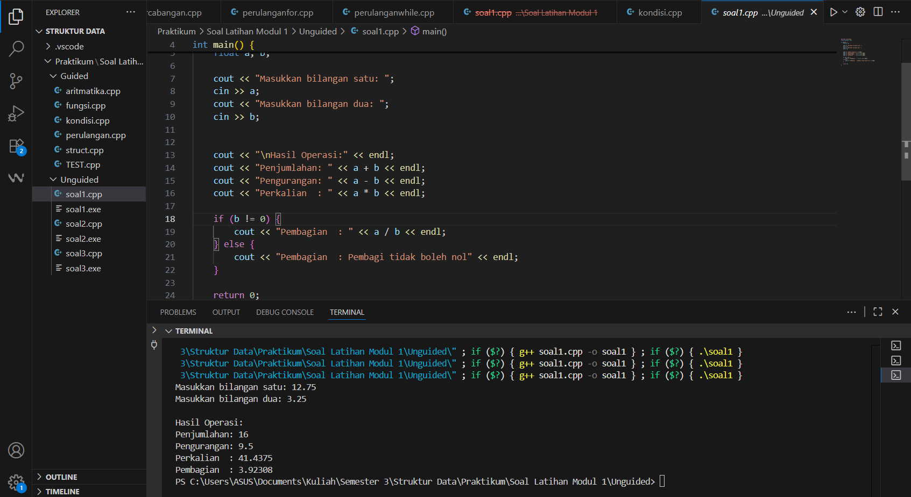
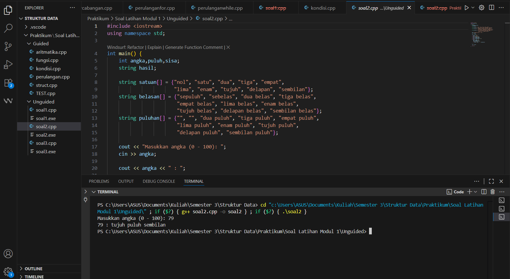
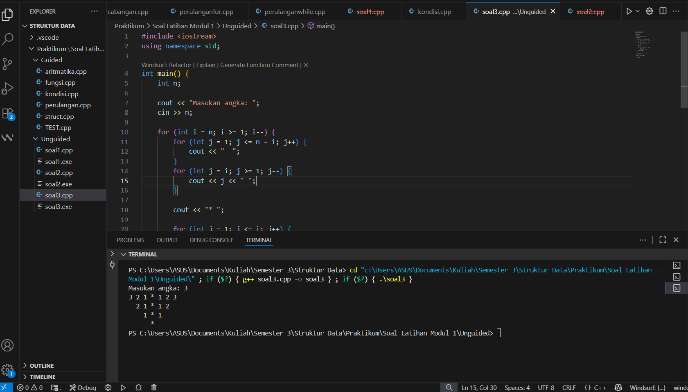

---
<h1 align="center">Laporan Praktikum Modul 1 <br>Code Blocks IDE & Pengenalan Bahasa C++
</h1>

<p align="center">Tri Setyono Martyantoro - 103112400279</p>
<p align="center">S1IF - 12 - 07</p>


---
## Dasar Teori
---
### Pengenalan Bahasa C++

Bahasa pemrograman **C++** pertama kali dikembangkan oleh Bjarne Stroustrup pada awal 1980-an di Bell Laboratories sebagai pengembangan dari bahasa C. Tujuan utamanya adalah menghadirkan bahasa yang tetap efisien seperti C, namun memiliki fitur pemrograman berorientasi objek (Object-Oriented Programming/OOP) sehingga lebih sesuai untuk mengembangkan perangkat lunak berskala besar dan kompleks (Dewi, 2010). Secara teori, C++ merupakan multi-paradigma language, karena mendukung beberapa gaya pemrograman sekaligus, yaitu: Pemrograman prosedural (menggunakan fungsi untuk membagi program menjadi bagian lebih kecil), Pemrograman berorientasi objek (menggunakan konsep class, object, encapsulation, inheritance, polymorphism), Generic programming(memanfaatkan _template_ untuk membuat kode yang reusable dan efisien).

Dalam konteks pendidikan, C++ sering digunakan sebagai bahasa pengantar untuk mahasiswa teknik dan komputer. Hal ini karena C++ menyediakan dasar pemahaman logika, struktur kontrol (_if, for, while_), penggunaan fungsi, hingga konsep tingkat lanjut seperti array, pointer, dan pemrograman objek. Menurut Putra dkk. (2020), penggunaan media pembelajaran interaktif berbasis C++ dapat meningkatkan pemahaman siswa terhadap algoritma dan logika pemrograman.

Penelitian lain menunjukkan bahwa pembelajaran C++ juga berpengaruh pada peningkatan kemampuan computational thinking siswa, yaitu kemampuan memecahkan masalah secara sistematis dengan pendekatan komputasi (Kristiyanto dkk., 2022). Sementara itu, Ritonga & Yahfizham (2023) menekankan bahwa meskipun Python lebih sederhana, C++ tetap unggul dalam performa dan efisiensi, sehingga pemahaman C++ sangat relevan untuk bidang seperti sistem operasi, embedded system, hingga aplikasi berbasis performa tinggi.

Dengan demikian, C++ bukan sekadar bahasa pemrograman, tetapi juga media untuk melatih mahasiswa berpikir sistematis, kritis, dan logis. Dalam praktiknya, keberhasilan pembelajaran C++ sangat dipengaruhi oleh pemilihan metode dan media, misalnya menggunakan IDE (CodeBlocks, Dev-C++), mobile learning, maupun simulasi berbasis _platform_ digital.

## Guided
---
### 1. Aritmatika

```cpp
#include <iostream>
using namespace std;

int main()
{
    int W, X, Y;
    float Z;
    X = 7;
    Y = 3;
    W = 1;
    Z = (X + Y) / (Y + W);
    cout << "Nilai z = " << Z << endl;
    return 0;
}
```
Program tersebut mendeklarasikan tiga variabel integer dan satu variabel float, lalu memberi nilai X = 7, Y = 3, dan W = 1. Setelah itu, program menghitung Z dengan rumus (X + Y) / (Y + W). Hasil perhitungan (7 + 3) / (3 + 1) sama dengan 10 / 4, namun karena pembagian dilakukan antar bilangan integer, hasilnya dibulatkan menjadi 2. Nilai tersebut kemudian disimpan ke dalam variabel float sehingga Z bernilai 2.0. Terakhir, program menampilkan hasil tersebut ke layar dengan tulisan Nilai z = 2.

### 2. Fungsi

```cpp
#include <iostream>
using namespace std;

// Prosedur: hanya menampilkan hasil, tidak mengembalikan nilai
void tampilkanHasil(double p, double l)
{
    cout << "\n=== Hasil Perhitungan ===" << endl;
    cout << "Panjang : " << p << endl;
    cout << "Lebar   : " << l << endl;
    cout << "Luas    : " << p * l << endl;
    cout << "Keliling: " << 2 * (p + l) << endl;
}

// Fungsi: mengembalikan nilai luas
double hitungLuas(double p, double l)
{
    return p * l;
}

// Fungsi: mengembalikan nilai keliling
double hitungKeliling(double p, double l)
{
    return 2 * (p + l);
}

int main()
{
    double panjang, lebar;
    cout << "Masukkan panjang: ";
    cin >> panjang;
    cout << "Masukkan lebar  : ";
    cin >> lebar;

    // Panggil fungsi
    double luas = hitungLuas(panjang, lebar);
    double keliling = hitungKeliling(panjang, lebar);

    cout << "\nDihitung dengan fungsi:" << endl;
    cout << "Luas      = " << luas << endl;
    cout << "Keliling  = " << keliling << endl;

    // Panggil prosedur
    tampilkanHasil(panjang, lebar);
    return 0;
}
```
Program ini digunakan untuk menghitung luas dan keliling persegi panjang dengan dua cara, yaitu menggunakan fungsi dan prosedur. Fungsi hitungLuas mengembalikan hasil perkalian panjang dan lebar sebagai luas, sedangkan fungsi hitungKeliling mengembalikan hasil perhitungan dua kali jumlah panjang dan lebar sebagai keliling. Prosedur tampilkanHasil hanya menampilkan panjang, lebar, luas, dan keliling tanpa mengembalikan nilai. Pada bagian utama program, pengguna diminta memasukkan panjang dan lebar, kemudian program menghitung luas dan keliling dengan fungsi, serta menampilkan hasil lengkapnya melalui prosedur.

### 3. Perkondisian

```cpp
#include <iostream>
using namespace std;
// int main()
// {
//     double tot_pembelian, diskon;
//     cout << "total pembelian: Rp";
//     cin >> tot_pembelian;
//     diskon = 0;
//     if (tot_pembelian >= 100000)
//         diskon = 0.05 * tot_pembelian;
//     cout << "besar diskon = Rp" << diskon;
// }

// int main()
// {
//     double tot_pembelian, diskon;
//     cout << "total pembelian: Rp";
//     cin >> tot_pembelian;
//     diskon = 0;
//     if (tot_pembelian >= 100000)
//         diskon = 0.05 * tot_pembelian;
//     else
//         diskon = 0;
//     cout << "besar diskon = Rp" << diskon;
// }

int main()
{
    int kode_hari;
    cout << "Menentukan hari kerja/libur\n"<<endl;
    cout << "1=Senin 3=Rabu 5=Jumat 7=Minggu "<<endl;
    cout << "2=Selasa 4=Kamis 6=Sabtu "<<endl;
    cin >> kode_hari;
    switch (kode_hari)
    {
    case 1:
        cout<<"Hari Kerja";
        break;
    case 2:
        cout<<"Hari Kerja";
        break;
    case 3:
        cout<<"Hari Kerja";
        break;
    case 4:
        cout<<"Hari Kerja";
        break;
    case 5:
        cout<<"Hari Kerja";
        break;
    case 6:
        cout<<"Hari Libur";
        break;
    case 7:
        cout<<"Hari Libur";
        break;
    default:
        cout<<"Kode masukan salah!!!";
    }
    return 0;
}
```
Program tersebut meminta input berupa kode angka hari, lalu menentukan apakah hari tersebut termasuk hari kerja atau hari libur. Jika pengguna memasukkan angka 1 sampai 5 (Senin sampai Jumat), program akan menampilkan keterangan “Hari Kerja”. Jika yang dimasukkan adalah angka 6 atau 7 (Sabtu dan Minggu), program akan menampilkan “Hari Libur”. Apabila input tidak sesuai dengan angka 1–7, maka program akan menampilkan pesan “Kode masukan salah”.

### 4. Perulangan 

```cpp
#include <iostream>
using namespace std;
// int main()
// {
//     int jum;
//     cout << "jumlah perulangan: ";
//     cin >> jum;
//     for (int i = 0; i < jum; i++)
//     {
//         cout << "saya sahroni\n";
//     }
//     return 1;
// }

// while
int main()
{
    int i = 1;
    int jum;
    cin >> jum;
    do
    {
        cout << "bahlil ke-" << (i + 1) << endl;
        i++;
    } while (i < jum);
    return 0;
}
```
Program ini berisi contoh penggunaan perulangan. Pada bagian yang dikomentari, digunakan perulangan for untuk mencetak tulisan “saya sahroni” sesuai jumlah yang dimasukkan pengguna. Sedangkan pada bagian yang aktif dijalankan, digunakan perulangan do–while. Program meminta input berupa sebuah angka, lalu mulai mencetak kalimat “bahlil ke-” disertai nomor urut mulai dari 2, karena penomoran menggunakan (i + 1) dengan nilai awal i = 1. Setelah setiap kali mencetak, nilai i bertambah satu, dan perulangan akan terus berjalan selama i masih lebih kecil dari jumlah yang dimasukkan pengguna.

### 5. Struct

```cpp
#include <iostream>
#include <string>
using namespace std;

// Definisi struct
struct Mahasiswa {
    string nama;
    string nim;
    float ipk;
};

int main() {
    Mahasiswa mhs1;
    cout << "Masukkan Nama Mahasiswa: ";
    getline(cin, mhs1.nama);
    // cin >> mhs1.nama;
    cout << "Masukkan NIM Mahasiswa : ";
    cin >> mhs1.nim;
    cout << "Masukkan IPK Mahasiswa : ";
    cin >> mhs1.ipk;
    cout << "\n=== Data Mahasiswa ===" << endl;
    cout << "Nama : " << mhs1.nama << endl;
    cout << "NIM  : " << mhs1.nim << endl;
    cout << "IPK  : " << mhs1.ipk << endl;

    return 0;
}
```
Program ini dibuat untuk menyimpan dan menampilkan data mahasiswa dengan menggunakan struct. Pertama, didefinisikan struct bernama Mahasiswa yang memiliki tiga atribut, yaitu nama bertipe string, nim bertipe string, dan ipk bertipe float. Di dalam fungsi main, program membuat sebuah variabel mhs1 dari struct tersebut. Pengguna diminta memasukkan nama mahasiswa menggunakan getline agar bisa membaca nama lengkap dengan spasi, lalu memasukkan NIM, dan terakhir memasukkan nilai IPK. Setelah semua data diinput, program menampilkan kembali data mahasiswa tersebut dalam format yang rapi.

### 6. Test

```cpp
#include <iostream>
using namespace std;
int main()
{
    string ch;
    cout << "Masukkan sebuah karakter: ";
    // cin >> ch;
    ch = getchar();  //Menggunakan getchar() untuk membaca satu karakter
    cout << "Karakter yang Anda masukkan adalah: " << ch << endl;
    return 0;
}
```
Program ini digunakan untuk membaca satu karakter dari input pengguna. Variabel yang dipakai adalah ch bertipe string, lalu program menampilkan pesan “Masukkan sebuah karakter”. Input sebenarnya dibaca menggunakan fungsi getchar(), yang hanya mengambil **satu karakter** dari keyboard. Hasil karakter tersebut kemudian disimpan ke variabel ch. Setelah itu, program menampilkan kembali karakter yang sudah dimasukkan dengan pesan “Karakter yang Anda masukkan adalah …”.

## Unguided
---

## Soal Latihan Modul 1

---


> 1. Buatlah program yang menerima input-an dua buah bilangan betipe float, kemudian memberikan output-an hasil penjumlahan, pengurangan, perkalian, dan pembagian dari dua bilangan tersebut.

```cpp
#include <iostream>
using namespace std;

int main() {
    float a, b;

    cout << "Masukkan bilangan satu: ";
    cin >> a;
    cout << "Masukkan bilangan dua: ";
    cin >> b;

    cout << "\nHasil Operasi:" << endl;
    cout << "Penjumlahan: " << a + b << endl;
    cout << "Pengurangan: " << a - b << endl;
    cout << "Perkalian  : " << a * b << endl;

    if (b != 0) {
        cout << "Pembagian  : " << a / b << endl;
    } else {
        cout << "Pembagian  : Tidak bisa (pembagi = 0)" << endl;
    }

    return 0;
}
```
### Output Code

Program diatas dibuat untuk menerima masukan berupa dua bilangan desimal dari pengguna, lalu menampilkan hasil dari empat operasi aritmatika dasar yaitu penjumlahan, pengurangan, perkalian, dan pembagian. Di dalam program tersebut, terdapat dua variabel bernama a dan b yang bertipe data float. Variabel a menyimpan bilangan pertama yang dimasukkan oleh pengguna, sedangkan variabel b menyimpan bilangan kedua. Setelah pengguna memberikan input, program langsung melakukan perhitungan. Hasil penjumlahan diperoleh dari a + b, hasil pengurangan dari a - b, hasil perkalian dari a * b, dan hasil pembagian dari a / b. Namun, untuk pembagian ada pengecekan terlebih dahulu. Jika nilai b sama dengan nol, maka program tidak akan menghitung karena pembagian dengan nol tidak bisa dilakukan.

>  2. Buatlah sebuah program yang menerima masukan angka dan mengeluarkan output nilai angka tersebut dalam bentuk tulisan. Angka yang akan diinputkan user adalah bilangan bulat positif mulai dari 0 s.d 100.  

**Contoh:**  
```
79 : tujuh puluh sembilan
```

```cpp
#include <iostream>
using namespace std;
int main() {
    int angka,puluh,sisa;        
    string hasil;    

    string satuan[] = {"nol", "satu", "dua", "tiga", "empat",
                       "lima", "enam", "tujuh", "delapan", "sembilan"};
    string belasan[] = {"sepuluh", "sebelas", "dua belas", "tiga belas",
                        "empat belas", "lima belas", "enam belas",
                        "tujuh belas", "delapan belas", "sembilan belas"};
    string puluhan[] = {"", "", "dua puluh", "tiga puluh", "empat puluh",
                        "lima puluh", "enam puluh", "tujuh puluh",
                        "delapan puluh", "sembilan puluh"};

    cout << "Masukkan angka (0 - 100): ";
    cin >> angka;

    cout << angka << " : ";

    if (angka == 100) {
        hasil = "seratus";
    } else if (angka < 10) {
        hasil = satuan[angka];
    } else if (angka < 20) {
        hasil = belasan[angka - 10];
    } else {
        puluh = angka / 10;
        sisa = angka % 10;
        hasil = puluhan[puluh];
        if (sisa != 0) {
            hasil = hasil + " " + satuan[sisa];
        }
    }
    cout << hasil;
    return 0;
}
```
### Output Code

Program di atas dibuat untuk menerima masukan berupa sebuah bilangan bulat dari pengguna, lalu menampilkan hasil berupa tulisan angka tersebut. Di dalam program terdapat variabel bernama angka, puluh, sisa, dan hasil. Variabel angka digunakan untuk menyimpan bilangan yang dimasukkan oleh pengguna, puluh digunakan untuk menyimpan bagian puluhan dari angka, sedangkan sisa menyimpan bagian satuan. Variabel hasil bertipe string dan digunakan untuk menyimpan hasil akhir dalam bentuk tulisan. Selain itu, terdapat tiga array string yaitu satuan, belasan, dan puluhan. Array satuan berisi tulisan angka nol sampai sembilan, array belasan berisi tulisan angka sepuluh sampai sembilan belas, sedangkan array puluhan berisi tulisan dua puluh sampai sembilan puluh. Setelah pengguna memberikan input, program akan memeriksa kondisi angka. Jika angka bernilai 100, hasil langsung ditampilkan sebagai “seratus”. Jika angka kurang dari 10, tulisan diambil dari array satuan. Jika angka berada pada rentang 10 hingga 19, tulisan diambil dari array belasan. Sedangkan untuk angka 20 ke atas, angka dipisahkan menjadi bagian puluhan dan satuan, lalu hasil tulisan diambil dari array puluhan dan satuan sesuai nilainya. Nanti outputnya akan menampilkan angka beserta hasil tulisannya.

---

> 3. Buatlah sebuah program yang menerima input berupa sebuah bilangan bulat positif n, kemudian menghasilkan output berupa pola Mirror seperti contoh di bawah.
### Input
```
3
```

### Output
```
3 2 1 * 1 2 3
2 1 * 1 2
1 * 1
*
```

```cpp
#include <iostream>
using namespace std;

int main() {
    int n;

    cout << "Masukan angka: ";
    cin >> n;

    for (int i = n; i >= 1; i--) {
        for (int j = 1; j <= n - i; j++) {
            cout << "  ";
        }
        for (int j = i; j >= 1; j--) {
            cout << j << " ";
        }
        cout << "* ";

        for (int j = 1; j <= i; j++) {
            cout << j;
            if (j != i) cout << " ";
        }
        cout << endl;
    }

    for (int i = 0; i < n; i++) {
        cout << "  ";
    }
    cout << "*" << endl;
    return 0;
}
```
### Output Code

Program di atas dibuat untuk menerima masukan berupa sebuah bilangan bulat dari pengguna, kemudian menampilkan pola angka berbentuk cermin (mirror). Di dalam program terdapat variabel n, i, dan j yang bertipe data integer. Variabel n digunakan untuk menyimpan bilangan yang dimasukkan oleh pengguna, sedangkan variabel i dan j berfungsi sebagai penghitung pada perulangan. Setelah pengguna memasukkan nilai n, program menjalankan perulangan dari n hingga 1. Pada setiap perulangan, bagian kiri pola dicetak dengan angka menurun dari i sampai 1, kemudian program mencetak tanda bintang * sebagai pemisah, dan dilanjutkan dengan mencetak bagian kanan pola berupa angka menaik dari 1 sampai i. Proses ini diulang hingga nilai i sama dengan 1. Setelah semua perulangan selesai, program menampilkan satu tanda bintang * pada baris terakhir.

---
### Referensi
---
[1] Putra, C. K., dkk. (2020). Pengembangan Media Pembelajaran Mobile Learning Pemrograman C++ untuk SMK. ePrints Universitas Muhammadiyah Surakarta. https://eprints.ums.ac.id/115405/10/Naskah%20Publikasi_Canygia%20Kalindra%20Putra.pdf
[2] Dewi, L. J. E. (2010). Media Pembelajaran Bahasa Pemrograman C++. Jurnal Pendidikan Teknologi dan Kejuruan. https://ejournal.undiksha.ac.id/index.php/JPTK/article/download/31/25/94
[3] Kristiyanto, A., dkk. (2022). Pelatihan Pemrograman C++ melalui Tinkercad Guna Meningkatkan Kemampuan Computational Thinking Siswa SMK. Jurnal Pengabdian Kepada Masyarakat. https://ejournal.sisfokomtek.org/index.php/jpkm/article/view/3362
[4] Ritonga, A., & Yahfizham. (2023). Studi Literatur Perbandingan Bahasa Pemrograman C++ dan Python pada Algoritma Pemrograman. Jurnal Informatika dan Sistem Informasi. https://www.researchgate.net/publication/375802955_Studi_Literatur_Perbandingan_Bahasa_Pemrograman_C_dan_Bahasa_Pemrograman_Python_pada_Algoritma_Pemrograman


