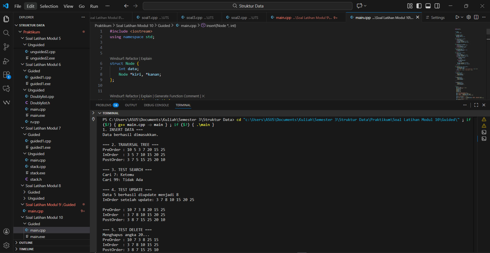
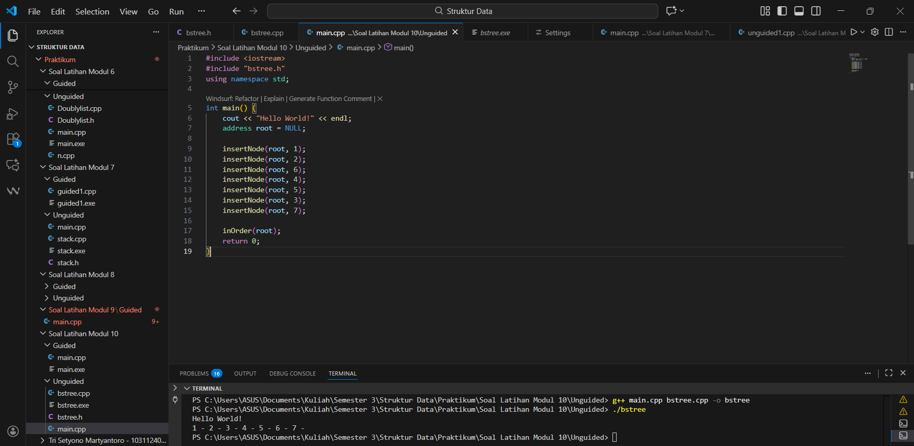
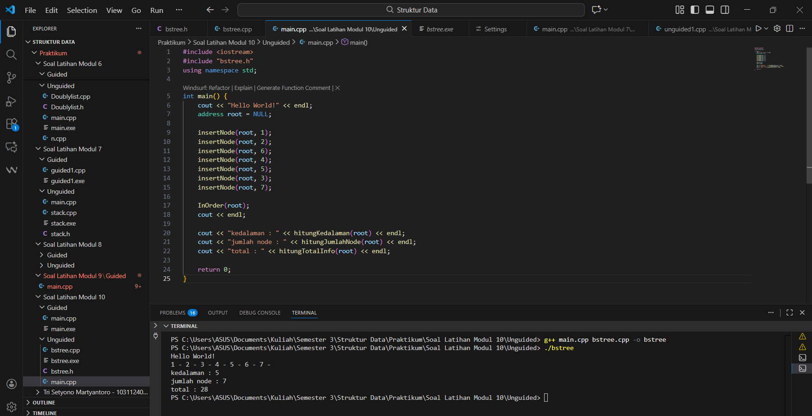
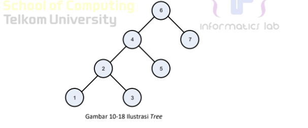
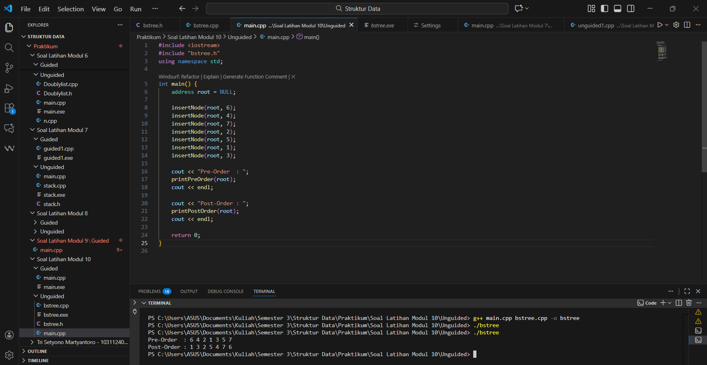

---
<h1 align="center">Laporan Praktikum Modul 10 <br>Tree
</h1>

<p align="center">Tri Setyono Martyantoro - 103112400279</p>
<p align="center">S1IF - 12 - 07</p>


---
## Dasar Teori - Tree

---
Pada modul 10 ini mempelajari struktur data Tree, yaitu struktur data non-linear yang digunakan untuk merepresentasikan data dalam bentuk hierarki. Struktur tree tersusun atas elemen-elemen yang disebut node, yang dihubungkan melalui edge, dengan satu node khusus bernama root yang menjadi simpul utama. Setiap node dapat memiliki satu atau lebih child, dan node yang tidak memiliki child disebut leaf. Konsep hirarki pada tree memungkinkan pengaturan data yang lebih terstruktur dibandingkan struktur data linear seperti array atau linked list.

Pada tree terdapat beberapa istilah penting, seperti parent, yaitu node yang memiliki anak; child, yaitu node yang mempunyai parent; siblings, yaitu node-node yang memiliki parent yang sama; level, yaitu posisi node dilihat dari kedalamannya terhadap root; serta height, yaitu panjang jalur terpanjang dari root ke node leaf. Struktur tree banyak digunakan dalam kehidupan nyata seperti struktur direktori pada sistem file komputer, struktur organisasi, serta silsilah keluarga.

Salah satu bentuk tree yang paling umum adalah Binary Tree, yaitu tree di mana setiap node memiliki maksimal dua anak, yakni left child dan right child. Binary tree sering menjadi dasar bagi pengembangan struktur tree lainnya, seperti Binary Search Tree (BST), AVL Tree, dan Heap, yang banyak digunakan dalam proses pencarian, penyimpanan data terurut, dan optimasi algoritma. Implementasi tree biasanya menggunakan pointer atau referensi yang menghubungkan setiap node, sehingga struktur ini bersifat fleksibel dan dapat berkembang secara dinamis.

## Guided
---

```cpp
#include <iostream>
using namespace std;

struct Node {
    int data;
    Node *kiri, *kanan;
};

Node* buatNode(int nilai) {
    Node* baru = new Node();
    baru->data = nilai;
    baru->kiri = baru->kanan = NULL;
    return baru;
}

Node* insert(Node* root, int nilai) {
    if (root == NULL)
        return buatNode(nilai);
    if (nilai < root->data)
        root->kiri = insert(root->kiri, nilai);
    else if (nilai > root->data)
        root->kanan = insert(root->kanan, nilai);
    return root;
}

Node* search(Node* root, int nilai) {
    if (root == NULL || root->data == nilai)
        return root;
    if (nilai < root->data)
        return search(root->kiri, nilai);
    return search(root->kanan, nilai);
}

Node* nilaiTerkecil(Node* node) {
    Node* current = node;
    while (current && current->kiri != NULL)
        current = current->kiri;
    return current;
}

Node* hapus(Node* root, int nilai) {
    if (root == NULL)
        return root;
    if (nilai < root->data)
        root->kiri = hapus(root->kiri, nilai);
    else if (nilai > root->data)
        root->kanan = hapus(root->kanan, nilai);
    else {
        if (root->kiri == NULL) {
            Node* temp = root->kanan;
            delete root;
            return temp;
        }
        else if (root->kanan == NULL) {
            Node* temp = root->kiri;
            delete root;
            return temp;
        }
        Node* temp = nilaiTerkecil(root->kanan);
        root->data = temp->data;
        root->kanan = hapus(root->kanan, temp->data);
    }
    return root;
}

Node* update(Node* root, int lama, int baru) {
    if (search(root, lama) != NULL) {  
        root = hapus(root, lama);
        root = insert(root, baru);
        cout << "Data " << lama << " berhasil diupdate menjadi " << baru << endl;
    } else {
        cout << "Data " << lama << " tidak ditemukan." << endl;
    }
    return root;
}

void preOrder(Node* root) {
    if (root != NULL) {
        cout << root->data << " ";
        preOrder(root->kiri);
        preOrder(root->kanan);
    }
}

void inOrder(Node* root) {
    if (root != NULL) {
        inOrder(root->kiri);
        cout << root->data << " ";
        inOrder(root->kanan);
    }
}

void postOrder(Node* root) {
    if (root != NULL) {
        postOrder(root->kiri);
        postOrder(root->kanan);
        cout << root->data << " ";
    }
}

int main() {
    Node* root = NULL;
    cout << "1. INSERT DATA ===" << endl;
    root = insert(root, 10);
    insert(root, 5);
    insert(root, 20);
    insert(root, 3);
    insert(root, 7);
    insert(root, 15);
    insert(root, 25);

    cout << "Data berhasil dimasukkan.\n\n";
    cout << "=== 2. TRAVERSAL TREE ===" << endl;
    cout << "PreOrder : "; preOrder(root); cout << endl;
    cout << "InOrder  : "; inOrder(root); cout << endl;
    cout << "PostOrder: "; postOrder(root); cout << endl << endl;

    cout << "=== 3. TEST SEARCH ===" << endl;
    int cari = 7, cari2 = 99;
    cout << "Cari " << cari  << ": " << (search(root, cari)  ? "Ketemu" : "Tidak Ada") << endl;
    cout << "Cari " << cari2 << ": " << (search(root, cari2) ? "Ketemu" : "Tidak Ada") << endl << endl;
    
    cout << "=== 4. TEST UPDATE ===" << endl;
    root = update(root, 5, 8);
    cout << "InOrder setelah update: "; inOrder(root); cout << endl << endl;
    cout << "PreOrder : "; preOrder(root); cout << endl;
    cout << "InOrder  : "; inOrder(root); cout << endl;
    cout << "PostOrder: "; postOrder(root); cout << endl << endl;


    cout << "=== 5. TEST DELETE ===" << endl;
    cout << "Menghapus angka 20..." << endl;
    root = hapus(root, 20);
    cout << "PreOrder : "; preOrder(root); cout << endl;
    cout << "InOrder  : "; inOrder(root); cout << endl;
    cout << "PostOrder: "; postOrder(root); cout << endl;

    return 0;
}
```
### Output Code

Program di atas merupakan implementasi struktur data Binary Search Tree (BST) dalam bahasa C++. Program ini dibuat untuk melakukan operasi dasar pada tree, yaitu memasukkan data (insert), mencari data (search), memperbarui data (update), menghapus data (delete), serta menampilkan isi tree menggunakan traversal Preorder, Inorder, dan Postorder. Struktur node pada tree disimpan menggunakan struct Node yang berisi nilai data serta pointer ke anak kiri dan kanan. Data dimasukkan ke tree menggunakan fungsi insert() dengan aturan bahwa nilai lebih kecil ditempatkan di kiri dan nilai lebih besar ditempatkan di kanan. Proses pencarian dilakukan oleh fungsi search() dengan mengikuti pola yang sama. Untuk proses penghapusan data digunakan fungsi hapus() yang menangani tiga kondisi: node tanpa anak, node dengan satu anak, dan node dengan dua anak, di mana nilai diganti oleh nilai terkecil pada subtree kanan. Traversal digunakan untuk menampilkan isi tree sesuai urutan tertentu: preorder mencetak root terlebih dahulu, inorder mencetak berdasarkan urutan terurut, dan postorder mencetak root paling akhir. Pada fungsi main(), program memasukkan beberapa data awal, menampilkan hasil traversal, melakukan pencarian nilai, mengupdate nilai 5 menjadi 8, dan menghapus angka 20.

---
## Unguided
---
## Soal Latihan Modul 10

---
### Soal 1

> 1. Buatlah ADT Binary Search Tree menggunakan Linked list sebagai berikut di dalam file “bstree.h”:

```
	Type infotype: integer
    Type address : pointer to Node
    Type Node: <
        info : infotype
        left, right : address
    >
        function alokasi( x : infotype ) → address
    procedure insertNode( input/output root : address,
        input x : infotype )
    function findNode( x : infotype, root : address )→address
    procedure printInorder( input root : address )
```

> Buatlah implementasi ADT Binary Search Tree pada file “bstree.cpp” dan cobalah hasil implementasi ADT pada file “main.cpp”

```
#include <iostream>
#include "bstree.h"

using namespace std;
int main() {
    cout << "Hello World" << endl;
    address root = Nil;
    insertNode(root,1);
    insertNode(root,2);
    insertNode(root,6);
    insertNode(root,4);
    insertNode(root,5);
    insertNode(root,3);
    insertNode(root,6);
    insertNode(root,7);
    InOrder(root);
    return 0;
}
```
### bstree.h
```cpp
#ifndef BSTREE_H
#define BSTREE_H

typedef int infotype;

struct Node {
    infotype info;
    Node *left, *right;
};

typedef Node* address;

void alokasi(address &p, infotype x);
void insertNode(address &root, infotype x);
address findNode(address root, infotype x);
void inOrder(address root);
#endif
```
### bstree.cpp
```cpp
#include <iostream>
#include "bstree.h"

using namespace std;

void alokasi(address &p, infotype x) {
    p = new Node;
    p->info = x;
    p->left = NULL;
    p->right = NULL;
}

  
void insertNode(address &root, infotype x) {
    if (root == NULL) {
        alokasi(root, x);
    } else if (x < root->info) {
        insertNode(root->left, x);
    } else if (x > root->info) {
        insertNode(root->right, x);
    }
}

address findNode(address root, infotype x) {
    if (root == NULL || root->info == x)
        return root;
    if (x < root->info)
        return findNode(root->left, x);
    else
        return findNode(root->right, x);
}

void inOrder(address root) {
    if (root != NULL) {
        inOrder(root->left);
        cout << root->info << " - ";
        inOrder(root->right);
    }
}
```
### main.cpp
```cpp
#include <iostream>
#include "bstree.h"

using namespace std;

int main() {
    cout << "Hello World!" << endl;
    address root = NULL;

    insertNode(root, 1);
    insertNode(root, 2);
    insertNode(root, 6);
    insertNode(root, 4);
    insertNode(root, 5);
    insertNode(root, 3);
    insertNode(root, 7);

    inOrder(root);
    return 0;
}
```
### Output Code

Program tersebut merupakan implementasi dari Binary Search Tree (BST) menggunakan struktur linked list pada bahasa C++. Pada Binary Search Tree, setiap node memiliki tiga komponen utama, yaitu nilai data, pointer ke anak kiri, dan pointer ke anak kanan. Struktur program terdiri dari tiga file utama: bstree.h, bstree.cpp, dan main.cpp. Pada file bstree.h, dideklarasikan tipe data node serta fungsi-fungsi yang digunakan, seperti fungsi untuk mengalokasikan node baru, fungsi untuk memasukkan data (insertNode), fungsi pencarian data (findNode), dan prosedur untuk menampilkan isi tree menggunakan metode inOrder traversal. Implementasi fungsi-fungsi tersebut kemudian dibuat di dalam file bstree.cpp sesuai dengan deklarasi pada file header. File main.cpp digunakan sebagai tempat untuk menguji implementasi BST. Pada bagian ini, root diinisialisasi dengan nilai NULL, kemudian dilakukan pemanggilan fungsi insertNode untuk memasukkan beberapa nilai, yaitu 1, 2, 6, 4, 5, 3, dan 7. Setelah seluruh data berhasil disisipkan, fungsi inOrder(root) dipanggil untuk menampilkan isi tree secara terurut dari nilai terkecil ke terbesar.

---
### Soal 2

>2. Buatlah fungsi untuk menghitung jumlah node dengan fungsi berikut.
    ➢ fungsi hitungJumlahNode( root:address ) : integer
    /* fungsi mengembalikan integer banyak node yang ada di dalam BST*/
    ➢ fungsi hitungTotalInfo( root:address, start:integer ) : integer
    /* fungsi mengembalikan jumlah (total) info dari node-node yang ada di dalam BST*/
    ➢ fungsi hitungKedalaman( root:address, start:integer ) : integer
    /* fungsi rekursif mengembalikan integer kedalaman maksimal dari binary tree */

```
int main() {
    cout << "Hello World" << endl;
    address root = Nil;
    insertNode(root,1);
    insertNode(root,2);
    insertNode(root,6);
    insertNode(root,4);
    insertNode(root,5);
    insertNode(root,3);
    insertNode(root,6);
    insertNode(root,7);
    InOrder(root);
    cout<<"\n";
    cout<<"kedalaman : "<<hitungKedalaman(root,0)<<endl;
    cout<<"jumlah Node : "<<hitungNode(root)<<endl;
    cout<<"total : "<<hitungTotal(root)<<endl;
    return 0;
}
```

### bstree.h
```cpp
#ifndef BSTREE_H
#define BSTREE_H

typedef int infotype;
typedef struct Node *address;

struct Node {
    infotype info;
    address left, right;
};

address alokasi(infotype x);
void insertNode(address &root, infotype x);
int hitungJumlahNode(address root);
int hitungTotalInfo(address root);
int hitungKedalaman(address root);
void InOrder(address root);

#endif
```
### bstree.cpp
```cpp
#include "bstree.h"
#include <iostream>
using namespace std;

address alokasi(infotype x) {
    address p = new Node;
    p->info = x;
    p->left = NULL;
    p->right = NULL;
    return p;
}

void insertNode(address &root, infotype x) {
    if (root == NULL) {
        root = alokasi(x);
    } else if (x < root->info) {
        insertNode(root->left, x);
    } else if (x > root->info) {
        insertNode(root->right, x);
    }
}

// Hitung banyak node
int hitungJumlahNode(address root) {
    if (root == NULL)
        return 0;
    return 1 + hitungJumlahNode(root->left) + hitungJumlahNode(root->right);
}

// Hitung total nilai dalam setiap node
int hitungTotalInfo(address root) {
    if (root == NULL)
        return 0;
    return root->info + hitungTotalInfo(root->left) + hitungTotalInfo(root->right);
}

// Hitung kedalaman tree
int hitungKedalaman(address root) {
    if (root == NULL)
        return 0;
    int kiri = hitungKedalaman(root->left);
    int kanan = hitungKedalaman(root->right);
    return 1 + (kiri > kanan ? kiri : kanan);
}

// traversal InOrder
void InOrder(address root) {
    if (root != NULL) {
        InOrder(root->left);
        cout << root->info << " - ";
        InOrder(root->right);
    }
}

```
### main.cpp
```cpp
#include <iostream>
#include "bstree.h"
using namespace std;

int main() {
    cout << "Hello World!" << endl;
    address root = NULL;

    insertNode(root, 1);
    insertNode(root, 2);
    insertNode(root, 6);
    insertNode(root, 4);
    insertNode(root, 5);
    insertNode(root, 3);
    insertNode(root, 7);

    InOrder(root);
    cout << endl;

    cout << "kedalaman : " << hitungKedalaman(root) << endl;
    cout << "jumlah node : " << hitungJumlahNode(root) << endl;
    cout << "total : " << hitungTotalInfo(root) << endl;

    return 0;
}
```
### Output Code

Pada bagian ini dibuat tiga fungsi tambahan untuk melakukan perhitungan pada struktur Binary Search Tree (BST), yaitu fungsi hitungJumlahNode, hitungTotalInfo, dan hitungKedalaman. Ketiga fungsi tersebut digunakan untuk menghitung jumlah node, total nilai data dalam tree, serta kedalaman maksimum tree. Fungsi hitungJumlahNode(root) bekerja dengan traversal rekursif. Jika root bernilai NULL maka mengembalikan 0, dan jika node ada maka menghitung 1 serta menjumlahkannya dengan hasil perhitungan subtree kiri dan kanan. Fungsi hitungTotalInfo(root) menggunakan konsep serupa, tetapi nilai yang dijumlahkan adalah isi dari setiap node sehingga menghasilkan total keseluruhan data pada BST. Fungsi hitungKedalaman(root) digunakan untuk mencari kedalaman maksimal tree dengan membandingkan kedalaman subtree kiri dan kanan, kemudian mengambil nilai terbesar dan menambahkannya satu level. Pada fungsi main(), nilai 1, 2, 6, 4, 5, 3, dan 7 dimasukkan ke dalam tree, kemudian dilakukan traversal InOrder untuk menampilkan data secara terurut. Setelah itu dipanggil fungsi hitungKedalaman, hitungJumlahNode, dan hitungTotalInfo untuk menampilkan hasil perhitungan.

---
### Soal 3

> 3. Print tree secara pre-order dan post-order.


### bstree.h
```cpp
#ifndef BSTREE_H
#define BSTREE_H

typedef int infotype;

struct Node {
    infotype info;
    Node *left, *right;
};

typedef Node* address;

address alokasi(infotype x);
void insertNode(address &root, infotype x);
void printPreOrder(address root);
void printPostOrder(address root);

#endif
```
### bstree.cpp
```cpp
#include <iostream>
#include "bstree.h"
using namespace std;

address alokasi(infotype x) {
    address p = new Node;
    p->info = x;
    p->left = NULL;
    p->right = NULL;
    return p;
}

void insertNode(address &root, infotype x) {
    if (root == NULL) {
        root = alokasi(x);
    } else if (x < root->info) {
        insertNode(root->left, x);
    } else if (x > root->info) {
        insertNode(root->right, x);
    }
}

void printPreOrder(address root) {
    if (root != NULL) {
        cout << root->info << " ";
        printPreOrder(root->left);
        printPreOrder(root->right);
    }
}

void printPostOrder(address root) {
    if (root != NULL) {
        printPostOrder(root->left);
        printPostOrder(root->right);
        cout << root->info << " ";
    }
}
```
### main.cpp
```cpp
#include <iostream>
#include "bstree.h"
using namespace std;

int main() {
    address root = NULL;

    insertNode(root, 6);
    insertNode(root, 4);
    insertNode(root, 7);
    insertNode(root, 2);
    insertNode(root, 5);
    insertNode(root, 1);
    insertNode(root, 3);

    cout << "Pre-Order  : ";
    printPreOrder(root);
    cout << endl;

    cout << "Post-Order : ";
    printPostOrder(root);
    cout << endl;

    return 0;
}
```
### Output Code

Program pada kode di atas mengimplementasikan struktur data Binary Search Tree (BST) dengan memisahkan deklarasi dan definisi fungsi ke dalam dua file, yaitu bstree.h dan bstree.cpp. File bstree.h berisi deklarasi struktur Node, tipe data address, serta prototype fungsi yang digunakan, seperti insertNode, printPreOrder, dan printPostOrder. File bstree.cpp berisi implementasi dari fungsi yang dideklarasikan sebelumnya. Fungsi alokasi digunakan untuk membuat node baru dengan nilai tertentu. Fungsi insertNode digunakan untuk menyisipkan data ke dalam tree dengan aturan BST, yaitu nilai yang lebih kecil ditempatkan di subtree kiri, dan nilai lebih besar di subtree kanan. Fungsi printPreOrder digunakan untuk menampilkan isi tree secara pre-order, yaitu mengunjungi root terlebih dahulu, kemudian subtree kiri, dan terakhir subtree kanan. Sedangkan printPostOrder menampilkan tree secara post-order, dimulai dari subtree kiri, subtree kanan, dan terakhir root. Kedua proses traversal ini juga dilakukan secara rekursif. Pada main.cpp, tree dibangun dengan memasukkan nilai 6, 4, 7, 2, 5, 1, dan 3. Setelah tree terbentuk, program mencetak isi tree menggunakan traversal pre-order dan post-order.

---
### Referensi
---

[1] Modul Praktikum Struktur Data – Tree, Politeknik Elektronika Negeri Surabaya.  
[https://yuliana.lecturer.pens.ac.id/Struktur%20Data%20C/Prak%20SD%20-%20pdf/Praktikum%2010.pdf](https://yuliana.lecturer.pens.ac.id/Struktur%20Data%20C/Prak%20SD%20-%20pdf/Praktikum%2010.pdf)
[2] GeeksforGeeks. (2022). “Introduction to Tree Data Structure.”  
[https://www.geeksforgeeks.org/introduction-to-tree-data-structure/](https://www.geeksforgeeks.org/introduction-to-tree-data-structure/)
[3] Idris, M. (2021). “Struktur Data Tree dan Binary Tree: Konsep dan Implementasi.” _Jurnal Informatika & Sistem Komputer_, 9(1).  
[https://repository.unikom.ac.id/46090/1/TREE.pdf](https://repository.unikom.ac.id/46090/1/TREE.pdf)

---


