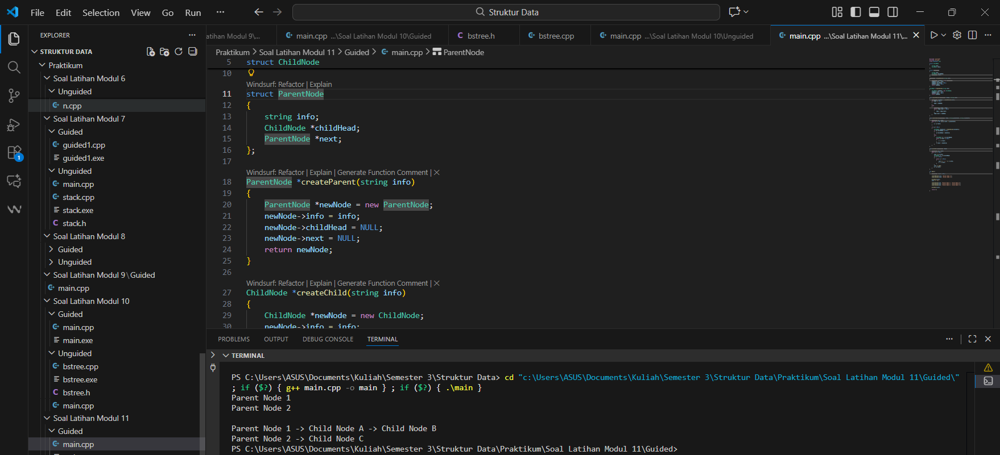
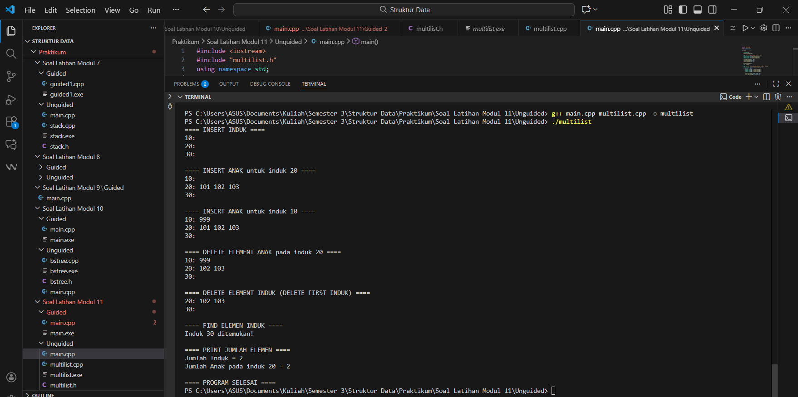
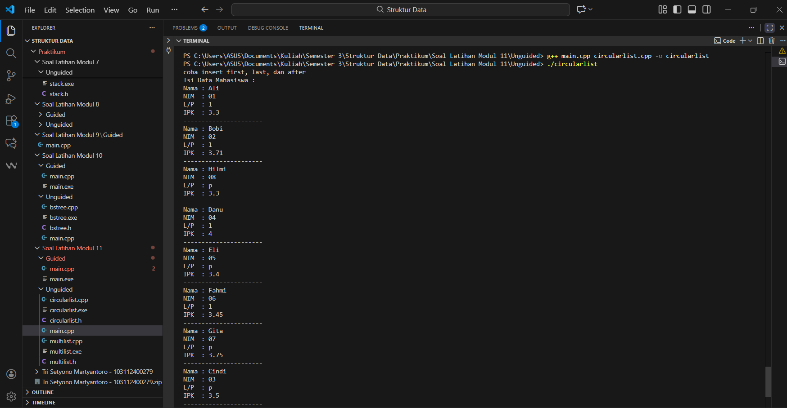

---
<h1 align="center">Laporan Praktikum Modul 11 <br>Multi Linked List
</h1>

<p align="center">Tri Setyono Martyantoro - 103112400279</p>
<p align="center">S1IF - 12 - 07</p>


---
## Dasar Teori - Multi Linked List

---
Pada modul ke-11 ini mempelajari struktur data Multi-Linked List, yaitu variasi dari linked list yang setiap node-nya memiliki lebih dari satu pointer atau penunjuk. Berbeda dengan single linked list yang hanya memiliki pointer _next_ dan double linked list yang memiliki pointer _next_ dan _prev_, pada Multi-Linked List sebuah node dapat memiliki beberapa pointer sekaligus sehingga data dapat terhubung melalui lebih dari satu jalur akses. Struktur ini digunakan untuk merepresentasikan data yang memiliki hubungan kompleks, seperti relasi satu-ke-banyak atau banyak-ke-banyak, tanpa perlu melakukan duplikasi data.

Multi-Linked List banyak diterapkan dalam pengelolaan data yang membutuhkan fleksibilitas tinggi, misalnya pada penyimpanan data mahasiswa yang terhubung dengan daftar mata kuliah yang diambil, struktur menu dan submenu pada aplikasi, serta representasi _sparse matrix_ yang menghubungkan elemen berdasarkan baris dan kolom. Keunggulan utama struktur ini terletak pada kemampuannya dalam mengatur data secara dinamis dan mempermudah operasi penambahan atau penghapusan elemen. Namun, implementasinya lebih kompleks karena pengelolaan pointer yang lebih banyak serta penggunaan memori yang lebih besar dibandingkan linked list biasa.

## Guided
---

```cpp
#include <iostream>
#include <string>
using namespace std;

struct ChildNode
{
    string info;
    ChildNode *next;
};

struct ParentNode
{
    string info;
    ChildNode *childHead;
    ParentNode *next;
};

ParentNode *createParent(string info)
{
    ParentNode *newNode = new ParentNode;
    newNode->info = info;
    newNode->childHead = NULL;
    newNode->next = NULL;
    return newNode;
}

ChildNode *createChild(string info)
{
    ChildNode *newNode = new ChildNode;
    newNode->info = info;
    newNode->next = NULL;
    return newNode;
}

void insertParent(ParentNode *&head, string info)
{
    ParentNode *newNode = createParent(info);
    if (head == NULL)
    {
        head = newNode;
    }
    else
    {
        ParentNode *temp = head;
        while (temp->next != NULL)
        {
            temp = temp->next;
        }
        temp->next = newNode;
    }
}

void insertChild(ParentNode *head, string parentInfo, string childInfo)
{
    ParentNode *p = head;
    while (p != NULL && p->info != parentInfo)
    {
        p = p->next;
    }
    if (p != NULL)
    {
        ChildNode *newChild = createChild(childInfo);
        if (p->childHead == NULL)
        {
            p->childHead = newChild;
        }
        else
        {
            ChildNode *c = p->childHead;
            while (c->next != NULL)
            {
                c = c->next;
            }
            c->next = newChild;
        }
    }
}

void printAll(ParentNode *head)
{
    ParentNode *p = head;
    while (p != NULL)
    {
        cout << p->info;
        ChildNode *c = p->childHead;
        if (c != NULL)
        {
            while (c != NULL)
            {
                cout << " -> " << c->info;
                c = c->next;
            }
        }
        cout << endl;
        p = p->next;
    }
}

int main()
{
    ParentNode *list = NULL;
    insertParent(list, "Parent Node 1");
    insertParent(list, "Parent Node 2");
    printAll(list);
    cout << "\n";
    insertChild(list, "Parent Node 1", "Child Node A");
    insertChild(list, "Parent Node 1", "Child Node B");
    insertChild(list, "Parent Node 2", "Child Node C");
    printAll(list);
    return 0;
}
```
### Output Code

Program di atas digunakan untuk mengimplementasikan struktur data multilist, yaitu struktur yang terdiri dari daftar parent (induk) di mana setiap parent dapat memiliki daftar child (anak). Program ini memanfaatkan dua struct utama, yaitu ParentNode untuk menyimpan data parent dan pointer ke child pertama serta parent berikutnya, serta ChildNode untuk menyimpan data child dan pointer ke child berikutnya. Proses penambahan data dilakukan melalui fungsi insertParent() untuk menambah parent baru ke akhir list, dan insertChild() untuk mencari parent tertentu dan menambahkan child ke daftar anak milik parent tersebut. Untuk menampilkan seluruh data, fungsi printAll() menelusuri setiap parent lalu mencetak semua child yang terhubung. Pada fungsi main(), program membuat list parent, menambahkan dua parent, menampilkan hasil awal, kemudian menambahkan beberapa child ke parent tertentu dan mencetak kembali strukturnya sehingga terlihat hubungan parent–child yang terbentuk.

---
## Unguided
---
## Soal Latihan Modul 11

---
### Soal 2

> 2. Perhatikan program 46 multilist.h, buat multilist.cpp untuk implementasi semua fungsi pada
    multilist.h. Buat main.cpp untuk pemanggilan fungsi-fungsi tersebut.
### multilist.h
```cpp
#ifndef MULTILIST_H
#define MULTILIST_H

#include <iostream>
using namespace std;

typedef int infotipeinduk;
typedef int infotipeanak;

struct elemen_list_anak;
struct elemen_list_induk;

typedef elemen_list_induk* address_induk;
typedef elemen_list_anak*  address_anak;

struct listanak {
    address_anak first;
    address_anak last;
};

struct elemen_list_anak {
    infotipeanak info;
    address_anak next;
    address_anak prev;
};

struct listinduk {
    address_induk first;
    address_induk last;
};

struct elemen_list_induk {
    infotipeinduk info;
    listanak anak;         
    address_induk next;
    address_induk prev;
};

// membuat list kosong
void CreateListInduk(listinduk &L);
void CreateListAnak(listanak &L);

// alokasi / dealokasi
address_induk alokasiInduk(infotipeinduk X);
void dealokasiInduk(address_induk P);

address_anak alokasiAnak(infotipeanak X);
void dealokasiAnak(address_anak P);

// find element
address_induk findElmInduk(listinduk L, infotipeinduk X);
address_anak findElmAnak(listanak L, infotipeanak X);

// insert induk
void insertFirstInduk(listinduk &L, address_induk P);
void insertLastInduk(listinduk &L, address_induk P);
void insertAfterInduk(listinduk &L, address_induk Prec, address_induk P);

// insert anak
void insertFirstAnak(listanak &L, address_anak P);
void insertLastAnak(listanak &L, address_anak P);
void insertAfterAnak(listanak &L, address_anak Prec, address_anak P);

// delete induk
void deleteFirstInduk(listinduk &L, address_induk &P);
void deleteLastInduk(listinduk &L, address_induk &P);
void deleteAfterInduk(listinduk &L, address_induk Prec, address_induk &P);

// delete anak
void deleteFirstAnak(listanak &L, address_anak &P);
void deleteLastAnak(listanak &L, address_anak &P);
void deleteAfterAnak(listanak &L, address_anak Prec, address_anak &P);

// hitung elemen
int nBelas(listinduk L);
int nBilas(listanak L);

// print
void printInfoInduk(listinduk L);
void printInfoAnak(listanak L);

#endif
```
### multilist.cpp
```cpp
#include "multilist.h"
#include <iostream>
using namespace std;

void CreateListInduk(listinduk &L) {
    L.first = NULL;
    L.last = NULL;
}

void CreateListAnak(listanak &L) {
    L.first = NULL;
    L.last = NULL;
}

address_induk alokasiInduk(infotipeinduk X) {
    address_induk P = new elemen_list_induk;
    if (P != NULL) {
        P->info = X;
        CreateListAnak(P->anak);  
        P->next = NULL;
        P->prev = NULL;
    }
    return P;
}

void dealokasiInduk(address_induk P) {
    delete P;
}

address_anak alokasiAnak(infotipeanak X) {
    address_anak P = new elemen_list_anak;
    if (P != NULL) {
        P->info = X;
        P->next = NULL;
        P->prev = NULL;
    }
    return P;
}

void dealokasiAnak(address_anak P) {
    delete P;
}

address_induk findElmInduk(listinduk L, infotipeinduk X) {
    address_induk P = L.first;
    while (P != NULL) {
        if (P->info == X) return P;
        P = P->next;
    }
    return NULL;
}

address_anak findElmAnak(listanak L, infotipeanak X) {
    address_anak P = L.first;
    while (P != NULL) {
        if (P->info == X) return P;
        P = P->next;
    }
    return NULL;
}

void insertFirstInduk(listinduk &L, address_induk P) {
    if (L.first == NULL) {
        L.first = P;
        L.last  = P;
    } else {
        P->next = L.first;
        L.first->prev = P;
        L.first = P;
    }
}

void insertLastInduk(listinduk &L, address_induk P) {
    if (L.first == NULL) {
        L.first = P;
        L.last  = P;
    } else {
        L.last->next = P;
        P->prev = L.last;
        L.last = P;
    }
}

void insertAfterInduk(listinduk &L, address_induk Prec, address_induk P) {
    if (Prec->next == NULL) {
        insertLastInduk(L, P);
    } else {
        P->next = Prec->next;
        Prec->next->prev = P;
        Prec->next = P;
        P->prev = Prec;
    }
}

void insertFirstAnak(listanak &L, address_anak P) {
    if (L.first == NULL) {
        L.first = P;
        L.last  = P;
    } else {
        P->next = L.first;
        L.first->prev = P;
        L.first = P;
    }
}

void insertLastAnak(listanak &L, address_anak P) {
    if (L.first == NULL) {
        L.first = P;
        L.last  = P;
    } else {
        L.last->next = P;
        P->prev = L.last;
        L.last = P;
    }
}

void insertAfterAnak(listanak &L, address_anak Prec, address_anak P) {
    if (Prec->next == NULL) {
        insertLastAnak(L, P);
    } else {
        P->next = Prec->next;
        Prec->next->prev = P;
        Prec->next = P;
        P->prev = Prec;
    }
}

void deleteFirstInduk(listinduk &L, address_induk &P) {
    if (L.first == NULL) {
        P = NULL;
    } else if (L.first == L.last) {
        P = L.first;
        L.first = NULL;
        L.last = NULL;
    } else {
        P = L.first;
        L.first = P->next;
        L.first->prev = NULL;
    }
}

void deleteLastInduk(listinduk &L, address_induk &P) {
    if (L.first == NULL) {
        P = NULL;
    } else if (L.first == L.last) {
        P = L.first;
        L.first = NULL;
        L.last = NULL;
    } else {
        P = L.last;
        L.last = P->prev;
        L.last->next = NULL;
    }
}

void deleteAfterInduk(listinduk &L, address_induk Prec, address_induk &P) {
    P = Prec->next;
    if (P == L.last) {
        deleteLastInduk(L, P);
    } else {
        Prec->next = P->next;
        P->next->prev = Prec;
    }
}

void deleteFirstAnak(listanak &L, address_anak &P) {
    if (L.first == NULL) {
        P = NULL;
    } else if (L.first == L.last) {
        P = L.first;
        L.first = NULL;
        L.last = NULL;
    } else {
        P = L.first;
        L.first = P->next;
        L.first->prev = NULL;
    }
}

void deleteLastAnak(listanak &L, address_anak &P) {
    if (L.first == NULL) {
        P = NULL;
    } else if (L.first == L.last) {
        P = L.first;
        L.first = NULL;
        L.last = NULL;
    } else {
        P = L.last;
        L.last = P->prev;
        L.last->next = NULL;
    }
}

void deleteAfterAnak(listanak &L, address_anak Prec, address_anak &P) {
    P = Prec->next;
    if (P == L.last) {
        deleteLastAnak(L, P);
    } else {
        Prec->next = P->next;
        P->next->prev = Prec;
    }
}

int nBelas(listinduk L) {
    int count = 0;
    address_induk P = L.first;
    while (P != NULL) {
        count++;
        P = P->next;
    }
    return count;
}

int nBilas(listanak L) {
    int count = 0;
    address_anak P = L.first;
    while (P != NULL) {
        count++;
        P = P->next;
    }
    return count;
}

void printInfoInduk(listinduk L) {
    if (L.first == NULL) {
        cout << "List Induk Kosong" << endl;
    } else {
        address_induk P = L.first;
        while (P != NULL) {
            cout << P->info << ": ";
            printInfoAnak(P->anak);
            cout << endl;
            P = P->next;
        }
    }
}

void printInfoAnak(listanak L) {
    address_anak P = L.first;
    while (P != NULL) {
        cout << P->info << " ";
        P = P->next;
    }
}

```
### main.cpp
```cpp
#include <iostream>
#include "multilist.h"
using namespace std;

int main() {

    listinduk LI;
    CreateListInduk(LI);

    cout << "==== INSERT INDUK ====" << endl;
    address_induk P1 = alokasiInduk(10);
    address_induk P2 = alokasiInduk(20);
    address_induk P3 = alokasiInduk(30);

    insertFirstInduk(LI, P1);
    insertLastInduk(LI, P2);   
    insertLastInduk(LI, P3);   

    printInfoInduk(LI);
    cout << endl;

    cout << "==== INSERT ANAK untuk induk 20 ====" << endl;
    address_induk parent = findElmInduk(LI, 20);

    if (parent != NULL) {
        address_anak A1 = alokasiAnak(101);
        address_anak A2 = alokasiAnak(102);
        address_anak A3 = alokasiAnak(103);

        insertFirstAnak(parent->anak, A1);     
        insertLastAnak(parent->anak, A2);     
        insertLastAnak(parent->anak, A3);    
    }

    printInfoInduk(LI);
    cout << endl;

    cout << "==== INSERT ANAK untuk induk 10 ====" << endl;
    parent = findElmInduk(LI, 10);

    if (parent != NULL) {
        insertLastAnak(parent->anak, alokasiAnak(999)); 
    }

    printInfoInduk(LI);
    cout << endl;


    cout << "==== DELETE ELEMENT ANAK pada induk 20 ====" << endl;
    parent = findElmInduk(LI, 20);

    if (parent != NULL) {
        address_anak delA;
        deleteFirstAnak(parent->anak, delA);
        dealokasiAnak(delA);
    }

    printInfoInduk(LI);
    cout << endl;


    cout << "==== DELETE ELEMENT INDUK (DELETE FIRST INDUK) ====" << endl;
    address_induk delI;
    deleteFirstInduk(LI, delI);
    dealokasiInduk(delI);

    printInfoInduk(LI);
    cout << endl;


    cout << "==== FIND ELEMEN INDUK ====" << endl;
    address_induk found = findElmInduk(LI, 30);
    if (found != NULL) {
        cout << "Induk 30 ditemukan!" << endl;
    } else {
        cout << "Induk 30 tidak ditemukan!" << endl;
    }

    cout << endl;

    cout << "==== PRINT JUMLAH ELEMEN ====" << endl;
    cout << "Jumlah Induk = " << nBelas(LI) << endl;

    if (findElmInduk(LI, 20) != NULL) {
        cout << "Jumlah Anak pada induk 20 = "
             << nBilas(findElmInduk(LI, 20)->anak)
             << endl;
    }

    cout << endl;

    cout << "==== PROGRAM SELESAI ====" << endl;

    return 0;
}
```
### Output Code

Pada soal nomor 2, diminta untuk membuat program multilist yang terdiri dari tiga file, yaitu multilist.h, multilist.cpp, dan main.cpp. File multilist.h digunakan untuk mendefinisikan struktur data list induk, list anak, node induk, node anak, serta seluruh prototype fungsi yang diperlukan. Seluruh fungsi yang telah dideklarasikan pada header kemudian diimplementasikan dalam multilist.cpp. Implementasi mencakup proses alokasi, dealokasi, pencarian elemen, penambahan data (insert), penghapusan data (delete), hingga fungsi untuk menampilkan isi list. File main.cpp berfungsi sebagai program utama untuk menguji seluruh fungsi yang telah dibuat. Pada bagian ini dilakukan penambahan induk, penambahan anak pada induk tertentu, penghapusan elemen, pencarian data, serta penampilan isi list

---
### Soal 3

> 3. Buatlah ADT Multi Linked list sebagai berikut di dalam file “circularlist.h”:

```
Type infotype : mahasiswa <
    Nama:string
    Nim:string
    Jenis_kelamin:char
    Ipk:float>
Type address : pointer to ElmList
Type ElmList <
    info : infotype
    next :address>
Type List <
    First : address>
```

> Terdapat 11 fungsi/prosedur untuk ADT circularlist
    o procedure CreateList( input/output L : List )
    o function alokasi( x : infotype ) → address
    o procedure dealokasi( input/output t P : address )
    o procedure insertFirst( input/output L : List, input P : address )
    o procedure insertAfter( input/output L : List, input Prec : address, P : address)
    o procedure insertLast( input/output L : List, input P : address )
    o procedure deleteFirst( input/output L : List, input/output P : address )
    o procedure deleteAfter( input/output L : List, input Prec : address,
       input/output t P : address )
    o procedure deleteLast( input/output L : List, P : address )
    o function findElm( L : List, x : infotype ) → address
    o procedure printInfo( input L : List )

> Keterangan :
    • fungsi findElm mencari elemen di dalam list L berdasarkan nim
    o fungsi mengembalikan elemen dengan dengan info nim == x.nim jika ditemukan

> Buatlah implementasi ADT Doubly Linked list pada file “circularlist.cpp”. Tambahkan fungsi/prosedur berikut pada file “main.cpp”.
    • fungsi create ( in nama, nim : string, jenis_kelamin : char, ipk : float)
    o fungsi disediakan, ketik ulang code yang diberikan
    o fungsi mengalokasikan sebuah elemen list dengan info sesuai input
    
```
address createData(string nama, string nim, char jenis_kelamin, float ipk)
{
    /**
    * PR : mengalokasikan sebuah elemen list dengan info dengan info sesuai input
    * FS : address P menunjuk elemen dengan info sesuai input
    */
    infotype x;
    address P;
    x.nama = nama;
    x.nim = nim;
    x.jenis_kelamin = jenis_kelamin;
    x.ipk = ipk;
    P = alokasi(x);
    return P;
}
```

> Cobalah hasil implementasi ADT pada file “main.cpp”

```
int main()
{
    List L, A, B, L2;
    address P1 = Nil;
    address P2 = Nil;
    infotype x;
    createList(L);
    cout<<"coba insert first, last, dan after"<<endl;
    P1 = createData("Danu", "04", 'l', 4.0);
    insertFirst(L,P1);
    P1 = createData("Fahmi", "06", 'l',3.45);
    insertLast(L,P1);
    P1 = createData("Bobi", "02", 'l',3.71);
    insertFirst(L,P1);
    P1 = createData("Ali", "01", 'l', 3.3);
    insertFirst(L,P1);
    P1 = createData("Gita", "07", 'p', 3.75);
    insertLast(L,P1);
    x.nim = "07";
    P1 = findElm(L,x);
    P2 = createData("Cindi", "03", 'p', 3.5);
    insertAfter(L, P1, P2);
    x.nim = "02";
    P1 = findElm(L,x);
    P2 = createData("Hilmi", "08", 'p', 3.3);
    insertAfter(L, P1, P2);
    x.nim = "04";
    P1 = findElm(L,x);
    P2 = createData("Eli", "05", 'p', 3.4);
    insertAfter(L, P1, P2);
    printInfo(L);
    return 0;
}
```
### circularlist.h
```cpp
#ifndef CIRCULARLIST_H_INCLUDED
#define CIRCULARLIST_H_INCLUDED

#include <iostream>
using namespace std;

#define Nil NULL

// Struktur data mahasiswa
typedef struct mahasiswa {
    string nama;
    string nim;
    char jenis_kelamin;
    float ipk;
} infotype;

// Pointer ke elemen list
typedef struct ElmList *address;

// Struktur elemen list
struct ElmList {
    infotype info;
    address next;
};

// Struktur list
struct List {
    address First;
};

// Membuat list kosong
void createList(List &L);

// Alokasi node baru
address alokasi(infotype x);

// Menghapus node
void dealokasi(address &P);

// Insert data di awal list
void insertFirst(List &L, address P);

// Insert data setelah node tertentu
void insertAfter(List &L, address Prec, address P);

// Insert data di akhir list
void insertLast(List &L, address P);

// Hapus data pertama
void deleteFirst(List &L, address &P);

// Hapus data setelah node tertentu
void deleteAfter(List &L, address Prec, address &P);

// Hapus data terakhir
void deleteLast(List &L, address &P);

// Mencari data berdasarkan NIM
address findElm(List L, infotype x);

// Menampilkan seluruh isi list
void printInfo(List L);

#endif
```
### circularlist.cpp
```cpp
#include "circularlist.h"

// Membuat list kosong
void createList(List &L) {
    L.First = Nil;
}

// Alokasi node baru
address alokasi(infotype x) {
    address P = new ElmList;
    P->info = x;
    P->next = Nil;
    return P;
}

// Dealokasi node
void dealokasi(address &P) {
    delete P;
    P = Nil;
}

// Insert pertama
void insertFirst(List &L, address P) {
    if (L.First == Nil) {
        L.First = P;
        P->next = P;
    } else {
        address last = L.First;
        while (last->next != L.First) {
            last = last->next;
        }
        P->next = L.First;
        last->next = P;
        L.First = P;
    }
}

// Insert setelah Prec
void insertAfter(List &L, address Prec, address P) {
    if (Prec != Nil) {
        P->next = Prec->next;
        Prec->next = P;
    }
}

// Insert terakhir
void insertLast(List &L, address P) {
    if (L.First == Nil) {
        insertFirst(L, P);
    } else {
        address last = L.First;
        while (last->next != L.First) {
            last = last->next;
        }
        last->next = P;
        P->next = L.First;
    }
}

// Delete pertama
void deleteFirst(List &L, address &P) {
    if (L.First != Nil) {
        if (L.First->next == L.First) {
            P = L.First;
            L.First = Nil;
        } else {
            address last = L.First;
            while (last->next != L.First) {
                last = last->next;
            }
            P = L.First;
            L.First = P->next;
            last->next = L.First;
            P->next = Nil;
        }
    }
}

// Delete setelah Prec
void deleteAfter(List &L, address Prec, address &P) {
    if (Prec != Nil && Prec->next != L.First) {
        P = Prec->next;
        Prec->next = P->next;
        P->next = Nil;
    }
}

// Delete terakhir
void deleteLast(List &L, address &P) {
    if (L.First != Nil) {
        if (L.First->next == L.First) {
            P = L.First;
            L.First = Nil;
        } else {
            address last = L.First;
            address prec = Nil;

            while (last->next != L.First) {
                prec = last;
                last = last->next;
            }

            P = last;
            prec->next = L.First;
            P->next = Nil;
        }
    }
}

// Mencari data berdasarkan NIM
address findElm(List L, infotype x) {
    if (L.First != Nil) {
        address P = L.First;
        do {
            if (P->info.nim == x.nim) {
                return P;
            }
            P = P->next;
        } while (P != L.First);
    }
    return Nil;
}

// Menampilkan isi list
void printInfo(List L) {
    if (L.First != Nil) {
        address P = L.First;
        cout << "Isi Data Mahasiswa :" << endl;
        do {
            cout << "Nama : " << P->info.nama << endl;
            cout << "NIM  : " << P->info.nim << endl;
            cout << "L/P  : " << P->info.jenis_kelamin << endl;
            cout << "IPK  : " << P->info.ipk << endl;
            cout << "----------------------" << endl;
            P = P->next;
        } while (P != L.First);
    } else {
        cout << "List kosong" << endl;
    }
}
```
### main.cpp
```cpp
#include "circularlist.h"

// Fungsi create sesuai soal
address createData(string nama, string nim, char jenis_kelamin, float ipk)
{
    infotype x;
    address P;

    x.nama = nama;
    x.nim = nim;
    x.jenis_kelamin = jenis_kelamin;
    x.ipk = ipk;

    P = alokasi(x);
    return P;
}

int main()
{
    List L, A, B, L2;
    address P1 = Nil;
    address P2 = Nil;
    infotype x;

    createList(L);

    cout << "coba insert first, last, dan after" << endl;

    P1 = createData("Danu", "04", 'l', 4.0);
    insertFirst(L, P1);

    P1 = createData("Fahmi", "06", 'l', 3.45);
    insertLast(L, P1);

    P1 = createData("Bobi", "02", 'l', 3.71);
    insertFirst(L, P1);

    P1 = createData("Ali", "01", 'l', 3.3);
    insertFirst(L, P1);

    P1 = createData("Gita", "07", 'p', 3.75);
    insertLast(L, P1);

    x.nim = "07";
    P1 = findElm(L, x);

    P2 = createData("Cindi", "03", 'p', 3.5);
    insertAfter(L, P1, P2);

    x.nim = "02";
    P1 = findElm(L, x);

    P2 = createData("Hilmi", "08", 'p', 3.3);
    insertAfter(L, P1, P2);

    x.nim = "04";
    P1 = findElm(L, x);

    P2 = createData("Eli", "05", 'p', 3.4);
    insertAfter(L, P1, P2);

    printInfo(L);

    return 0;
}
```
### Output Code

Pada nomor 3, program yang dibuat bertujuan untuk menguji implementasi ADT Circular Linked List yang telah didefinisikan sebelumnya. Program ini dimulai dengan membuat sebuah list kosong menggunakan createList, kemudian menambahkan beberapa data mahasiswa menggunakan fungsi createData yang bertugas mengisi struktur mahasiswa dan mengembalikannya sebagai node baru. Setelah itu, data dimasukkan ke dalam list dengan variasi operasi, yaitu insertFirst, insertLast, dan insertAfter. Setiap kali ingin menambahkan data di posisi tertentu, program mencari elemen yang sesuai terlebih dahulu menggunakan findElm, terutama ketika menggunakan insertAfter. Proses ini memastikan bahwa data baru ditempatkan pada posisi yang tepat di dalam list yang bersifat melingkar.Setelah semua proses penyisipan selesai, program memanggil printInfo untuk menampilkan seluruh isi list secara berurutan mulai dari elemen pertama.

---
### Referensi
---

[1] R.H. Kusniyati. (2017). _Modul Praktikum Struktur Data – Multi Linked List_, Universitas Gunadarma.  
https://repository.gunadarma.ac.id/610/1/Modul%20Praktikum%20Struktur%20Data.pdf

[2] Sari, N. (2020). “Penerapan Multi Linked List dalam Pengelolaan Data Akademik.” _Jurnal Teknologi Informasi dan Komputer_, 6(2).  
https://ejournal.bsi.ac.id/ejurnal/index.php/jtk/article/view/8045/3616

[3] GeeksforGeeks. (2021). “Multi Linked List in Data Structure.”  
https://www.geeksforgeeks.org/multi-linked-list-in-data-structure/

---


