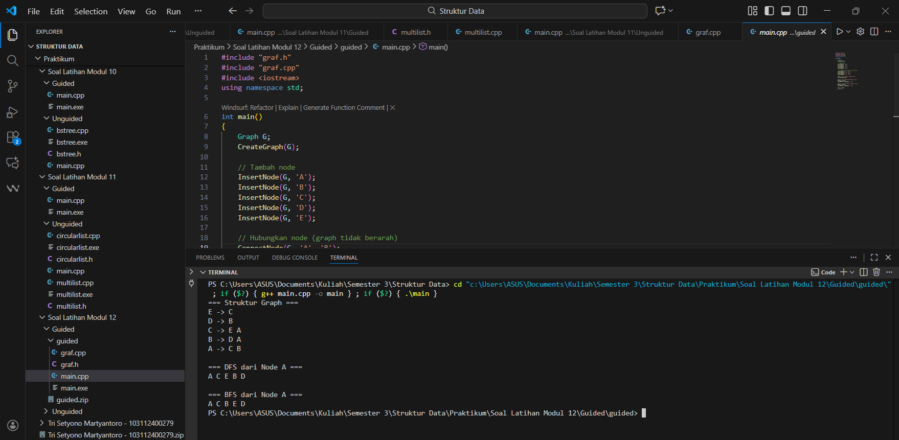
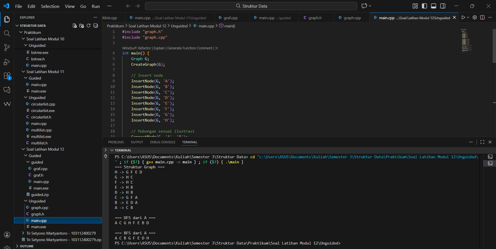

---
<h1 align="center">Laporan Praktikum Modul 12 <br>Graph
</h1>

<p align="center">Tri Setyono Martyantoro - 103112400279</p>
<p align="center">S1IF - 12 - 07</p>


---
## Dasar Teori - Graph

---
Pada modul ke-12 ini mempelajari struktur data Graph, yaitu struktur data non-linear yang digunakan untuk merepresentasikan hubungan atau keterkaitan antar data. Graph terdiri dari dua komponen utama, yaitu _vertex_ (simpul) dan _edge_ (sisi). Vertex digunakan untuk merepresentasikan objek, sedangkan edge digunakan untuk merepresentasikan hubungan antar objek tersebut. Struktur graph banyak digunakan untuk memodelkan permasalahan dunia nyata, seperti peta jalan, jaringan komputer, media sosial, dan sistem transportasi.

Graph dapat dibedakan menjadi beberapa jenis, di antaranya graph berarah (_directed graph_) dan graph tidak berarah (_undirected graph_), serta graph berbobot (_weighted graph_) dan tidak berbobot. Pada graph berarah, edge memiliki arah tertentu dari satu vertex ke vertex lain, sedangkan pada graph tidak berarah hubungan antar vertex bersifat dua arah. Sementara itu, graph berbobot memiliki nilai atau bobot pada setiap edge yang biasanya digunakan untuk menunjukkan jarak, biaya, atau waktu.

Dalam implementasinya, graph dapat direpresentasikan menggunakan beberapa cara, yaitu _adjacency matrix_ dan _adjacency list_. Adjacency matrix menggunakan matriks dua dimensi untuk menunjukkan hubungan antar vertex, sehingga mudah dipahami namun membutuhkan memori yang besar. Adjacency list menggunakan daftar linked list untuk setiap vertex, sehingga lebih efisien dalam penggunaan memori terutama untuk graph dengan jumlah edge yang sedikit.

## Guided
---
### graf.h
```cpp
#ifndef GRAF_H_INCLUDED
#define GRAF_H_INCLUDED

#include <iostream>
using namespace std;

typedef char infoGraph;

struct ElmNode;
struct ElmEdge;

typedef ElmNode *adrNode;
typedef ElmEdge *adrEdge;

struct ElmNode
{
    infoGraph info;
    int visited;
    adrEdge firstEdge;
    adrNode next;
};

struct ElmEdge
{
    adrNode node;
    adrEdge next;
};

struct Graph
{
    adrNode first;
};

// PRIMITIF GRAPH
void CreateGraph(Graph &G);
adrNode AllocateNode(infoGraph X);
adrEdge AllocateEdge(adrNode N);
void InsertNode(Graph &G, infoGraph X);
adrNode FindNode(Graph G, infoGraph X);
void ConnectNode(Graph &G, infoGraph A, infoGraph B);
void PrintInfoGraph(Graph G);

// Traversal
void ResetVisited(Graph &G);
void PrintDFS(Graph &G, adrNode N);
void PrintBFS(Graph &G, adrNode N);

#endif
```
### graf.cpp
```cpp
#include "graf.h"
#include <queue>
#include <stack>

void CreateGraph(Graph &G)
{
    G.first = NULL;
}

adrNode AllocateNode(infoGraph X)
{
    adrNode P = new ElmNode;
    P->info = X;
    P->visited = 0;
    P->firstEdge = NULL;
    P->next = NULL;
    return P;
}

adrEdge AllocateEdge(adrNode N)
{
    adrEdge P = new ElmEdge;
    P->node = N;
    P->next = NULL;
    return P;
}

void InsertNode(Graph &G, infoGraph X)
{
    adrNode P = AllocateNode(X);
    P->next = G.first;
    G.first = P;
}

adrNode FindNode(Graph G, infoGraph X)
{
    adrNode P = G.first;
    while (P != NULL)
    {
        if (P->info == X)
            return P;
        P = P->next;
    }
    return NULL;
}

void ConnectNode(Graph &G, infoGraph A, infoGraph B)
{
    adrNode N1 = FindNode(G, A);
    adrNode N2 = FindNode(G, B);
    if (N1 == NULL || N2 == NULL)
    {
        cout << "Node tidak ditemukan!\n";
        return;
    }

    // Buat edge dari N1 ke N2
    adrEdge E1 = AllocateEdge(N2);
    E1->next = N1->firstEdge;
    N1->firstEdge = E1;

    // Karena undirected → buat edge balik
    adrEdge E2 = AllocateEdge(N1);
    E2->next = N2->firstEdge;
    N2->firstEdge = E2;
}

void PrintInfoGraph(Graph G)
{
    adrNode P = G.first;
    while (P != NULL)
    {
        cout << P->info << " -> ";
        adrEdge E = P->firstEdge;
        while (E != NULL)
        {
            cout << E->node->info << " ";
            E = E->next;
        }
        cout << endl;
        P = P->next;
    }
}

void ResetVisited(Graph &G)
{
    adrNode P = G.first;
    while (P != NULL)
    {
        P->visited = 0;
        P = P->next;
    }
}

void PrintDFS(Graph &G, adrNode N)
{
    if (N == NULL)
        return;
    N->visited = 1;
    cout << N->info << " ";
    adrEdge E = N->firstEdge;
    while (E != NULL)
    {
        if (E->node->visited == 0)
        {
            PrintDFS(G, E->node);
        }
        E = E->next;
    }
}

void PrintBFS(Graph &G, adrNode N)
{
    if (N == NULL)
        return;
    queue<adrNode> Q;
    Q.push(N);
    while (!Q.empty())
    {
        adrNode curr = Q.front();
        Q.pop();
        if (curr->visited == 0)
        {
            curr->visited = 1;
            cout << curr->info << " ";
            adrEdge E = curr->firstEdge;
            while (E != NULL)
            {
                if (E->node->visited == 0)
                {
                    Q.push(E->node);
                }
                E = E->next;
            }
        }
    }
}
```
### main.cpp
```cpp
#include "graf.h"
#include "graf.cpp"
#include <iostream>
using namespace std;

int main()
{
    Graph G;
    CreateGraph(G);

    // Tambah node
    InsertNode(G, 'A');
    InsertNode(G, 'B');
    InsertNode(G, 'C');
    InsertNode(G, 'D');
    InsertNode(G, 'E');

    // Hubungkan node (graph tidak berarah
    ConnectNode(G, 'A', 'B');
    ConnectNode(G, 'A', 'C')
    ConnectNode(G, 'B', 'D');
    ConnectNode(G, 'C', 'E');

    cout << "=== Struktur Graph ===\n";
    PrintInfoGraph(G);

    cout << "\n=== DFS dari Node A ===\n";
    ResetVisited(G);
    PrintDFS(G, FindNode(G, 'A'));

    cout << "\n\n=== BFS dari Node A ===\n";
    ResetVisited(G);
    PrintBFS(G, FindNode(G, 'A'));

    cout << endl;
    return 0;
}
```
### Output Code

Program di atas merupakan implementasi struktur data graph tidak berarah menggunakan bahasa C++ dengan representasi adjacency list. Graph dibangun dari beberapa node yang saling terhubung melalui edge, di mana setiap node menyimpan data, penanda kunjungan, dan daftar node yang terhubung dengannya. Program dimulai dengan membuat graph kosong, kemudian menambahkan node A, B, C, D, dan E serta menghubungkannya menggunakan fungsi ConnectNode. Karena graph bersifat tidak berarah, setiap hubungan dibuat dua arah. Struktur graph yang terbentuk ditampilkan untuk menunjukkan keterhubungan antar node. Selanjutnya, program melakukan traversal graph menggunakan metode Depth First Search (DFS) dan Breadth First Search (BFS) yang diawali dari node A. Sebelum traversal, status kunjungan node di-reset terlebih dahulu. Hasil DFS dan BFS ditampilkan untuk memperlihatkan perbedaan urutan penelusuran graph.

---
## Unguided
---
## Soal Latihan Modul 12

---

> 1. Buatlah ADT Graph tidak berarah file “graph.h”:

```
Type infoGraph: char
Type adrNode : pointer to ElmNode
Type adrEdge : pointer to ElmNode
Type ElmNode <
    info : infoGraph
    visited : integer
    firstEdge : adrEdge
    Next : adrNode
>
Type ElmEdge <
    Node : adrNode
    Next : adrEdge
>
Type Graph <
    first : adrNode
>
procedure CreateGraph (input/output G : Graph)
procedure InsertNode (input/output G : Graph,
    input X : infotype)
procedure ConnectNode (input/output N1, N2 : adrNode)
procedure PrintInfoGraph (input G : Graph)
```

> Buatlah implementasi ADT Graph pada file “graph.cpp” dan cobalah hasil implementasi ADT pada file “main.cpp”.

> 2. Buatlah prosedur untuk menampilkan hasil penelusuran DFS. prosedur PrintDFS (Graph G, adrNode N);

> 3. Buatlah prosedur untuk menampilkanhasil penelusuran DFS. prosedur PrintBFS (Graph G, adrNode N);
### graph.h
```cpp
#ifndef GRAPH_H_INCLUDED
#define GRAPH_H_INCLUDED

#include <iostream>
using namespace std;

typedef char infoGraph;

struct ElmNode;
struct ElmEdge;

typedef ElmNode* adrNode;
typedef ElmEdge* adrEdge;

struct ElmEdge {
    adrNode node;
    adrEdge next;
};

struct ElmNode {
    infoGraph info;
    int visited;
    adrEdge firstEdge;
    adrNode next;
};

struct Graph {
    adrNode first;
};

// Primitif Graph
void CreateGraph(Graph &G);
adrNode AllocateNode(infoGraph X);
adrEdge AllocateEdge(adrNode N);

void InsertNode(Graph &G, infoGraph X);
adrNode FindNode(Graph G, infoGraph X);
void ConnectNode(Graph &G, infoGraph A, infoGraph B);

void PrintInfoGraph(Graph G);

// Traversal
void ResetVisited(Graph &G);
void PrintDFS(Graph &G, adrNode N);
void PrintBFS(Graph &G, adrNode N);

#endif
```
### graph.cpp
```cpp
#include "graph.h"
#include <queue>

void CreateGraph(Graph &G) {
    G.first = NULL;
}

adrNode AllocateNode(infoGraph X) {
    adrNode P = new ElmNode;
    P->info = X;
    P->visited = 0;
    P->firstEdge = NULL;
    P->next = NULL;
    return P;
}

adrEdge AllocateEdge(adrNode N) {
    adrEdge P = new ElmEdge;
    P->node = N;
    P->next = NULL;
    return P;
}

void InsertNode(Graph &G, infoGraph X) {
    adrNode P = AllocateNode(X);
    P->next = G.first;
    G.first = P;
}

adrNode FindNode(Graph G, infoGraph X) {
    adrNode P = G.first;
    while (P != NULL) {
        if (P->info == X) return P;
        P = P->next;
    }
    return NULL;
}

void ConnectNode(Graph &G, infoGraph A, infoGraph B) {
    adrNode N1 = FindNode(G, A);
    adrNode N2 = FindNode(G, B);

    if (N1 == NULL || N2 == NULL) return;

    // edge A -> B
    adrEdge E1 = AllocateEdge(N2);
    E1->next = N1->firstEdge;
    N1->firstEdge = E1;

    // edge B -> A (tidak berarah)
    adrEdge E2 = AllocateEdge(N1);
    E2->next = N2->firstEdge;
    N2->firstEdge = E2;
}

void PrintInfoGraph(Graph G) {
    adrNode P = G.first;
    while (P != NULL) {
        cout << P->info << " -> ";
        adrEdge E = P->firstEdge;
        while (E != NULL) {
            cout << E->node->info << " ";
            E = E->next;
        }
        cout << endl;
        P = P->next;
    }
}

void ResetVisited(Graph &G) {
    adrNode P = G.first;
    while (P != NULL) {
        P->visited = 0;
        P = P->next;
    }
}

void PrintDFS(Graph &G, adrNode N) {
    if (N == NULL) return;

    N->visited = 1;
    cout << N->info << " ";

    adrEdge E = N->firstEdge;
    while (E != NULL) {
        if (E->node->visited == 0)
            PrintDFS(G, E->node);
        E = E->next;
    }
}

void PrintBFS(Graph &G, adrNode N) {
    if (N == NULL) return;

    queue<adrNode> Q;
    Q.push(N);
    N->visited = 1;

    while (!Q.empty()) {
        adrNode cur = Q.front();
        Q.pop();
        cout << cur->info << " ";

        adrEdge E = cur->firstEdge;
        while (E != NULL) {
            if (E->node->visited == 0) {
                E->node->visited = 1;
                Q.push(E->node);
            }
            E = E->next;
        }
    }
}
```
### main.cpp
```cpp
#include "graph.h"
#include "graph.cpp"

int main() {
    Graph G;
    CreateGraph(G);

    InsertNode(G, 'A');
    InsertNode(G, 'B');
    InsertNode(G, 'C');
    InsertNode(G, 'D');
    InsertNode(G, 'E');
    InsertNode(G, 'F');
    InsertNode(G, 'G');
    InsertNode(G, 'H');

    ConnectNode(G, 'A', 'B');
    ConnectNode(G, 'A', 'C');
    ConnectNode(G, 'B', 'D');
    ConnectNode(G, 'B', 'E');
    ConnectNode(G, 'C', 'F');
    ConnectNode(G, 'C', 'G');
    ConnectNode(G, 'D', 'H');
    ConnectNode(G, 'E', 'H');
    ConnectNode(G, 'F', 'H');
    ConnectNode(G, 'G', 'H');

    cout << "=== Struktur Graph ===\n";
    PrintInfoGraph(G);

    cout << "\n=== DFS dari A ===\n";
    ResetVisited(G);
    PrintDFS(G, FindNode(G, 'A'));

    cout << "\n\n=== BFS dari A ===\n";
    ResetVisited(G);
    PrintBFS(G, FindNode(G, 'A'));

    return 0;
}
```
### Output Code

Program di atas dibuat untuk mengimplementasikan struktur data graph tidak berarah menggunakan bahasa C++ dengan representasi adjacency list. Setiap node pada graph menyimpan informasi berupa data, penanda visited, serta daftar edge yang menunjukkan hubungan antar node. Program ini juga menyediakan proses penelusuran graph menggunakan Depth First Search (DFS) dan Breadth First Search (BFS). DFS dilakukan dengan menelusuri node secara mendalam menggunakan pemanggilan rekursif, sedangkan BFS menelusuri node secara bertahap menggunakan queue. Pada bagian main, graph dibentuk sesuai ilustrasi yang diberikan, kemudian dilakukan penelusuran DFS dan BFS dari node A untuk melihat urutan kunjungan setiap node.

---

[1] Modul Praktikum Struktur Data – Graph, Politeknik Elektronika Negeri Surabaya.  
[https://yuliana.lecturer.pens.ac.id/Struktur%20Data%20C/Prak%20SD%20-%20pdf/Praktikum%2012.pdf](https://yuliana.lecturer.pens.ac.id/Struktur%20Data%20C/Prak%20SD%20-%20pdf/Praktikum%2012.pdf)

[2] GeeksforGeeks. (2022). “Introduction to Graph Data Structure.”  
[https://www.geeksforgeeks.org/graph-data-structure-and-algorithms/](https://www.geeksforgeeks.org/graph-data-structure-and-algorithms/)

[3] Idris, M. (2021). “Struktur Data Graph: Konsep dan Implementasi.” _Jurnal Informatika dan Sistem Komputer_, 9(1).  
https://repository.unikom.ac.id/46091/1/GRAPH.pdf

---


