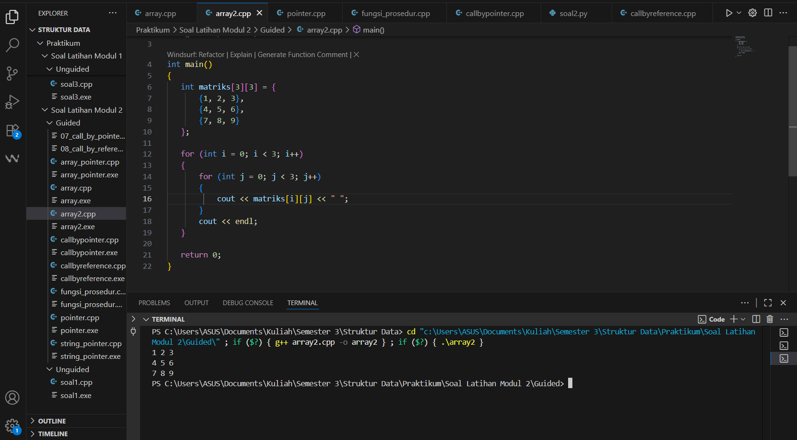

---
<h1 align="center">Laporan Praktikum Modul 2 <br>Pengenalan Bahasa C++ (Bagian Kedua)
</h1>

<p align="center">Tri Setyono Martyantoro - 103112400279</p>
<p align="center">S1IF - 12 - 07</p>


---
## Dasar Teori
---
Pada modul kedua ini, pembahasan difokuskan pada konsep pengelolaan data dan memori dalam bahasa C++ melalui penggunaan Array, Pointer, serta penerapan fungsi dan prosedur dengan mekanisme call by reference. Array merupakan struktur data yang digunakan untuk menyimpan sekumpulan elemen dengan tipe data yang sama di bawah satu nama variabel. Setiap elemen dalam array dapat diakses menggunakan indeks, yang dimulai dari 0 untuk elemen pertama. Dalam implementasinya, array dapat berbentuk satu dimensi, dua dimensi, atau bahkan multidimensi tergantung kebutuhan penyimpanan data. Penggunaan array membantu efisiensi pengelolaan data karena elemen-elemen disimpan secara berurutan dalam memori.

Pointer merupakan variabel khusus yang berfungsi untuk menyimpan **alamat memori** dari variabel lain. Dengan menggunakan operator address-of (&), programmer dapat memperoleh alamat dari suatu variabel, sedangkan dengan operator dereference , nilai yang tersimpan di alamat tersebut dapat diakses atau dimodifikasi. Pointer juga memiliki keterkaitan erat dengan array, karena nama sebuah array pada dasarnya adalah pointer konstan yang menunjuk ke alamat elemen pertamanya. Pemahaman pointer menjadi penting dalam konteks pengelolaan memori dinamis serta dalam pembentukan struktur data seperti linked list dan stack.

Fungsi dan prosedur digunakan untuk membagi program menjadi bagian-bagian yang lebih kecil dan terstruktur. Fungsi mengembalikan sebuah nilai hasil proses, sedangkan prosedur (fungsi bertipe void) hanya menjalankan instruksi tanpa mengembalikan nilai. Dalam pemanggilan fungsi, terdapat beberapa cara untuk mengirimkan parameter, yaitu call by value, call by pointer, dan call by reference. Pada call by value, nilai variabel dikirim sebagai salinan ke fungsi sehingga perubahan di dalam fungsi tidak mempengaruhi nilai asli. Pada call by pointer, alamat memori variabel dikirim sehingga perubahan di fungsi akan mengubah nilai asli variabel tersebut. Sedangkan pada call by reference, parameter yang dikirim menggunakan tanda & agar menjadi alias langsung dari variabel aslinya, membuatnya lebih sederhana dan aman dibanding penggunaan pointer.

## Guided
---
### 1. Array

```cpp
#include <iostream>
using namespace std;

int main()
{
    int nilai [5] = {1, 2, 3, 4, 5};
    for (int i = 0; i < 5; i++)
    {
        cout << "Elemen ke-" << i << " = " << nilai[i] << endl;
    }
    return 0;
}
```
### Output Code

Program di atas adalah program yang tujuannya menampilkan isi array. Pada program ini, dibuat sebuah array bernama nilai dengan ukuran 5 elemen yang berisi angka 1 sampai 5. Untuk menampilkan setiap elemen, digunakan perulangan for dengan variabel **i** sebagai penghitung indeks. Perulangan berjalan mulai dari indeks 0 sampai 4, sehingga semua elemen array bisa diakses. Setiap kali perulangan berjalan, program akan menampilkan teks "Elemen ke-i" disertai dengan nilai dari array pada indeks tersebut. Dengan begitu, hasil akhirnya berupa daftar isi array lengkap dari elemen pertama sampai terakhir.

### 2. Array Dua Dimensi

```cpp
#include <iostream>
using namespace std;

int main()
{
   int matriks[3][3] = {
       {1, 2, 3},
       {4, 5, 6},
       {7, 8, 9}
   };

   for (int i = 0; i < 3; i++)
   {
       for (int j = 0; j < 3; j++)
       {
           cout << matriks[i][j] << " ";
       }
       cout << endl;
   }
   return 0;
}
```
### Output Code

Program di atas adalah program yang digunakan untuk menampilkan isi dari sebuah array dua dimensi atau yang biasa disebut matriks. Pada program ini, dibuat sebuah array bernama matriks dengan ukuran 3x3 yang berisi angka dari 1 sampai 9. Untuk menampilkan seluruh isi matriks, digunakan dua buah perulangan for yang bersarang. Perulangan pertama dengan variabel i berfungsi untuk mengakses baris, sedangkan perulangan kedua dengan variabel j berfungsi untuk mengakses kolom. Di dalam perulangan, program akan mencetak setiap elemen matriks sesuai posisi indeks baris dan kolomnya, lalu memberikan spasi setelah angka. Setelah satu baris selesai ditampilkan, program mencetak endl agar hasilnya pindah ke baris baru.

### 3. Pointer

```cpp
#include <iostream>
using namespace std;

int main()
{
    int umur = 25;
    int *p_umur;
    p_umur = &umur;
    cout << "Nilai 'umur': " << umur << endl;
    cout << "Alamat memori 'umur': " << &umur << endl;
    cout << "Nilai 'p_umur' (alamat): " << umur << endl;
    cout << "Nilai yang diakses 'p_umur': " << *p_umur << endl;
    cout << "Alamat memori dari pointer 'p_umur'itu sendiri: " << &p_umur << endl;
    return 0;
}
```
### OutputCode

Program di atas merupakan contoh penggunaan pointer. Pada program ini, pertama dideklarasikan sebuah variabel bernama umur dengan nilai 25. Kemudian dibuat sebuah pointer bernama p_umur yang bertipe integer dan digunakan untuk menyimpan alamat dari variabel umur dengan cara memberikan nilai &umur. Setelah itu, program menampilkan beberapa informasi. Pertama, menampilkan nilai dari variabel umur itu sendiri. Kedua, menampilkan alamat memori tempat variabel umur disimpan. Ketiga, seharusnya program menampilkan nilai dari pointer p_umur, yaitu alamat memori dari variabel umur. Namun pada kode tertulis umur sehingga yang ditampilkan masih nilai 25, bukan alamatnya. Keempat, program menampilkan nilai yang ditunjuk oleh pointer dengan menggunakan p_umur, hasilnya sama dengan isi variabel umur yaitu 25. Kelima, program menampilkan alamat memori dari pointer p_umur itu sendiri dengan menggunakan &p_umur.
### 4. Array Pointer

```cpp
#include <iostream>
using namespace std;

int main()
{
    int data [5] = {10, 20, 30, 40, 50};
    int *p_data = data;

    cout << "Mengakses elemen array cara normal:" << endl;
    for (int i = 0; i < 5; i++)
    {
        cout << "Elemen ke-" << i << " = " << data[i] << endl;
    }
    cout << "Mengakses elemen array menggunakan pointer:" << endl;
    for (int i = 0; i < 5; i++)
    {
        cout << "Elemen ke-" << i << ": " << *(p_data + i) << endl;
    }
    return 0;
}
```
### Output Code

Program di atas merupakan contoh penggunaan pointer untuk mengakses elemen-elemen dalam sebuah array. Pada program ini, pertama dibuat sebuah array dengan nama `data` yang berisi lima nilai integer, yaitu 10, 20, 30, 40, dan 50. Setelah itu dideklarasikan sebuah pointer p_data yang juga bertipe integer dan langsung diinisialisasi dengan data. Karena nama array sebenarnya mewakili alamat dari elemen pertamanya, maka p_data otomatis menunjuk ke elemen pertama array tersebut. Selanjutnya, program menampilkan isi array dengan dua cara berbeda. Cara pertama adalah cara biasa, yaitu menggunakan indeks data[i], di mana setiap elemen array ditampilkan mulai dari elemen ke-0 sampai ke-4. Cara kedua menggunakan pointer, dengan menuliskan (p_data + i). Ekspresi ini artinya kita mengakses nilai dari alamat memori yang ditunjuk pointer setelah digeser sebanyak i posisi. Hasil yang ditampilkan melalui cara ini sama persis dengan cara pertama, yaitu menampilkan nilai 10, 20, 30, 40, dan 50 secara berurutan.
### 5. String Pointer 

```cpp
#include <iostream>
using namespace std;

int main()
{
    char pesan_array[] = "Nasi Padang";        
    char *pesan_pointer = "Ayam Bakar 23";

    cout << "String Array: " << pesan_array << endl;
    cout << "String Pointer: " << pesan_pointer << endl;

    pesan_array[0] = 'h';
    cout << "String Array setelah diubah: " << pesan_array << endl;

    pesan_pointer = "Sariman";
    cout << "String Pointer setelah merujuk ke string lain: " << pesan_pointer << endl;

    return 0;
}
```

### Output Code

Program di atas pada dasarnya menunjukkan bagaimana sebuah teks (string) bisa disimpan dan digunakan dengan dua cara yang berbeda. Pertama, teks disimpan langsung di dalam sebuah wadah (array karakter), sehingga isi dari teks tersebut bisa diubah huruf per huruf. Kedua, teks disimpan sebagai alamat dari sebuah kalimat tetap (string literal), jadi sebenarnya pointer hanya menunjuk ke posisi teks yang sudah ada, bukan menyimpan salinannya. Di bagian awal, program menyimpan tulisan "Nasi Padang" di dalam wadah yang bisa diubah, dan menyimpan tulisan "Ayam Bakar 23" sebagai alamat yang ditunjuk oleh pointer. Setelah itu, program menampilkan kedua tulisan tersebut. Lalu, huruf pertama dari "Nasi Padang" diganti menjadi 'h', sehingga hasilnya berubah menjadi "hasi Padang". Berikutnya, pointer yang tadinya menunjuk ke "Ayam Bakar 23" diarahkan untuk menunjuk ke tulisan lain yaitu "Sariman". Jadi ketika ditampilkan kembali, yang keluar bukan "Ayam Bakar 23" lagi, melainkan "Sariman".

### 6. Fungsi Prosedur

```cpp
#include <iostream>
using namespace std;

int hitungJumlah(int a, int b)
{
    int total = a + b;
    return total;
}

void tampilkanHasil(int hasil)
{
    std::cout << "Hasil penjumlahannya adalah: " << hasil << std::endl;
}

int main()
{
    int angka1 = 15;
    int angka2 = 10;
    int hasilJumlah;

    hasilJumlah = hitungJumlah(angka1, angka2);
    tampilkanHasil(hasilJumlah);
    return 0;
}
```
### Output Code

Program di atas merupakan contoh penggunaan fungsi dan prosedur dalam pemrograman C++. Pada program ini terdapat dua bagian utama selain fungsi main(), yaitu hitungJumlah dan tampilkanHasil. Pertama, dibuat sebuah fungsi bernama hitungJumlah yang memiliki dua parameter bertipe integer, yaitu a dan b. Di dalam fungsi ini, kedua parameter dijumlahkan dan hasilnya disimpan dalam variabel total. Nilai total kemudian dikembalikan menggunakan return. 
Kedua, dibuat sebuah prosedur bernama tampilkanHasil yang bertipe void. Prosedur ini tidak mengembalikan nilai, tetapi hanya menampilkan teks ke layar berupa hasil penjumlahan yang diberikan sebagai parameter hasil. Selanjutnya, di dalam fungsi main(), dibuat dua variabel integer angka1 dengan nilai 15 dan angka2 dengan nilai 10, serta sebuah variabel hasilJumlah. Kemudian, fungsi hitungJumlah dipanggil dengan memasukkan angka1 dan angka2 sebagai argumen. Nilai kembalian dari fungsi tersebut disimpan pada variabel hasilJumlah. Setelah itu, prosedur tampilkanHasil dipanggil dengan memberikan hasilJumlah sebagai argumen.

### 7. Call By Pointer

```cpp
#include <iostream>
using namespace std;

void tukar(int *px, int *py)
{
    int temp = *px;
    *px = *py;
    *py = temp;

}

int main()
{
    int a = 10, b = 20;
    cout << "Sebelum ditukar: a = " << a << ", b = " << b << endl;
    tukar(&a, &b);
    cout << "Setelah ditukar: a = " << a << ", b = " << b << endl;
    return 0;
}
```
### Output Code

Program di atas digunakan untuk menukar nilai dari dua variabel dengan bantuan pointer. Pada program ini terdapat sebuah prosedur bernama tukar yang bertipe void. Prosedur ini menerima dua parameter berupa pointer ke integer, yaitu px dan py. Di dalam prosedur, nilai yang ditunjuk oleh px disimpan terlebih dahulu dalam variabel sementara temp. Selanjutnya, nilai yang ditunjuk px diganti dengan nilai yang ditunjuk py, lalu nilai py diisi dengan temp.  Pada fungsi main(), dideklarasikan dua variabel integer a = 10 dan b = 20. Program pertama menampilkan nilai keduanya sebelum ditukar. Setelah itu, prosedur tukar dipanggil dengan memberikan alamat a dan b (&a dan &b) sebagai argumen. Karena yang diberikan adalah alamat, maka perubahan yang dilakukan di dalam prosedur akan langsung memengaruhi nilai asli dari a dan b.

### 8. Call By Reference

```cpp
#include <iostream>
using namespace std;

void tukar(int &x, int &y)
{
    int temp = x;
    x = y;
    y = temp;
}

int main()
{
    int a = 10, b = 20;
    cout << "Sebelum ditukar: a = " << a << ", b = " << b << endl;
    tukar(a, b);
    cout << "Setelah ditukar: a = " << a << ", b = " << b << endl;
    return 0;
}
```

### Output Code

Program di atas digunakan untuk menukar nilai dari dua variabel dengan bantuan parameter reference. Pada program ini terdapat sebuah prosedur bernama tukar yang bertipe void. Prosedur ini menerima dua parameter berupa reference ke integer, yaitu x dan y. Di dalam prosedur, nilai dari x disimpan terlebih dahulu dalam variabel sementara temp. Selanjutnya, nilai x diganti dengan nilai y, lalu nilai y diisi dengan temp. Dengan cara ini, nilai dari kedua variabel berhasil ditukar. Pada fungsi main(), dideklarasikan dua variabel integer a = 10 dan b = 20. Program pertama  menampilkan nilai keduanya sebelum ditukar. Setelah itu, prosedur tukar dipanggil dengan memberikan a dan b sebagai argumen. Karena parameter pada prosedur menggunakan reference, maka perubahan yang dilakukan di dalam prosedur akan langsung memengaruhi nilai asli dari a dan b.

## Unguided
---

## Soal Latihan Modul 2

---


> 1. Buatlah sebuah program untuk melakukan transpose pada sebuah matriks persegi berukuran 3x3. Operasi transpose adalah mengubah baris menjadi kolom dan sebaliknya. Inisialisasi matriks awal di dalam kode, kemudian buat logika untuk melakukan transpose dan simpan hasilnya ke dalam matriks baru. Terakhir, tampilkan matriks awal dan matriks hasil transpose.

Contoh Output:

Matriks Awal:
1 2 3
4 5 6
7 8 9

Matriks Hasil Transpose:
1 4 7
2 5 8
3 6 9

```cpp
#include <iostream>
using namespace std;

int main() {
    int matriks[3][3] = {
        {1, 2, 3},
        {4, 5, 6},
        {7, 8, 9}
    };

    int transpose[3][3];

    for (int i = 0; i < 3; i++) {
        for (int j = 0; j < 3; j++) {
            transpose[j][i] = matriks[i][j];
        }
    }

    cout << "Matriks Awal:" << endl;
    for (int i = 0; i < 3; i++) {
        for (int j = 0; j < 3; j++) {
            cout << matriks[i][j] << " ";
        }
        cout << endl;
    }
    cout << endl;

    cout << "Matriks Hasil Transpose:" << endl;
    for (int i = 0; i < 3; i++) {
        for (int j = 0; j < 3; j++) {
            cout << transpose[i][j] << " ";
        }
        cout << endl;
    }
    return 0;
}
```
### Output Code

Program di atas digunakan untuk menampilkan hasil transpose dari sebuah matriks berukuran 3x3. Jadi, program ini menukar posisi baris menjadi kolom dan kolom menjadi baris. Pertama, dibuat sebuah matriks awal bernama matriks yang sudah diisi dengan nilai tetap, yaitu angka dari 1 sampai 9. Nilai-nilai tersebut tersusun dalam bentuk matriks 3x3. Setelah itu, dibuat juga sebuah matriks baru bernama transpose yang berfungsi untuk menyimpan hasil dari proses transpose.
Selanjutnya, terdapat dua perulangan bersarang (for) yang digunakan untuk menukar posisi elemen-elemen matriks. Pada bagian ini, setiap elemen matriks[i][j] akan dipindahkan ke posisi transpose[j][i]. Artinya, elemen yang semula berada di baris ke-i dan kolom ke-j akan menjadi baris ke-j dan kolom ke-i. Setelah proses penukaran selesai, program menampilkan dua bagian hasil. Pertama, program menampilkan matriks awal seperti nilai yang diinisialisasi di awal. Kedua, program menampilkan matriks hasil transpose yang sudah ditukar posisi baris dan kolomnya.

>  2. . Buatlah program yang menunjukkan penggunaan call by reference. Buat sebuah prosedur bernama kuadratkan yang menerima satu parameter integer secara referensi (&). Prosedur ini akan mengubah nilai asli variabel yang dilewatkan dengan nilai kuadratnya. Tampilkan nilai variabel di main() sebelum dan sesudah memanggil prosedur untuk membuktikan perubahannya. 

Contoh Output:

Nilai awal: 5
Nilai setelah dikuadratkan: 25

```cpp
#include <iostream>
using namespace std;

void kuadrat(int &a)
{
    a = a * a;
}

int main() {
    int angka;

    cout << "Masukkan angka: ";
    cin >> angka;
    cout << "Nilai awal: " << angka << endl;
    kuadrat(angka);
    cout << "Nilai setelah dikuadratkan: " << angka << endl;

    return 0;
}
```
### Output Code

Program di atas digunakan untuk menunjukkan penggunaan call by reference, yaitu cara memanggil prosedur atau fungsi dengan memberikan referensi (alamat) dari variabel. Pertama, dibuat sebuah prosedur bernama kuadrat yang memiliki satu parameter bertipe integer dan menggunakan tanda & di depannya. Tanda & ini menandakan bahwa parameter tersebut diterima secara referensi, artinya prosedur akan bekerja langsung pada variabel asli, bukan salinannya.
Di dalam prosedur kuadrat, nilai parameter a dikalikan dengan dirinya sendiri (a = a * a;), sehingga menghasilkan nilai kuadrat dari variabel yang dikirim. Selanjutnya, di dalam fungsi main(), program meminta pengguna untuk memasukkan sebuah angka melalui input. Nilai yang dimasukkan disimpan dalam variabel angka. Setelah itu, program menampilkan nilai awal sebelum dilakukan proses kuadrat. Kemudian, prosedur kuadrat dipanggil dengan memberikan variabel `angka` sebagai argumen. Karena menggunakan call by reference, perubahan yang dilakukan di dalam prosedur akan langsung memengaruhi variabel angka di fungsi main().

---
### Referensi
---
[1] Wijaya, R., & Sari, T. (2023). _Implementasi Konsep Array dan Pointer dalam Pengelolaan Data Menggunakan Bahasa C++._ Jurnal Teknologi dan Sistem Informasi, 11(1), 65–73. https://jurnal.stmikroyal.ac.id/index.php/jtsi/article/view/4108
[2] Nugroho, D. (2022). _Analisis Pemanfaatan Fungsi dan Prosedur dalam Bahasa Pemrograman C++ untuk Efisiensi Program._ Jurnal Informatika dan Aplikasi Komputer, 7(2), 112–120. https://ejournal.bsi.ac.id/ejurnal/index.php/jika/article/view/2167
[3] Putra, A. R., & Santoso, L. (2021). _Perbandingan Mekanisme Call by Value dan Call by Reference dalam Bahasa Pemrograman C++._ Jurnal Ilmiah Teknologi dan Rekayasa, 9(3), 189–196. https://journal.uny.ac.id/index.php/jitk/article/view/2782


