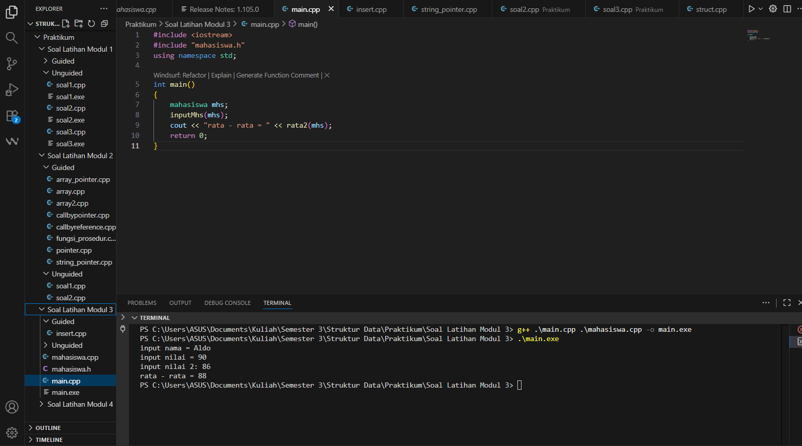

---
<h1 align="center">Laporan Praktikum Modul 3 <br>Abstract Data Type
</h1>

<p align="center">Tri Setyono Martyantoro - 103112400279</p>
<p align="center">S1IF - 12 - 07</p>


---
## Dasar Teori - Abstract Data Type (ADT)

---
Pada Modul ketiga ini membahas ADT sebagai konsep yang membantu programmer memisahkan antara apa operasi terhadap data dan bagaimana data itu diolah. Dengan ADT, kita bisa menggunakan fungsi-fungsi (seperti tampil, tukar, input) tanpa perlu tahu detail internal dari data tersebut.

ADT sering diimplementasikan menggunakan struct, class, atau modul tertentu, bila struktur data seperti array atau pointer disembunyikan dari pengguna ADT. Ini memungkinkan pengguna hanya berinteraksi lewat interface (operasi) dan tidak mengutak-atik representasi internalnya. Dokumen ajar menyebutkan bahwa ADT adalah kumpulan data dan operasi yang dapat memanipulasi data tersebut, serta implementasi internalnya disembunyikan agar interface tetap konsisten. 

Selain itu, di dalam kurikulum pengantar struktur data, dikatakan bahwa tipe data abstrak (ADT) seperti stack dan queue menjadi bagian penting yang harus dipahami karena mereka tidak tergantung pada implementasi tertentu (misalnya menggunakan array atau linked list).

## Guided
---
### mahasiswa.h

```cpp
#ifndef MAHASISWA_H_INCLUDED
#define MAHASISWA_H_INCLUDED

struct mahasiswa
{
    char nim[10];
    int nilai1, nilai2;
};
void inputMhs(mahasiswa &m);
float rata2(mahasiswa m);
#endif
```

Kode `mahasiswa.h` ini berfungsi untuk mendefinisikan **struktur data mahasiswa** dan **deklarasi fungsi** yang akan digunakan di program utama. Bagian `#ifndef`, `#define`, dan `#endif` disebut header guard, tujuannya agar file ini tidak dibaca lebih dari sekali oleh compiler. Di dalamnya ada struct mahasiswa yang menyimpan NIM, nilai1, dan nilai2.  
Lalu ada dua fungsi:
- `inputMhs(mahasiswa &m)` untuk mengisi data mahasiswa.
- `rata2(mahasiswa m)` untuk menghitung rata-rata nilai mahasiswa.
### mahasiswa.cpp

```cpp
#include "mahasiswa.h"
#include <iostream>

using namespace std;

void inputMhs(mahasiswa &m)
{
    cout << "input nama = ";
    cin >> (m).nim;
    cout << "input nilai = ";
    cin >> (m).nilai1;
    cout << "input nilai 2: ";
    cin >> (m).nilai2;
}
float rata2(mahasiswa m)
{
    return float(m.nilai1 + m.nilai2) / 2;
}
```

Kode ini adalah lanjutan dari file `mahasiswa.h`. Bagian `#include "mahasiswa.h"` digunakan untuk menghubungkan file ini dengan file header, sedangkan `#include <iostream>` dan `using namespace std;` supaya program bisa menggunakan perintah input dan output seperti cin dan cout. Fungsi `inputMhs` digunakan untuk memasukkan data mahasiswa. Di dalamnya, program akan meminta pengguna mengetik NIM, nilai pertama, dan nilai kedua. Karena parameter menggunakan tanda `&`, data yang diubah di dalam fungsi ini langsung tersimpan pada variabel mahasiswa yang ada di program utama. Fungsi rata2 digunakan untuk menghitung rata-rata nilai mahasiswa. Nilai pertama dan nilai kedua dijumlahkan lalu dibagi dua, hasilnya dikembalikan dalam bentuk float agar bisa menampilkan angka desimal.
### main.cpp

```cpp
#include <iostream>
#include "mahasiswa.h"

using namespace std;

int main()
{
    mahasiswa mhs;
    inputMhs(mhs);
    cout << "rata - rata = " << rata2(mhs);
    return 0;
}
```

Kode di file main.cpp ini adalah program utama yang menjalankan keseluruhan proses dari struktur dan fungsi yang sudah dibuat di mahasiswa.h dan mahasiswa.cpp. Di dalam fungsi main(), dibuat satu variabel bernama `mhs` dengan tipe mahasiswa. Variabel ini akan menyimpan data mahasiswa seperti NIM dan dua nilai. Lalu, program memanggil fungsi inputMhs(mhs) untuk meminta pengguna memasukkan data tersebut. Setelah data dimasukkan, baris 
```cpp
cout << "rata - rata = " << rata2(mhs);
```
akan menampilkan hasil rata-rata dari dua nilai yang sudah dihitung oleh fungsi rata2().
### Output Code

## Unguided
---
## Soal Latihan Modul 3

---

> 1. **Buat program yang dapat menyimpan data mahasiswa (max. 10) ke dalam sebuah array** dengan field nama, NIM, UTS, UAS, tugas, dan nilai akhir. Nilai akhir diperoleh dari **fungsi** dengan rumus:

$$
\text{Nilai Akhir} = (0.3 \times \text{UTS}) + (0.4 \times \text{UAS}) + (0.3 \times \text{Tugas})
$$

```cpp
#include <iostream>
using namespace std;

struct Mahasiswa {
    string nama, nim;
    float uts, uas, tugas, nilaiAkhir;
};

float hitungNilaiAkhir(float uts, float uas, float tugas) {
    return (0.3 * uts) + (0.4 * uas) + (0.3 * tugas);
}

int main() {
    Mahasiswa mhs[10];
    int n;

    cout << "Jumlah mahasiswa (max 10): ";
    cin >> n;
    cin.ignore();

    for (int i = 0; i < n; i++) {
        cout << "\nData mahasiswa ke-" << i + 1 << endl;
        cout << "Nama : ";
        cin >> mhs[i].nama;
        cout << "NIM  : "
        cin >> mhs[i].nim;
        cout << "UTS  : ";
        cin >> mhs[i].uts;
        cout << "UAS  : ";
        cin >> mhs[i].uas;
        cout << "Tugas: ";
        cin >> mhs[i].tugas;
        cin.ignore();

        mhs[i].nilaiAkhir = hitungNilaiAkhir(mhs[i].uts, mhs[i].uas, mhs[i].tugas);
    }

    cout << "\n===== DATA MAHASISWA =====" << endl;
    for (int i = 0; i < n; i++) {
        cout << "\nNama        : " << mhs[i].nama;
        cout << "\nNIM         : " << mhs[i].nim;
        cout << "\nUTS         : " << mhs[i].uts;
        cout << "\nUAS         : " << mhs[i].uas;
        cout << "\nTugas       : " << mhs[i].tugas;
        cout << "\nNilai Akhir : " << mhs[i].nilaiAkhir << endl;
    }
    return 0;
}
```
### Output Code

Program di atas digunakan untuk mencatat dan menghitung nilai akhir beberapa mahasiswa. Di dalamnya ada struct Mahasiswa yang berisi nama, NIM, nilai UTS, UAS, tugas, dan nilai akhir supaya datanya lebih rapi. Kemudian terdapat fungsi hitungNilaiAkhir() untuk menghitung nilai akhir dengan rumus (0.3 * UTS) + (0.4 * UAS) + (0.3 * Tugas). Di bagian main(), pengguna diminta mengisi jumlah mahasiswa, lalu memasukkan data masing-masing seperti nama, NIM, dan nilai-nilainya. Setelah itu, program langsung menghitung nilai akhir tiap mahasiswa dan menampilkannya sebagai output.

>  2. Buatlah ADT pelajaran sebagai berikut di dalam file “pelajaran.h”:

```
Type pelajaran <
	namaMapel : string
	kodeMapel : string
>
	function create_pelajaran( namapel : string,
	kodepel : string ) → pelajaran
	procedure tampil_pelajaran( input pel : pelajaran )
```

> Buatlah implementasi ADT pelajaran pada file “pelajaran.cpp” Cobalah hasil implementasi ADT pada file “main.cpp”

```cpp
using namespace std;
int main(){
	string namapel = "Struktur Data";
	string kodepel = "STD";
	pelajaran pel = create_pelajaran(namapel,kodepel);
	tampil_pelajaran(pel);
	return 0;
}
```

Contoh Output Hasil:

```
Nama pelajaran : Struktur data
Nilai : STD
```
### pelajaran.h

```cpp
#ifndef PELAJARAN_H_INCLUDED
#define PELAJARAN_H_INCLUDED
#include <string>

using namespace std;
struct pelajaran {
    string namaMapel;
    string kodeMapel;
};
pelajaran create_pelajaran(string namaMapel, string kodeMapel);
void tampil_pelajaran(pelajaran pel);

#endif
```
### pelajaran.cpp

```cpp
#include <iostream>
#include "pelajaran.h"

using namespace std;
pelajaran create_pelajaran(string namaMapel, string kodeMapel) {
    pelajaran p;
    p.namaMapel = namaMapel;
    p.kodeMapel = kodeMapel;
    return p;
}

void tampil_pelajaran(pelajaran pel) {
    cout << "nama pelajaran : " << pel.namaMapel << endl;
    cout << "nilai          : " << pel.kodeMapel << endl;
}
```

### main.cpp

```cpp
#include <iostream>
#include "pelajaran.h"

using namespace std;
int main() {
    string namapel = "Struktur Data";
    string kodepel = "STD";
    pelajaran pel = create_pelajaran(namapel, kodepel);
    tampil_pelajaran(pel);

    return 0;
}
```
### Output Code

Program di atas digunakan untuk menampilkan data pelajaran dengan menggunakan konsep ADT (Abstract Data Type). Program ini terdiri dari tiga file, yaitu pelajaran.h, pelajaran.cpp, dan main.cpp.
Pada file pelajaran.h, terdapat struct pelajaran yang berisi dua field, yaitu namaMapel dan kodeMapel, yang digunakan untuk menyimpan nama serta kode mata pelajaran. Selain itu, di file ini juga terdapat deklarasi fungsi create_pelajaran() dan prosedur tampil_pelajaran(). Pada file pelajaran.cpp, fungsi create_pelajaran() digunakan untuk membuat data pelajaran baru dengan mengisi nilai namaMapel dan kodeMapel, kemudian mengembalikannya sebagai hasil. Prosedur tampil_pelajaran() berfungsi untuk menampilkan isi data pelajaran tersebut ke layar. Sedangkan di file **main.cpp**, terdapat proses utama program. Di dalamnya dibuat dua variabel namapel dan kodepel yang berisi data "Struktur Data" dan "STD". Kedua variabel ini dikirim ke fungsi create_pelajaran() untuk membuat objek pelajaran, kemudian hasilnya ditampilkan menggunakan tampil_pelajaran().

> 3. Buatlah program dengan ketentuan :

```
- 2 buah array 2D integer berukuran 3x3 dan 2 buah pointer integer
- fungsi/prosedur yang menampilkan isi sebuah array integer 2D
- fungsi/prosedur yang akan menukarkan isi dari 2 array integer 2D pada posisi tertentu
- fungsi/prosedur yang akan menukarkan isi dari variabel yang ditunjuk oleh 2 buah pointer
```

```cpp
#include <iostream>
using namespace std;

struct Matriks {
    int elemen[3][3];
};

void tampilMatriks(Matriks M) {
    for (int i = 0; i < 3; i++) {
        for (int j = 0; j < 3; j++)
            cout << M.elemen[i][j] << " ";
        cout << endl;
    }
}

void tukarElemen(Matriks &X, Matriks &Y, int baris, int kolom) {
    int sementara = X.elemen[baris][kolom];
    X.elemen[baris][kolom] = Y.elemen[baris][kolom];
    Y.elemen[baris][kolom] = sementara;
}

void tukarNilaiPointer(int *ptrA, int *ptrB) {
    int sementara = *ptrA;
    *ptrA = *ptrB;
    *ptrB = sementara;
}

int main() {
    Matriks M1 = {{{1,2,3},{4,5,6},{7,8,9}}};
    Matriks M2 = {{{10,11,12},{13,14,15},{16,17,18}}};
    int nilaiA = 5, nilaiB = 10;
    int *penunjukA = &nilaiA, *penunjukB = &nilaiB;

    cout << "Matriks M1:" << endl;
    tampilMatriks(M1);
    cout << endl << "Matriks M2:" << endl;
    tampilMatriks(M2);

    tukarElemen(M1, M2, 1, 1);

    cout << endl << "Setelah menukar posisi [1][1]:" << endl;
    cout << "Matriks M1:" << endl;
    tampilMatriks(M1);
    cout << endl << "Matriks M2:" << endl;
    tampilMatriks(M2);

    cout << endl << "Sebelum menukar pointer: nilaiA=" << nilaiA << ", nilaiB=" << nilaiB << endl;
    tukarNilaiPointer(penunjukA, penunjukB);
    cout << "Sesudah menukar pointer: nilaiA=" << nilaiA << ", nilaiB=" << nilaiB << endl;

    return 0;
}
```
### Output Code

Program di atas digunakan untuk menampilkan dan menukar isi dari dua buah matriks berukuran 3x3, serta menukar nilai dari dua variabel menggunakan pointer. Di awal, terdapat struktur bernama Matriks yang berfungsi untuk menyimpan data dalam bentuk array dua dimensi berukuran 3x3. Fungsi tampilMatriks() digunakan untuk menampilkan isi matriks ke layar dengan cara melakukan perulangan pada setiap baris dan kolom. Fungsi tukarElemen() digunakan untuk menukar satu elemen pada posisi tertentu antara dua matriks, misalnya elemen pada baris ke-1 dan kolom ke-1 dari M1 dan M2 akan saling bertukar posisi. Fungsi tukarNilaiPointer() digunakan untuk menukar nilai dua variabel yang diakses melalui pointer. Pada bagian main(), program membuat dua matriks M1 dan M2 dengan nilai berbeda, lalu dua variabel nilaiA dan nilaiB yang masing-masing bernilai 5 dan 10. Program pertama-tama menampilkan isi kedua matriks, kemudian melakukan pertukaran elemen pada posisi [1][1] antara M1 dan M2. Setelah itu, hasil pertukaran ditampilkan kembali agar terlihat perubahannya. Terakhir, program juga menampilkan proses sebelum dan sesudah menukar nilai variabel menggunakan pointer.

---
### Referensi
---
[1] Instruksi Bahasa Pemrograman ADT (Abstract Data Type) pada Virus dan Loop Batch, Wahyudi, J. (2013). Media Infotama, 9(2). https://www.neliti.com/publications/153187/instruksi-bahasa-pemrograman-adt-abstract-data-type-pada-virus-dan-loop-batch

[2] DT(Abstract Data Type) (Makalah), Rizki Muliono. Dokumen ajar PDF. https://rizkimuliono.blog.uma.ac.id/wp-content/uploads/sites/365/2017/05/ADT-Abstract-Data-Type.pdf

[3] Struktur Data — dokumen RPS Binadarma. _Dokumen RPS_ (2021). https://in.binadarma.ac.id/document/1690340116_RPS%20Struktur%20data%20Terbaru.pdf


