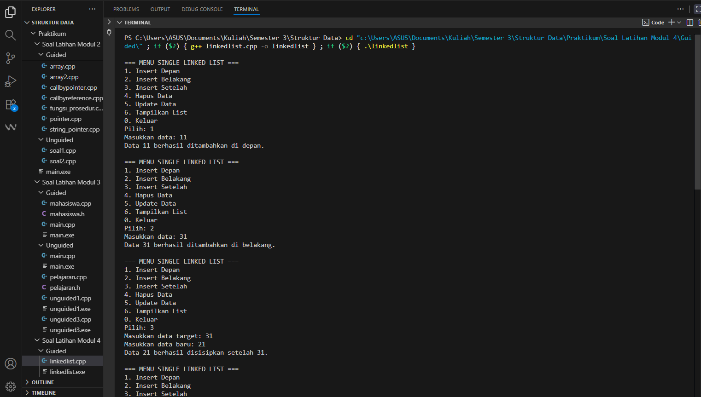
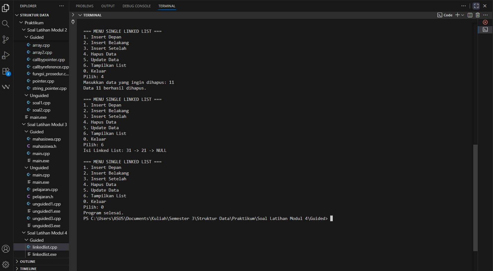
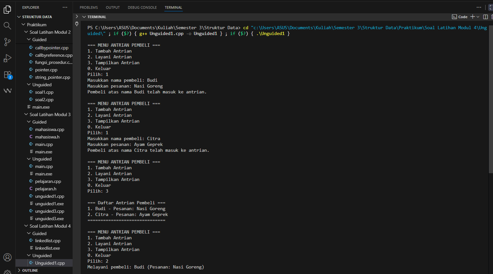
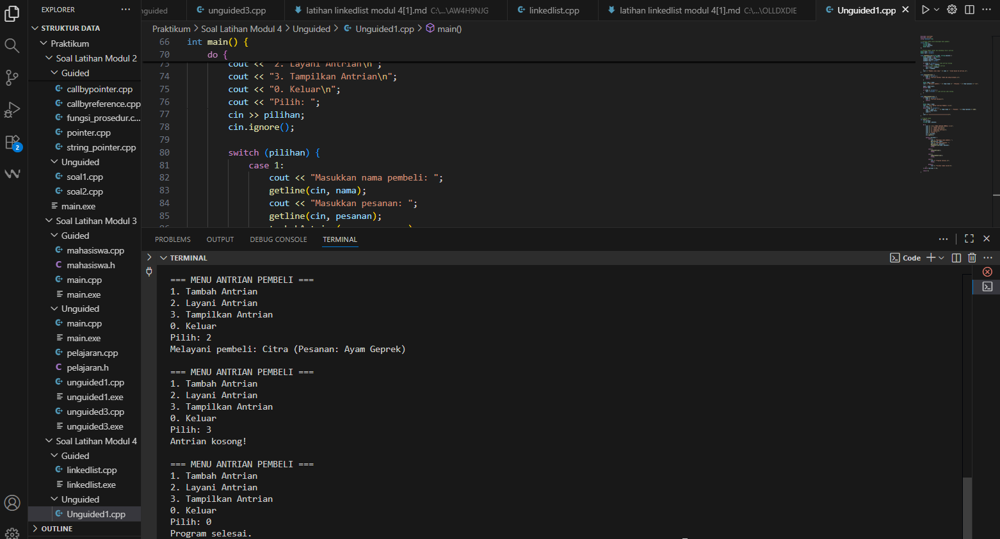
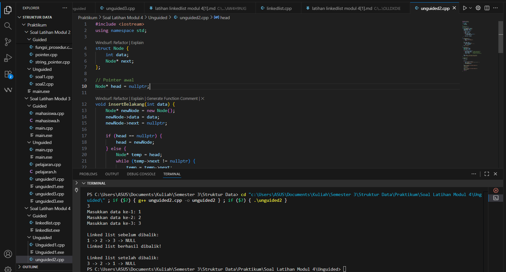

---
<h1 align="center">Laporan Praktikum Modul 4 <br>Singly Linked List
</h1>

<p align="center">Tri Setyono Martyantoro - 103112400279</p>
<p align="center">S1IF - 12 - 07</p>


---
## Dasar Teori - Singly Linked List

---
Pada Modul ke 4 ini membahas Singly Linked List. Jadi Singly Linked List adalah salah satu jenis _linked list_ di mana tiap simpul (node) hanya memiliki satu penunjuk (pointer) ke simpul berikutnya. Dalam struktur ini, data tidak disimpan dalam array berurutan, melainkan tersebar di memori secara dinamis, dan setiap node “menautkan” dirinya ke node selanjutnya.

Pada Singly Linked List, ada istilah head (simpul pertama) dan tail (simpul terakhir). Head adalah titik awal untuk mengakses seluruh list, sedangkan tail biasanya menunjukkan node terakhir yang pointer-nya null (tidak menunjuk ke node lain).

Keunggulan Singly Linked List dibanding array adalah fleksibilitas dalam pengalokasian dan penghapusan data secara dinamis. Ketika kita ingin menambah atau menghapus elemen, tidak perlu menggeser elemen-elemen lain seperti dalam array. Namun, kelemahannya adalah akses ke elemen secara acak (misalnya meminta elemen ke-n langsung) menjadi tidak efisien, karena harus melewati node satu per satu dari head.

Dalam konteks modul 4 (materi terkait Singly Linked List), ketika kamu membuat struct node dengan data dan pointer, dan fungsi-fungsi seperti insert, delete, traverse, itu sebenarnya kamu membuat ADT Linked List: bagian “apa operasi yang bisa dilakukan” sudah kamu spesifikasikan, sementara cara internal penautannya (pointer next, alokasi memori) berada di bagian implementasi.
## Guided
---

```cpp
#include <iostream>
using namespace std;

// Struktur Node
struct Node {
    int data;
    Node* next;
};

// Pointer awal
Node* head = nullptr;

// Fungsi untuk membuat node baru
Node* createNode(int data) {
    Node* newNode = new Node();
    newNode->data = data;
    newNode->next = nullptr;
    return newNode;
}

// ========== INSERT DEPAN ==========
void insertDepan(int data) {
    Node* newNode = createNode(data);
    newNode->next = head;
    head = newNode;
    cout << "Data " << data << " berhasil ditambahkan di depan.\n";
}

// ========== INSERT BELAKANG ==========
void insertBelakang(int data) {
    Node* newNode = createNode(data);
    if (head == nullptr) {
        head = newNode;
    } else {
        Node* temp = head;
        while (temp->next != nullptr) {
            temp = temp->next;
        }
        temp->next = newNode;
    }
    cout << "Data " << data << " berhasil ditambahkan di belakang.\n";
}

// ========== INSERT SETELAH ==========
void insertSetelah(int target, int dataBaru) {
    Node* temp = head;
    while (temp != nullptr && temp->data != target) {
        temp = temp->next;
    }
    if (temp == nullptr) {
        cout << "Data " << target << " tidak ditemukan!\n";
    } else {
        Node* newNode = createNode(dataBaru);
        newNode->next = temp->next;
        temp->next = newNode;
        cout << "Data " << dataBaru << " berhasil disisipkan setelah " << target << ".\n";
    }
}

// ========== DELETE FUNCTION ==========
void hapusNode(int data) {
    if (head == nullptr) {
        cout << "List kosong!\n";
        return;
    }
    Node* temp = head;
    Node* prev = nullptr;

    // Jika data di node pertama
    if (temp != nullptr && temp->data == data) {
        head = temp->next;
        delete temp;
        cout << "Data " << data << " berhasil dihapus.\n";
        return;
    }

    // Cari node yang akan dihapus
    while (temp != nullptr && temp->data != data) {
        prev = temp;
        temp = temp->next;
    }

    // Jika data tidak ditemukan
    if (temp == nullptr) {
        cout << "Data " << data << " tidak ditemukan!\n";
        return;
    }
    prev->next = temp->next;
    delete temp;
    cout << "Data " << data << " berhasil dihapus.\n";
}

// ========== UPDATE FUNCTION ==========
void updateNode(int dataLama, int dataBaru) {
    Node* temp = head;
    while (temp != nullptr && temp->data != dataLama) {
        temp = temp->next;
    }
    if (temp == nullptr) {
        cout << "Data " << dataLama << " tidak ditemukan!\n";
    } else {
        temp->data = dataBaru;
        cout << "Data " << dataLama << " berhasil diupdate menjadi " << dataBaru << ".\n";
    }
}

// ========== DISPLAY FUNCTION ==========
void tampilkanList() {
    if (head == nullptr) {
        cout << "List kosong!\n";
        return;
    }
    Node* temp = head;
    cout << "Isi Linked List: ";
    while (temp != nullptr) {
        cout << temp->data << " -> ";
        temp = temp->next; //
    }
    cout << "NULL\n";
}

// ========== MAIN PROGRAM ==========
int main() {
    int pilihan, data, target, dataBaru;
    do {
        cout << "\n=== MENU SINGLE LINKED LIST ===\n";
        cout << "1. Insert Depan\n";
        cout << "2. Insert Belakang\n";
        cout << "3. Insert Setelah\n";
        cout << "4. Hapus Data\n";
        cout << "5. Update Data\n";
        cout << "6. Tampilkan List\n";
        cout << "0. Keluar\n";
        cout << "Pilih: ";
        cin >> pilihan;

        switch (pilihan) {
            case 1
                cout << "Masukkan data: ";
                cin >> data;
                insertDepan(data);
                break;
            case 2:
                cout << "Masukkan data: ";
                cin >> data;
                insertBelakang(data);
                break;
            case 3:
                cout << "Masukkan data target: ";
                cin >> target;
                cout << "Masukkan data baru: ";
                cin >> dataBaru;
                insertSetelah(target, dataBaru);
                break;
            case 4:
                cout << "Masukkan data yang ingin dihapus: ";
                cin >> data;
                hapusNode(data);
                break;
            case 5:
                cout << "Masukkan data lama: ";
                cin >> data;
                cout << "Masukkan data baru: ";
                cin >> dataBaru;
                updateNode(data, dataBaru);
                break;
            case 6:
                tampilkanList();
                break;
            case 0:
                cout << "Program selesai.\n";
                break;
            default:
                cout << "Pilihan tidak valid!\n";
        }
    } while (pilihan != 0);
    return 0;
}
```
### Output Code



Program di atas adalah program untuk mengelola singly linked list, yaitu struktur data yang menyimpan data secara berantai menggunakan pointer. Di awal, terdapat struktur Node yang berisi dua bagian: data untuk menyimpan nilai, dan next yang berfungsi sebagai penunjuk ke node berikutnya. Pointer head digunakan sebagai penanda node pertama dalam list, dan nilainya diinisialisasi dengan nullptr karena pada awal program belum ada data yang dimasukkan. Lalu, ada fungsi createNode() yang digunakan untuk membuat node baru secara dinamis menggunakan operator new. Fungsi ini mengembalikan alamat node yang baru dibuat, dengan isi data sesuai input dan pointer next bernilai nullptr. Program ini memiliki beberapa operasi utama. Fungsi insertDepan() digunakan untuk menambahkan data di bagian depan list, dengan cara menghubungkan node baru ke head lama, lalu menjadikan node baru tersebut sebagai head yang baru. Fungsi insertBelakang() digunakan untuk menambahkan data di akhir list dengan cara menelusuri seluruh node sampai menemukan node terakhir, lalu menautkan node baru ke bagian akhir tersebut. Sedangkan insertSetelah() berfungsi untuk menambahkan node baru setelah data tertentu yang sudah ada di dalam list. Selain operasi penambahan, ada juga fungsi hapusNode() yang digunakan untuk menghapus data tertentu dari list. Fungsi ini akan mencari node dengan data yang sesuai, lalu menghapusnya dari rantai linked list. Kemudian, updateNode() digunakan untuk mengganti nilai data lama dengan data baru tanpa mengubah posisi node-nya. Untuk menampilkan seluruh isi list, digunakan fungsi tampilkanList(). Fungsi ini akan menelusuri setiap node dari head hingga node terakhir, dan mencetak isi datanya satu per satu. Jika list masih kosong, maka akan muncul pesan “List kosong”. Bagian main() berisi menu interaktif yang memungkinkan pengguna memilih operasi yang ingin dilakukan, seperti menambah, menghapus, mengubah, atau menampilkan data. Program akan terus berjalan selama pengguna belum memilih opsi keluar (angka 0).
## Unguided
---
## Soal Latihan Modul 4

---
### Soal 1

> 1. Buatlah single linked list untuk Antrian yang menyimpan data pembeli( nama dan pesanan). program memiliki beberapa menu seperti tambah antrian,  layani antrian(hapus), dan tampilkan antrian. \*antrian pertama harus yang pertama dilayani

```cpp
#include <iostream>
#include <string>

using namespace std;

// Struktur Node untuk menyimpan data pembeli
struct Node {
    string nama;
    string pesanan;
    Node* next;
};

// Pointer depan (head) dan belakang (tail) antrian
Node* head = nullptr;
Node* tail = nullptr;

void tambahAntrian(string nama, string pesanan) {
    Node* newNode = new Node();
    newNode->nama = nama;
    newNode->pesanan = pesanan;
    newNode->next = nullptr;

    if (head == nullptr) { // Jika antrian kosong
        head = tail = newNode;
    } else { // Jika sudah ada antrian
        tail->next = newNode;
        tail = newNode;
    }
    cout << "Pembeli atas nama " << nama << " telah masuk ke antrian.\n";
}

void layaniAntrian() {
    if (head == nullptr) {
        cout << "Antrian kosong! Tidak ada yang dilayani.\n";
        return;
    }

    Node* temp = head;
    cout << "Melayani pembeli: " << temp->nama << " (Pesanan: " << temp->pesanan << ")\n";
    head = head->next;
    delete temp;
    if (head == nullptr) {
        tail = nullptr; // Jika antrian jadi kosong
    }
}

void tampilkanAntrian() {
    if (head == nullptr) {
        cout << "Antrian kosong!\n";
        return;
    }
    Node* temp = head;
    cout << "\n=== Daftar Antrian Pembeli ===\n";
    int nomor = 1;
    while (temp != nullptr) {
        cout << nomor << ". " << temp->nama << " - Pesanan: " << temp->pesanan << endl;
        temp = temp->next;
        nomor++;
    }
    cout << "==============================\n";
}

// Program utama
int main() {
    int pilihan;
    string nama, pesanan;

    do {
        cout << "\n=== MENU ANTRIAN PEMBELI ===\n";
        cout << "1. Tambah Antrian\n";
        cout << "2. Layani Antrian\n";
        cout << "3. Tampilkan Antrian\n";
        cout << "0. Keluar\n";
        cout << "Pilih: ";
        cin >> pilihan;
        cin.ignore();

        switch (pilihan) {
            case 1:
                cout << "Masukkan nama pembeli: ";
                getline(cin, nama);
                cout << "Masukkan pesanan: ";
                getline(cin, pesanan);
                tambahAntrian(nama, pesanan);
                break;
            case 2:
                layaniAntrian();
                break;
            case 3:
                tampilkanAntrian();
                break;
            case 0:
                cout << "Program selesai.\n";
                break;
            default:
                cout << "Pilihan tidak valid!\n";
        }
    } while (pilihan != 0);
    return 0;
}
```
### Output Code



Program di atas merupakan program antrian pembeli yang dibuat menggunakan konsep singly linked list. Program ini digunakan untuk mencatat pembeli yang datang secara berurutan, di mana pembeli pertama yang masuk akan menjadi pembeli pertama yang dilayani (first in, first out). Di dalam program, terdapat struktur Node yang berisi dua data, yaitu nama untuk menyimpan nama pembeli dan pesanan untuk mencatat pesanan yang diminta. Selain itu, setiap node juga memiliki pointer next yang digunakan untuk menautkan node satu dengan node lainnya, sehingga membentuk rantai data yang saling terhubung. Program ini menggunakan dua pointer utama, yaitu head dan tail. Pointer head menunjuk ke pembeli pertama dalam antrian, sedangkan tail menunjuk ke pembeli terakhir. Saat program dijalankan, keduanya bernilai nullptr karena belum ada data yang dimasukkan. Ketika pengguna memilih menu Tambah Antrian, program akan membuat node baru yang berisi nama dan pesanan pembeli, lalu menambahkannya di bagian belakang antrian. Jika antrian masih kosong, node baru akan menjadi node pertama sekaligus terakhir. Menu Layani Antrian digunakan untuk melayani pembeli yang berada di urutan paling depan. Program akan menampilkan nama dan pesanan pembeli tersebut, kemudian menghapus datanya dari list. Setelah itu, head akan berpindah ke pembeli berikutnya. Jika setelah penghapusan antrian menjadi kosong, pointer tail juga akan diatur kembali menjadi nullptr. Sementara itu, menu Tampilkan Antrian berfungsi untuk menampilkan seluruh data pembeli yang sedang mengantri, lengkap dengan urutannya. Jika tidak ada pembeli, program akan menampilkan pesan “Antrian kosong!”.

---
### Soal 2

>  2. buatlah program kode untuk membalik (reverse) singly linked list (1-2-3 menjadi 3-2-1)

```cpp
#include <iostream>
using namespace std;

struct Node {
    int data;
    Node* next;
};

// Pointer awal
Node* head = nullptr;

void insertBelakang(int data) {
    Node* newNode = new Node();
    newNode->data = data;
    newNode->next = nullptr;

    if (head == nullptr) {
        head = newNode;
    } else {
        Node* temp = head;
        while (temp->next != nullptr) {
            temp = temp->next;
        }
        temp->next = newNode;
    }
}

void tampilkanList() 
    if (head == nullptr) {
        cout << "List kosong!\n";
        return;
    }

    Node* temp = head;
    while (temp != nullptr) {
        cout << temp->data << " -> ";
        temp = temp->next;
    }
    cout << "NULL\n";
}

void reverseList() {
    Node* prev = nullptr;
    Node* current = head;
    Node* next = nullptr;
    while (current != nullptr) {
        next = current->next;  // simpan node berikutnya
        current->next = prev;  // balik arah pointer
        prev = current;        // geser prev ke current
        current = next;        // pindah ke node berikutnya
    }
    head = prev; // ubah head ke node terakhi
    cout << "Linked list berhasil dibalik!\n";
}
// Program utama
int main() {
    int n, data;
    cin >> n;

    for (int i = 0; i < n; i++) {
        cout << "Masukkan data ke-" << i + 1 << ": ";
        cin >> data;
        insertBelakang(data);
    }
    cout << "\nLinked list sebelum dibalik:\n";
    tampilkanList();
    reverseList();
    cout << "\nLinked list setelah dibalik:\n";
    tampilkanList();
    return 0;
}
```
### Output Code

Program diatas digunakan untuk membalik urutan data pada singly linked list. Awalnya, data dimasukkan secara berurutan dari depan ke belakang. Setelah itu, program menjalankan fungsi reverseList() untuk membalik arah tautan antar node. Di dalam fungsi tersebut, digunakan tiga pointer  prev, current, dan next untuk menelusuri node satu per satu sambil membalik arah pointer next. Setelah seluruh node selesai dibalik, head diarahkan ke node terakhir, sehingga urutan datanya menjadi terbalik.

---
### Referensi
---
[1] Modul 6 Single & Double Linked List, Universitas Negeri Malang. Modul Struktur Data (PDF) https://elektro.um.ac.id/wp-content/uploads/2016/04/ASD-Modul-6-Linked-List.pdf

[2] Linked List, Modul Kuliah Struktur Data Universitas Esa Unggul. https://lms-paralel.esaunggul.ac.id/pluginfile.php?file=%2F86227%2Fmod_resource%2Fcontent%2F1%2FModul+Struktur+Data-Linked+List.pdf

[3] “Struktur Data: Pengertian dan Implementasi Dasar Linked List”, Rumah Coding. https://rumahcoding.co.id/linked-list-pengertian-dan-implementasi-dasar/


