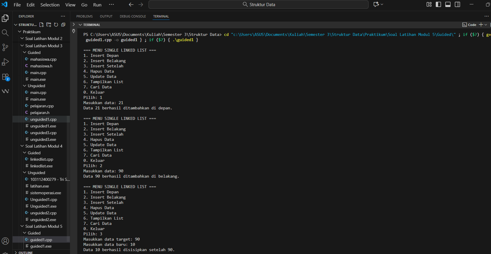
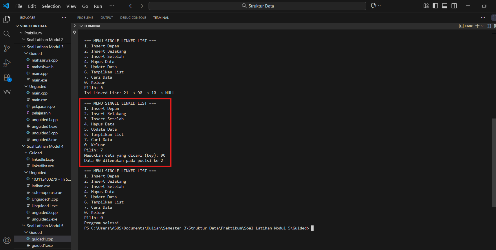
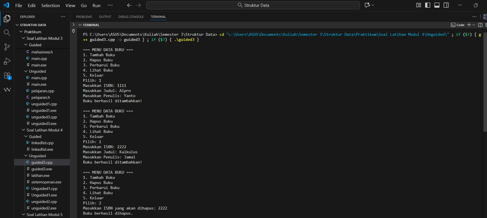
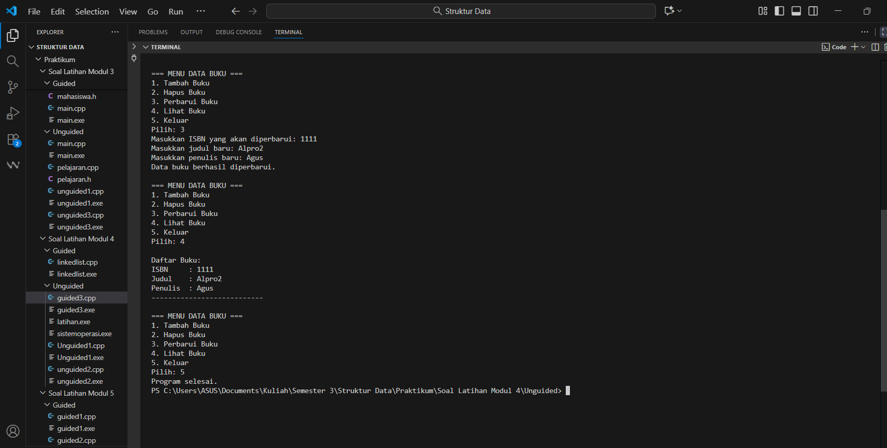
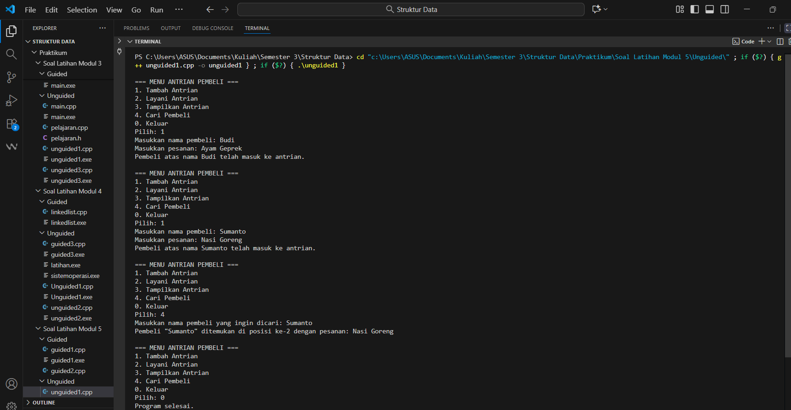
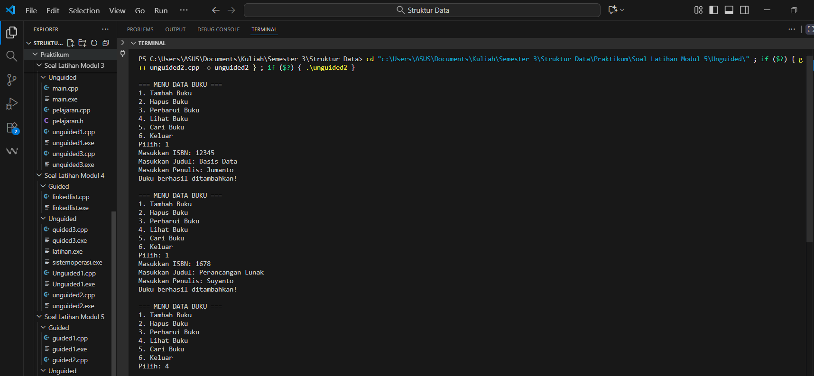
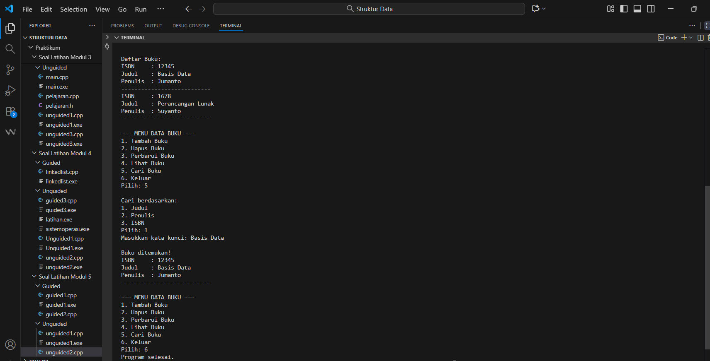

---
<h1 align="center">Laporan Praktikum Modul 5 <br>Searching
</h1>

<p align="center">Tri Setyono Martyantoro - 103112400279</p>
<p align="center">S1IF - 12 - 07</p>


---
## Dasar Teori - Searching pada Singly Linked List

---
Pada modul kelima ini, pembahasan difokuskan pada operasi searching (pencarian) di dalam singly linked list. Searching merupakan salah satu operasi dasar dalam struktur data yang digunakan untuk menemukan elemen atau node tertentu berdasarkan nilai (key) yang dicari. Proses pencarian dilakukan dengan cara menelusuri setiap node satu per satu mulai dari head hingga node yang memiliki nilai sesuai dengan data yang dicari, atau hingga akhir list jika data tidak ditemukan.

Dalam linked list, pencarian bersifat sekuensial (sequential search) karena data tidak disimpan secara berurutan di memori seperti pada array. Setiap node hanya mengetahui alamat node berikutnya melalui pointer next, sehingga proses pencarian harus dilakukan dengan mengakses setiap node secara berurutan.

Terdapat dua jenis pencarian dalam linked list, yaitu pencarian berdasarkan nilai dan pencarian berdasarkan alamat. Pencarian berdasarkan nilai digunakan untuk menemukan node dengan data tertentu, sedangkan pencarian berdasarkan alamat digunakan untuk mengakses node yang sudah diketahui posisinya di memori.

Pada proses implementasinya, function pencarian biasanya menggunakan parameter berupa list dan nilai yang akan dicari. Fungsi tersebut akan mengembalikan alamat node jika ditemukan, dan nilai NULL jika tidak ada data yang sesuai. Konsep ini juga berkaitan erat dengan penggunaan pointer, di mana setiap pergerakan dari satu node ke node berikutnya dilakukan melalui dereferensi pointer next.

Pemahaman terhadap mekanisme searching pada singly linked list menjadi dasar penting untuk mengembangkan operasi lain seperti insert after, delete after, atau update data, karena seluruh operasi tersebut memerlukan proses pencarian terlebih dahulu untuk menentukan posisi elemen yang akan dimodifikasi.
## Guided
---

```cpp
#include <iostream>
using namespace std;

// Struktur Node
struct Node {
    int data;
    Node* next;
};
Node* head = nullptr;

// Fungsi untuk membuat node baru
Node* createNode(int data) {
    Node* newNode = new Node();
    newNode->data = data;
    newNode->next = nullptr;
    return newNode;
}

// ========== INSERT DEPAN FUNCTION (Penambahan) ==========
void insertDepan(int data) {
    Node* newNode = createNode(data);
    // Logika Insert First: Node baru menunjuk ke head lama, lalu head menunjuk ke Node baru.
    newNode->next = head;
    head = newNode;
    cout << "Data " << data << " berhasil ditambahkan di depan.\n";
}

void insertBelakang(int data) {
    Node* newNode = createNode(data);
    if (head == nullptr) {
        head = newNode;
    } else {
        Node* temp = head;
        while (temp->next != nullptr) {
            temp = temp->next;
        }
        temp->next = newNode;
    }
    cout << "Data " << data << " berhasil ditambahkan di belakang.\n";
}

void insertSetelah(int target, int dataBaru) {
    Node* temp = head;
    while (temp != nullptr && temp->data != target) {
        temp = temp->next;
    }
    if (temp == nullptr) {
        cout << "Data " << target << " tidak ditemukan!\n";
    } else {
        Node* newNode = createNode(dataBaru);
        // Logika Insert After: Sambungkan newNode ke temp->next, lalu temp ke newNode
        newNode->next = temp->next;
        temp->next = newNode;
        cout << "Data " << dataBaru << " berhasil disisipkan setelah " << target << ".\n";
    }
}

// ========== DELETE FUNCTION ==========
void hapusNode(int data) {
    if (head == nullptr) {
        cout << "List kosong!\n";
        return;
    }
    Node* temp = head;
    Node* prev = nullptr;
    // Jika data di node pertama (Delete First)
    if (temp != nullptr && temp->data == data) {
        head = temp->next;
        delete temp;
        cout << "Data " << data << " berhasil dihapus.\n";
        return;
    }

    // Cari node yang akan dihapus
    while (temp != nullptr && temp->data != data) {
        prev = temp;
        temp = temp->next;
    }

    // Jika data tidak ditemukan
    if (temp == nullptr) {
        cout << "Data " << data << " tidak ditemukan!\n";
        return;
    }

    // Putuskan tautan: prev melompati temp
    prev->next = temp->next;
    delete temp;
    cout << "Data " << data << " berhasil dihapus.\n";
}

// ========== UPDATE FUNCTION ==========
void updateNode(int dataLama, int dataBaru) {
    Node* temp = head;
    while (temp != nullptr && temp->data != dataLama) {
        temp = temp->next;
    }
    if (temp == nullptr) {
        cout << "Data " << dataLama << " tidak ditemukan!\n";
    } else {
        temp->data = dataBaru;
        cout << "Data " << dataLama << " berhasil diupdate menjadi " << dataBaru << ".\n";
    }
}

// ========== SEARCH FUNCTION  ==========
void searchData(int key) {
    Node *temp = head;
    int pos = 1;
    bool found = false;
    while (temp != nullptr) {
        // Cek apakah data di node saat ini sama dengan key
        if (temp->data == key) {
            cout << "Data " << key << " ditemukan pada posisi ke-" << pos << endl;
            found = true;
            break; // Hentikan perulangan jika sudah ditemukan
        }
        temp = temp->next; // Geser ke node berikutnya
        pos++;             // Tambah posisi
    }

    // PENTING: Menggunakan 'if (!found)' untuk mengoreksi kesalahan logika asli
    if (!found) {
        cout << "Data " << key << " tidak ditemukan dalam linked list.\n";
    }
}

// ========== DISPLAY FUNCTION ==========
void tampilkanList() {
    if (head == nullptr) {
        cout << "List kosong!\n";
        return;
    }

    Node* temp = head;
    cout << "Isi Linked List: ";
    while (temp != nullptr) {
        cout << temp->data << " -> ";
        temp = temp->next;
    }
    cout << "NULL\n";
}

// ========== MAIN PROGRAM ==========
int main() {
    int pilihan, data, target, dataBaru;
    do {
        cout << "\n=== MENU SINGLE LINKED LIST ===\n";
        cout << "1. Insert Depan\n";
        cout << "2. Insert Belakang\n";
        cout << "3. Insert Setelah\n";
        cout << "4. Hapus Data\n";
        cout << "5. Update Data\n";
        cout << "6. Tampilkan List\n";
        cout << "7. Cari Data\n";
        cout << "0. Keluar\n";
        cout << "Pilih: ";
        if (!(cin >> pilihan)) {
            // Menangani input non-integer
            cin.clear();
            cin.ignore(10000, '\n');
            pilihan = -1; // Set pilihan ke nilai default
        }
        switch (pilihan) {
            case 1:
                cout << "Masukkan data: ";
                cin >> data;
                insertDepan(data);
                break;
            case 2:
                cout << "Masukkan data: ";
                cin >> data;
                insertBelakang(data);
                break;
            case 3:
                cout << "Masukkan data target: ";
                cin >> target;
                cout << "Masukkan data baru: ";
                cin >> dataBaru;
                insertSetelah(target, dataBaru);
                break;
            case 4:
                cout << "Masukkan data yang ingin dihapus: ";
                cin >> data;
                hapusNode(data);
                break;
            case 5:
                cout << "Masukkan data lama: ";
                cin >> data;
                cout << "Masukkan data baru: ";
                cin >> dataBaru;
                updateNode(data, dataBaru);
                break;
            case 6:
                tampilkanList();
                break;
            case 7: // Case baru untuk Search
                cout << "Masukkan data yang dicari (key): ";
                cin >> data;
                searchData(data);
                break;
            case 0:
                cout << "Program selesai.\n";
                break;
            default:
                cout << "Pilihan tidak valid!\n";
        }
    } while (pilihan != 0);
    return 0;
}
```
### Output Code



Program diatas dibuat untuk mengelola data menggunakan singly linked list, di mana setiap elemen datanya disimpan dalam bentuk node yang saling terhubung lewat pointer. Di dalamnya ada struktur Node yang menyimpan nilai data dan alamat node berikutnya, sedangkan variabel head digunakan untuk menandai node pertama dalam list. Program ini punya beberapa fungsi utama seperti insertDepan, insertBelakang, dan insertSetelah untuk menambah data di posisi yang berbeda. Lalu ada hapusNode untuk menghapus data tertentu dan updateNode untuk mengganti nilai data lama dengan yang baru. Yang membedakan dari versi sebelumnya adalah penambahan fungsi searchData, yaitu fitur untuk mencari data tertentu di dalam list. Proses pencariannya dilakukan dengan cara menelusuri node satu per satu dari head sampai ketemu data yang dicari. Kalau datanya ketemu, program akan menampilkan posisinya, tapi kalau tidak ada, akan muncul pesan kalau datanya tidak ditemukan.

---

```cpp
#include <iostream>
#include <string>

using namespace std;

struct Buku {
    string isbn, judul, penulis;
    Buku* next;

};

Buku* head = nullptr;

void tambahBuku(string isbn, string judul, string penulis) {
    Buku* newNode = new Buku;
    newNode->isbn = isbn;
    newNode->judul = judul;
    newNode->penulis = penulis;
    newNode->next = nullptr;
    if (head == nullptr) {
        head = newNode;
    } else {
        Buku* temp = head;
        while (temp->next != nullptr) {
            temp = temp->next;
        }
        temp->next = newNode;
    }
    cout << "Buku berhasil ditambahkan!\n";
}

void hapusBuku(string isbn) {
    if (head == nullptr) {
        cout << "Tidak ada buku dalam daftar.\n";
        return;
    }
    Buku* temp = head;
    Buku* prev = nullptr;

    if (temp != nullptr && temp->isbn == isbn) {
        head = temp->next;
        delete temp;
        cout << "Buku dengan ISBN " << isbn << " berhasil dihapus.\n";
        return;
    }
    while (temp != nullptr && temp->isbn != isbn) {
        prev = temp;
        temp = temp->next;
    }
    if (temp == nullptr) {
        cout << "Buku dengan ISBN " << isbn << " tidak ditemukan.\n";
        return;
    }
    prev->next = temp->next;
    delete temp;
    cout << "Buku berhasil dihapus.\n";

}

void perbaruiBuku(string isbn) {
    Buku* temp = head;
    while (temp != nullptr) {
        if (temp->isbn == isbn) {
            cout << "Masukkan judul baru: ";
            getline(cin, temp->judul);
            cout << "Masukkan penulis baru: ";
            getline(cin, temp->penulis);
            cout << "Data buku berhasil diperbarui.\n";
            return;
        }
        temp = temp->next;
    }
    cout << "Buku dengan ISBN " << isbn << " tidak ditemukan.\n";
}

void lihatBuku() {
    if (head == nullptr) {
        cout << "Belum ada buku yang tersimpan.\n";
        return;
    }
    Buku* temp = head;
    cout << "\nDaftar Buku:\n";
    while (temp != nullptr) {
        cout << "ISBN     : " << temp->isbn << endl;
        cout << "Judul    : " << temp->judul << endl;
        cout << "Penulis  : " << temp->penulis << endl;
        cout << "---------------------------\n";
        temp = temp->next;
    }
}

int main() {
    int pilihan;
    string isbn, judul, penulis;
    do {
        cout << "\n=== MENU DATA BUKU ===\n";
        cout << "1. Tambah Buku\n";
        cout << "2. Hapus Buku\n";
        cout << "3. Perbarui Buku\n";
        cout << "4. Lihat Buku\n";
        cout << "5. Keluar\n";
        cout << "Pilih: ";
        cin >> pilihan;
        cin.ignore();

        switch (pilihan) {
            case 1:
                cout << "Masukkan ISBN: ";
                getline(cin, isbn);
                cout << "Masukkan Judul: ";
                getline(cin, judul);
                cout << "Masukkan Penulis: ";
                getline(cin, penulis);
                tambahBuku(isbn, judul, penulis);
                break;
            case 2:
                cout << "Masukkan ISBN yang akan dihapus: ";
                getline(cin, isbn);
                hapusBuku(isbn);
                break;
            case 3:
                cout << "Masukkan ISBN yang akan diperbarui: ";
                getline(cin, isbn);
                perbaruiBuku(isbn);
                break;
            case 4:
                lihatBuku();
                break;
            case 5:
                cout << "Program selesai.\n";
                break;
            default:
                cout << "Pilihan tidak valid.\n";
        }
    } while (pilihan != 5);
    return 0;
}
```
### Output Code


Program diatas dibuat untuk mengelola data buku menggunakan struktur data Single Linked List. Di dalam program ini ada struktur bernama Buku yang menyimpan tiga data utama yaitu ISBN, judul, dan penulis, serta satu pointer next untuk menghubungkan setiap node buku ke buku berikutnya. Pointer head berfungsi sebagai penanda buku pertama dalam daftar. Fungsi tambahBuku() digunakan untuk menambahkan buku baru ke dalam daftar, di mana data baru akan diletakkan di bagian akhir list. Lalu ada hapusBuku() yang berfungsi untuk menghapus buku berdasarkan nomor ISBN, dan perbaruiBuku() yang digunakan untuk mengubah data buku tertentu dengan data baru yang dimasukkan pengguna. Sementara itu, lihatBuku() digunakan untuk menampilkan seluruh data buku yang sudah tersimpan secara berurutan dari yang pertama ditambahkan. Pada bagian main(), program menampilkan menu agar pengguna bisa memilih aksi yang ingin dilakukan seperti menambah, menghapus, memperbarui, atau melihat data buku.

---
## Unguided
---
## Soal Latihan Modul 5

---
### Soal 1

> 1. Buatlah searcing untuk mencari nama pembeli pada unguided sebelumnya

```cpp
#include <iostream>
#include <string>

using namespace std;

// Struktur Node untuk menyimpan data pembeli
struct Node {
    string nama;
    string pesanan;
    Node* next;
};

Node* head = nullptr;
Node* tail = nullptr;

void tambahAntrian(string nama, string pesanan) {
    Node* newNode = new Node();
    newNode->nama = nama;
    newNode->pesanan = pesanan;
    newNode->next = nullptr;

    if (head == nullptr) { // Jika antrian kosong
        head = tail = newNode;
    } else { // Jika sudah ada antrian
        tail->next = newNode;
        tail = newNode;
    }
    cout << "Pembeli atas nama " << nama << " telah masuk ke antrian.\n";
}

void layaniAntrian() {
    if (head == nullptr) {
        cout << "Antrian kosong! Tidak ada yang dilayani.\n";
        return;
    }
    Node* temp = head;
    cout << "Melayani pembeli: " << temp->nama << " (Pesanan: " << temp->pesanan << ")\n";
    head = head->next;
    delete temp;
    if (head == nullptr) {
        tail = nullptr; // Jika antrian jadi kosong
    }
}

void tampilkanAntrian() {
    if (head == nullptr) {
        cout << "Antrian kosong!\n";
        return;
    }
    Node* temp = head;
    cout << "\n=== Daftar Antrian Pembeli ===\n";
    int nomor = 1;
    while (temp != nullptr) {
        cout << nomor << ". " << temp->nama << " - Pesanan: " << temp->pesanan << endl;
        temp = temp->next;
        nomor++;
    }
    cout << "==============================\n";
}

// ====== SEARCHING FUNCTION ======
void cariPembeli(string namaCari) {
    if (head == nullptr) {
        cout << "Antrian kosong! Tidak ada data untuk dicari.\n";
        return;
    }
    Node* temp = head;
    int posisi = 1;
    bool ditemukan = false;

    while (temp != nullptr) {
        if (temp->nama == namaCari) {
            cout << "Pembeli \"" << namaCari << "\" ditemukan di posisi ke-" << posisi
                 << " dengan pesanan: " << temp->pesanan << endl;
            ditemukan = true;
            break;
        }
        temp = temp->next;
        posisi++;
    }
    if (!ditemukan) {
        cout << "Pembeli dengan nama \"" << namaCari << "\" tidak ditemukan dalam antrian.\n";
    }
}

// Program utama
int main() {
    int pilihan;
    string nama, pesanan;
    do {
        cout << "\n=== MENU ANTRIAN PEMBELI ===\n";
        cout << "1. Tambah Antrian\n";
        cout << "2. Layani Antrian\n";
        cout << "3. Tampilkan Antrian\n";
        cout << "4. Cari Pembeli\n";
        cout << "0. Keluar\n";
        cout << "Pilih: ";
        cin >> pilihan;
        cin.ignore();

        switch (pilihan) {
            case 1:
                cout << "Masukkan nama pembeli: ";
                getline(cin, nama);
                cout << "Masukkan pesanan: ";
                getline(cin, pesanan);
                tambahAntrian(nama, pesanan);
                break;
            case 2:
                layaniAntrian();
                break;
            case 3:
                tampilkanAntrian();
                break;
            case 4:
                cout << "Masukkan nama pembeli yang ingin dicari: ";
                getline(cin, nama);
                cariPembeli(nama);
                break;
            case 0:
                cout << "Program selesai.\n";
                break;
            default:
                cout << "Pilihan tidak valid!\n";
        }
    } while (pilihan != 0);
    return 0;
}
```
### Output Code

Program diatas digunakan untuk membuat sistem antrian pembeli menggunakan Single Linked List. Struktur Node menyimpan data pembeli berupa nama, pesanan, dan pointer next yang menghubungkan ke pembeli berikutnya. Variabel head menunjukkan pembeli paling depan, sedangkan tail menunjukkan pembeli terakhir dalam antrian. Fungsi tambahAntrian() menambah pembeli ke belakang antrian, layaniAntrian() melayani dan menghapus pembeli terdepan, serta tampilkanAntrian() menampilkan seluruh daftar pembeli yang sedang mengantri. Tambahan fungsi cariPembeli() digunakan untuk mencari nama pembeli tertentu dan menampilkan posisinya di antrian.

---
### Soal 2

>  2. Gunakan latihan pada pertemuan minggun ini dan tambahkan seardhing untuk mencari buku berdasarkan judul, penulis, dan ISBN

```cpp
#include <iostream>
#include <string>

using namespace std;

struct Buku {
    string isbn, judul, penulis;
    Buku* next;
};

Buku* head = nullptr;

void tambahBuku(string isbn, string judul, string penulis) {
    Buku* newNode = new Buku;
    newNode->isbn = isbn;
    newNode->judul = judul;
    newNode->penulis = penulis;
    newNode->next = nullptr;
    if (head == nullptr) {
        head = newNode;
    } else {
        Buku* temp = head;
        while (temp->next != nullptr) {
            temp = temp->next;
        }
        temp->next = newNode;
    }
    cout << "Buku berhasil ditambahkan!\n";
}
void hapusBuku(string isbn) {
    if (head == nullptr) {
        cout << "Tidak ada buku dalam daftar.\n";
        return;
    }
    Buku* temp = head;
    Buku* prev = nullptr;

    if (temp != nullptr && temp->isbn == isbn) {
        head = temp->next;
        delete temp;
        cout << "Buku dengan ISBN " << isbn << " berhasil dihapus.\n";
        return;
    }
    while (temp != nullptr && temp->isbn != isbn) {
        prev = temp;
        temp = temp->next;
    }
    if (temp == nullptr) {
        cout << "Buku dengan ISBN " << isbn << " tidak ditemukan.\n";
        return;
    }
    prev->next = temp->next;
    delete temp;
    cout << "Buku berhasil dihapus.\n";
}

void perbaruiBuku(string isbn) {
    Buku* temp = head;
    while (temp != nullptr) {
        if (temp->isbn == isbn) {
            cout << "Masukkan judul baru: ";
            getline(cin, temp->judul);
            cout << "Masukkan penulis baru: ";
            getline(cin, temp->penulis);
            cout << "Data buku berhasil diperbarui.\n";
            return;
        }
        temp = temp->next;
    }
    cout << "Buku dengan ISBN " << isbn << " tidak ditemukan.\n";
}

void lihatBuku() {
    if (head == nullptr) {
        cout << "Belum ada buku yang tersimpan.\n";
        return;
    }
    Buku* temp = head;
    cout << "\nDaftar Buku:\n";
    while (temp != nullptr) {
        cout << "ISBN     : " << temp->isbn << endl;
        cout << "Judul    : " << temp->judul << endl;
        cout << "Penulis  : " << temp->penulis << endl;
        cout << "---------------------------\n";
        temp = temp->next;
    }
}

// ====== FUNGSI SEARCHING ======
void cariBuku(string key, int pilihan) {
    if (head == nullptr) {
        cout << "Data buku kosong!\n";
        return;
    }
    Buku* temp = head;
    bool ditemukan = false;
    while (temp != nullptr) {
        if ((pilihan == 1 && temp->judul == key) ||
            (pilihan == 2 && temp->penulis == key) ||
            (pilihan == 3 && temp->isbn == key)) {
            cout << "\nBuku ditemukan!\n";
            cout << "ISBN     : " << temp->isbn << endl;
            cout << "Judul    : " << temp->judul << endl;
            cout << "Penulis  : " << temp->penulis << endl;
            cout << "---------------------------\n";
            ditemukan = true;
        }
        temp = temp->next;
    }
    if (!ditemukan) {
        cout << "Buku dengan data tersebut tidak ditemukan.\n";
    }
}

int main() {
    int pilihan;
    string isbn, judul, penulis, key;

    do {
        cout << "\n=== MENU DATA BUKU ===\n";
        cout << "1. Tambah Buku\n";
        cout << "2. Hapus Buku\n";
        cout << "3. Perbarui Buku\n";
        cout << "4. Lihat Buku\n";
        cout << "5. Cari Buku\n";
        cout << "6. Keluar\n";
        cout << "Pilih: ";
        cin >> pilihan;
        cin.ignore();

        switch (pilihan) {
            case 1:
                cout << "Masukkan ISBN: ";
                getline(cin, isbn);
                cout << "Masukkan Judul: ";
                getline(cin, judul);
                cout << "Masukkan Penulis: ";
                getline(cin, penulis);
                tambahBuku(isbn, judul, penulis);
                break;
            case 2:
                cout << "Masukkan ISBN yang akan dihapus: ";
                getline(cin, isbn);
                hapusBuku(isbn);
                break;
            case 3:
                cout << "Masukkan ISBN yang akan diperbarui: ";
                getline(cin, isbn);
                perbaruiBuku(isbn);
                break;
            case 4:
                lihatBuku();
                break;
            case 5:
                int opsi;
                cout << "\nCari berdasarkan:\n";
                cout << "1. Judul\n";
                cout << "2. Penulis\n";
                cout << "3. ISBN\n";
                cout << "Pilih: ";
                cin >> opsi;
                cin.ignore();
                cout << "Masukkan kata kunci: ";
                getline(cin, key);
                cariBuku(key, opsi);
                break;
            case 6:
                cout << "Program selesai.\n";
                break;
            default:
                cout << "Pilihan tidak valid.\n";
        }
    } while (pilihan != 6);
    return 0;
}
```
### Output Code


Program diatas digunakan untuk mengelola data buku menggunakan Single Linked List. Setiap node menyimpan ISBN, judul, dan penulis. Program menyediakan fitur untuk menambah, menghapus, memperbarui, menampilkan, dan mencari buku. Bagian pencarian (searching) ditambahkan dengan fungsi cariBuku(), yang memungkinkan pengguna mencari buku berdasarkan judul, penulis, atau ISBN. Program akan menelusuri setiap node dari awal (head) hingga menemukan data yang sesuai, lalu menampilkan detail buku tersebut.

---
### Referensi
---
[1] Modul 6 Single & Double Linked List, Universitas Negeri Malang. Modul Struktur Data (PDF) https://elektro.um.ac.id/wp-content/uploads/2016/04/ASD-Modul-6-Linked-List.pdf
[2] Linked List, Modul Kuliah Struktur Data Universitas Esa Unggul. https://lms-paralel.esaunggul.ac.id/pluginfile.php?file=%2F86227%2Fmod_resource%2Fcontent%2F1%2FModul+Struktur+Data-Linked+List.pdf
[3] “Struktur Data: Pengertian dan Implementasi Dasar Linked List”, Rumah Coding. https://rumahcoding.co.id/linked-list-pengertian-dan-implementasi-dasar/


