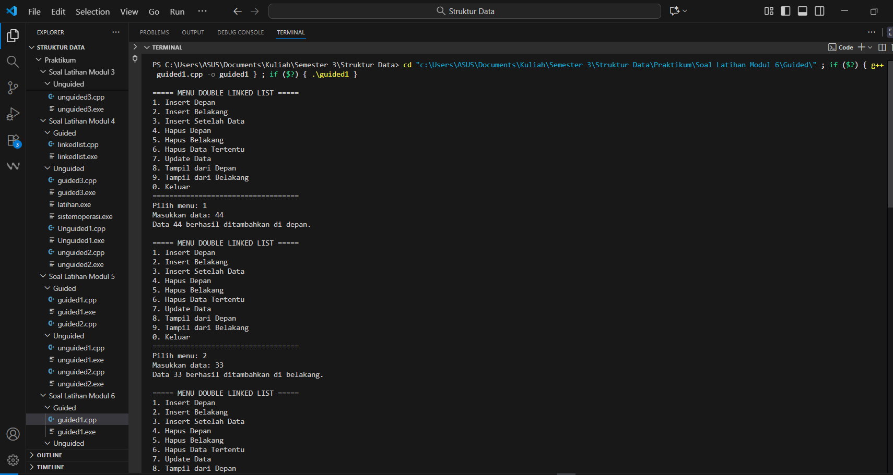
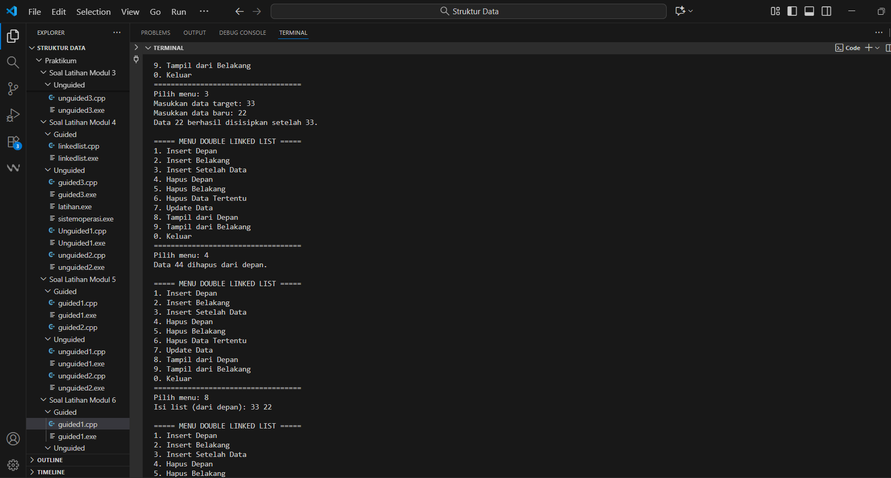
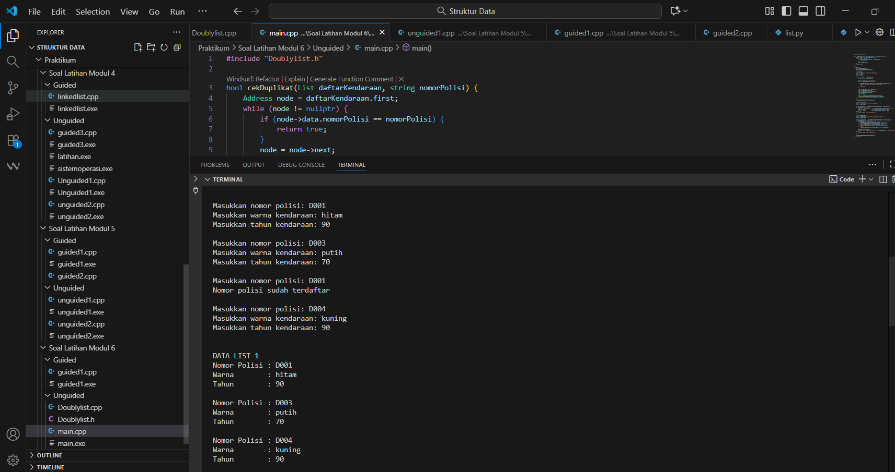
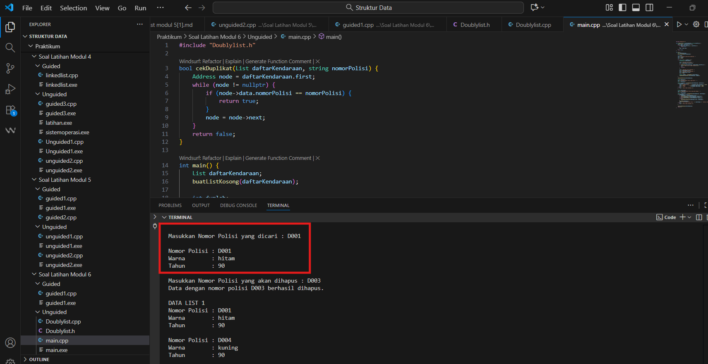
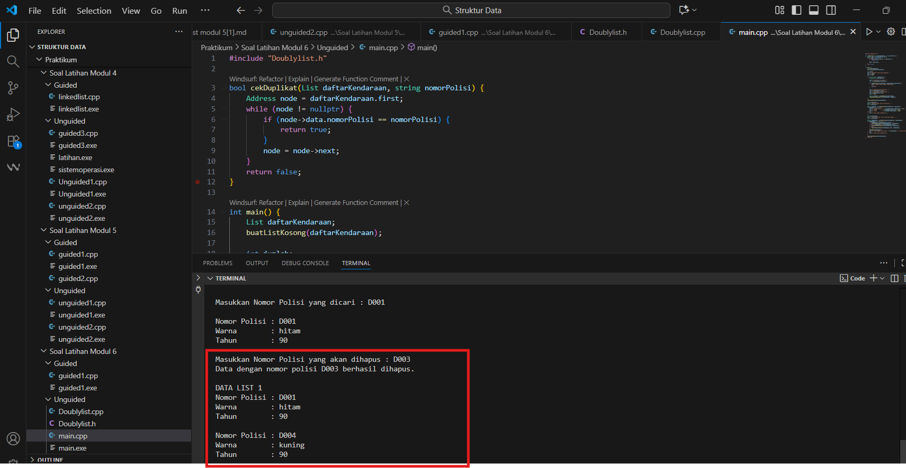

---
<h1 align="center">Laporan Praktikum Modul 6 <br>Doubly Linked List
</h1>

<p align="center">Tri Setyono Martyantoro - 103112400279</p>
<p align="center">S1IF - 12 - 07</p>


---
## Dasar Teori - Doubly Linked List

---
Pada modul 6 ini, pembahasan difokuskan pada materi Doubly Linked List yang merupakan pengembangan dari Single Linked List. Struktur data ini memiliki dua pointer dalam setiap nodenya, yaitu pointer _next_ yang menunjuk ke node berikutnya dan pointer _prev_ yang menunjuk ke node sebelumnya. Dengan adanya dua pointer ini, proses penelusuran data bisa dilakukan dari depan ke belakang maupun sebaliknya, sehingga lebih fleksibel dan efisien dalam pengelolaan data.

Menurut penelitian yang dilakukan oleh Agung Wijoyo dkk. (2024) pada jurnal _JRIIN: Jurnal Riset Informatika dan Inovasi_, struktur Doubly Linked List banyak digunakan karena memudahkan proses penyisipan dan penghapusan data tanpa harus menelusuri list dari awal seperti pada Single Linked List . Setiap node terdiri dari tiga bagian, yaitu data, pointer prev, dan pointer next. Hal ini membuat perubahan data di tengah list dapat dilakukan dengan cepat karena kita bisa langsung mengakses node sebelumnya maupun sesudahnya.

Selain itu, dalam artikel di _JSIT Journal_ disebutkan bahwa Doubly Linked List sering digunakan untuk sistem yang membutuhkan navigasi dua arah, seperti pengelolaan data mahasiswa atau aplikasi dengan fitur undo dan redo. Namun, struktur ini juga memiliki kelemahan, yaitu membutuhkan memori lebih banyak karena setiap node menyimpan dua pointer, serta lebih rumit dalam pengelolaannya dibandingkan Single Linked List.
## Guided
---

```cpp
#include <iostream>
using namespace std;

struct Node {
    int data;
    Node* prev;
    Node* next;
};

Node* head = nullptr;
Node* tail = nullptr;

void insertDepan(int data) {
    Node* newNode = new Node();
    newNode->data = data;
    newNode->prev = nullptr;
    newNode->next = head;

    if (head != nullptr) {
        head->prev = newNode;
    } else {
        tail = newNode;
    }
    head = newNode;
    cout << "Data " << data << " berhasil ditambahkan di depan.\n";
}

void insertBelakang(int data) {
    Node* newNode = new Node();
    newNode->data = data;
    newNode->prev = tail;
    newNode->next = nullptr;

    if (tail != nullptr) {
        tail->next = newNode;
    } else {
        head = newNode;
    }
    tail = newNode;
    cout << "Data " << data << " berhasil ditambahkan di belakang.\n";
}

void insertSetelah(int target, int data) {
    Node* current = head;
    while (current != nullptr && current->data != target) {
        current = current->next;
    }
    if (current == nullptr) {
        cout << "Data " << target << " tidak ditemukan.\n";
        return;
    }

    Node* newNode = new Node();
    newNode->data = data;
    newNode->prev = current;
    newNode->next = current->next;

    if (current->next != nullptr) {
        current->next->prev = newNode;
    } else {
        tail = newNode;
    }
    current->next = newNode;
    cout << "Data " << data << " berhasil disisipkan setelah " << target << ".\n";
}

void hapusDepan() {
    if (head == nullptr) {
        cout << "List kosong.\n";
        return;
    }
    Node* temp = head;
    head = head->next;
    if (head != nullptr) {
        head->prev = nullptr;
    } else {
        tail = nullptr;
    }
    cout << "Data " << temp->data << " dihapus dari depan.\n";
    delete temp;
}

void hapusBelakang() {
    if (tail == nullptr) {
        cout << "List kosong.\n";
        return;
    }
    Node* temp = tail;
    tail = tail->prev;

    if (tail != nullptr) {
        tail->next = nullptr;
    } else {
        head = nullptr;
    }
    cout << "Data " << temp->data << " dihapus dari belakang.\n";
    delete temp;
}

void hapusData (int target) {
    if (head == nullptr) {
        cout << "List kosong.\n";
        return;
    }

    Node* current = head;
    while (current != nullptr && current->data != target) {
        current = current->next;
    }

    if (current == nullptr) {
        cout << "Data " << target << " tidak ditemukan.\n";
        return;
    }

    if (current == head) {
        hapusDepan();
    } else if (current == tail) {
        hapusBelakang();
    } else {
        current->prev->next = current->next;
        current->next->prev = current->prev;
        cout << "Data " << target << " dihapus.\n";
        delete current;
    }
}

void updateData(int oldData, int newData) {
    Node* current = head;
    while (current != nullptr && current->data != oldData)
        current = current->next;

    if (current == nullptr) {
        cout << "Data " << oldData << " tidak ditemukan.\n";
        return;
    }
    current->data = newData;
    cout << "Data " << oldData << " diubah menjadi " << newData << ".\n";
}

void tampilDepan() {
    if (head == nullptr) {
        cout << "List kosong.\n";
        return;
    }
    cout << "Isi list (dari depan): ";
    Node* current = head;
    while (current != nullptr) {
        cout << current->data << " ";
        current = current->next;
    }
    cout << "\n";
}

// ====================================
// Fungsi: Tampilkan dari belakang
// ====================================

void tampilBelakang() {
    if (tail == nullptr) {
        cout << "List kosong.\n";
        return;
    }
    cout << "Isi list (dari belakang): ";
    Node* current = tail;
    while (current != nullptr) {
        cout << current->data << " ";
        current = current->prev;
    }
    cout << "\n";
}

// ====================================
// MAIN PROGRAM (MENU INTERAKTIF)
// ====================================
int main() {
    int pilihan, data, target, oldData, newData;
    do {
        cout << "\n===== MENU DOUBLE LINKED LIST =====\n";
        cout << "1. Insert Depan\n";
        cout << "2. Insert Belakang\n";
        cout << "3. Insert Setelah Data\n";
        cout << "4. Hapus Depan\n";
        cout << "5. Hapus Belakang\n";
        cout << "6. Hapus Data Tertentu\n";
        cout << "7. Update Data\n";
        cout << "8. Tampil dari Depan\n";
        cout << "9. Tampil dari Belakang\n";
        cout << "0. Keluar\n";
        cout << "===================================\n";
        cout << "Pilih menu: ";
        cin >> pilihan;

        switch (pilihan) {
            case 1:
                cout << "Masukkan data: ";
                cin >> data;
                insertDepan(data);
                break;
            case 2:
                cout << "Masukkan data: ";
                cin >> data;
                insertBelakang(data);
                break;
            case 3:
                cout << "Masukkan data target: ";
                cin >> target;
                cout << "Masukkan data baru: ";
                cin >> data;
                insertSetelah(target, data);
                break;
            case 4:
                hapusDepan();
                break;
            case 5:
                hapusBelakang();
                break;
            case 6:
                cout << "Masukkan data yang ingin dihapus: ";
                cin >> target;
                hapusData(target);
                break;
            case 7:
                cout << "Masukkan data lama: ";
                cin >> oldData;
                cout << "Masukkan data baru: ";
                cin >> newData;
                updateData(oldData, newData);
                break;
            case 8:
                tampilDepan();
                break;
            case 9:
                tampilBelakang();
                break;
            case 0:
                cout << "👋 Keluar dari program.\n";
                break;
            default:
                cout << "Pilihan tidak valid.\n";
        }
    } while (pilihan != 0);
    return 0;
}
```
### Output Code



Program di atas digunakan untuk mengelola data menggunakan struktur Double Linked List. Program ini memungkinkan pengguna menambahkan, menghapus, menampilkan, dan mengubah data secara interaktif melalui menu pilihan. Setiap data disimpan dalam node yang saling terhubung dua arah, yaitu dari depan ke belakang dan sebaliknya. Alur programnya dimulai dari tampilan menu yang meminta pengguna memilih operasi yang ingin dilakukan. Jika pengguna memilih menambah data, program akan membuat node baru dan menautkannya ke posisi yang sesuai bisa di depan, di belakang, atau setelah data tertentu. Jika memilih hapus, program akan mencari data yang dimaksud dan menghapus node-nya dengan memperbarui hubungan antar-node agar list tetap terhubung. Fitur tampil depan dan tampil belakang berfungsi untuk melihat isi list dari dua arah, sedangkan fitur update digunakan untuk mengganti nilai data lama dengan data baru. Program akan terus berjalan hingga pengguna memilih opsi keluar.

---
## Unguided
---
## Soal Latihan Modul 6

---
### Soal 1

> 1. Buatlah ADT Doubly Linked list sebagai berikut di dalam file “Doublylist.h”:

```
Type infotype : kendaraan <
	nopol : string 
	warna : string 
	thnBuat : integer > 

Type address : pointer to ElmList Type ElmList < 
	info : infotype
	next :address 
	prev : address > 
	
Type List < 
	First : address 
	Last : address 
>
procedure CreateList( input/output L : List ) 
function alokasi( x : infotype ) → address 
procedure dealokasi(input/output P : address ) 
procedure printInfo( input L : List ) 
procedure insertLast(input/output L : List, 
	input P : address ) 
```

> Buatlah implementasi ADT Doubly Linked list pada file “Doublylist.cpp” dan coba hasil implementasi ADT pada file “main.cpp”.

### Contoh Output
```
Masukkan nomor polisi: D001  
Masukkan warna kendaraan: hitam  
Masukkan tahun kendaraan: 90  

Masukkan nomor polisi: D003  
Masukkan warna kendaraan: putih  
Masukkan tahun kendaraan: 70  

Masukkan nomor polisi: D001  
Masukkan warna kendaraan: merah  
Masukkan tahun kendaraan: 80  
Nomor polisi sudah terdaftar  

Masukkan nomor polisi: D004  
Masukkan warna kendaraan: kuning  
Masukkan tahun kendaraan: 90  
```

```
No Polisi : D004  
Warna     : kuning  
Tahun     : 90  

No Polisi : D003  
Warna     : putih  
Tahun     : 70  

No Polisi : D001  
Warna     : hitam  
Tahun     : 90  
```
### 1. Doublylist.h
```cpp
#ifndef DOUBLYLIST_H
#define DOUBLYLIST_H

#include <iostream>
#include <string>
using namespace std;
struct Kendaraan {
    string nomorPolisi;
    string warna;
    int tahun;
};

typedef Kendaraan InfoKendaraan;

struct Node {
    InfoKendaraan data;
    Node* next;
    Node* prev;
};

typedef Node* Address;

struct List {
    Address first;
    Address last;
};

void buatListKosong(List &daftarKendaraan);
Address buatNodeBaru(InfoKendaraan kendaraanBaru);
void hapusNode(Address node);
void tambahKendaraanDiAkhir(List &daftarKendaraan, Address nodeBaru);
void tampilkanKendaraan(List daftarKendaraan);
Address cariKendaraan(List daftarKendaraan, string nomorPolisi);
void hapusKendaraanPertama(List &daftarKendaraan, Address &node);
void hapusKendaraanTerakhir(List &daftarKendaraan, Address &node);
void hapusKendaraanSetelah(Address sebelum, Address &node);

#endif
```

### 2. Doublylist.cpp
```cpp
#include "Doublylist.h"

void buatListKosong(List &daftarKendaraan) {
    daftarKendaraan.first = nullptr;
    daftarKendaraan.last = nullptr;
}

Address buatNodeBaru(InfoKendaraan kendaraanBaru) {
    Address node = new Node;
    node->data = kendaraanBaru;
    node->next = nullptr;
    node->prev = nullptr;
    return node;
}

void hapusNode(Address node) {
    delete node;
}

void tambahKendaraanDiAkhir(List &daftarKendaraan, Address nodeBaru) {
    if (daftarKendaraan.first == nullptr) {
        daftarKendaraan.first = nodeBaru;
        daftarKendaraan.last = nodeBaru;
    } else {
        daftarKendaraan.last->next = nodeBaru;
        nodeBaru->prev = daftarKendaraan.last;
        daftarKendaraan.last = nodeBaru;
    }
}

void tampilkanKendaraan(List daftarKendaraan) {
    Address node = daftarKendaraan.first;
    cout << "\nDATA LIST 1\n";
    while (node != nullptr) {
        cout << "Nomor Polisi : " << node->data.nomorPolisi << endl;
        cout << "Warna        : " << node->data.warna << endl;
        cout << "Tahun        : " << node->data.tahun << endl << endl;
        node = node->next;
    }
}

Address cariKendaraan(List daftarKendaraan, string nomorPolisi) {
    Address node = daftarKendaraan.first;
    while (node != nullptr) {
        if (node->data.nomorPolisi == nomorPolisi) {
            return node;
        }
        node = node->next;
    }
    return nullptr;
}

void hapusKendaraanPertama(List &daftarKendaraan, Address &node) {
    if (daftarKendaraan.first != nullptr) {
        node = daftarKendaraan.first;
        if (daftarKendaraan.first == daftarKendaraan.last) {
            daftarKendaraan.first = nullptr;
            daftarKendaraan.last = nullptr;
        } else {
            daftarKendaraan.first = daftarKendaraan.first->next;
            daftarKendaraan.first->prev = nullptr;
            node->next = nullptr;
        }
    }
}

void hapusKendaraanTerakhir(List &daftarKendaraan, Address &node) {
    if (daftarKendaraan.last != nullptr) {
        node = daftarKendaraan.last;
        if (daftarKendaraan.first == daftarKendaraan.last) {
            daftarKendaraan.first = nullptr;
            daftarKendaraan.last = nullptr;
        } else {
            daftarKendaraan.last = daftarKendaraan.last->prev;
            daftarKendaraan.last->next = nullptr;
            node->prev = nullptr;
        }
    }
}

void hapusKendaraanSetelah(Address sebelum, Address &node) {
    if (sebelum != nullptr && sebelum->next != nullptr) {
        node = sebelum->next;
        sebelum->next = node->next;
        if (node->next != nullptr) {
            node->next->prev = sebelum;
        }
        node->next = nullptr;
        node->prev = nullptr;
    }
}
```
### 3. main.cpp
```cpp
#include "Doublylist.h"

bool cekDuplikat(List daftarKendaraan, string nomorPolisi) {
    Address node = daftarKendaraan.first;
    while (node != nullptr) {
        if (node->data.nomorPolisi == nomorPolisi) {
            return true;
        }
        node = node->next;
    }
    return false;
}

int main() {
    List daftarKendaraan;
    buatListKosong(daftarKendaraan);

    int jumlah;
    cout << "Masukkan jumlah data kendaraan: ";
    cin >> jumlah;
    cout << endl;

    for (int i = 0; i < jumlah; i++) {
        InfoKendaraan kendaraanBaru;

        cout << "Masukkan nomor polisi: ";
        cin >> kendaraanBaru.nomorPolisi;

        if (cekDuplikat(daftarKendaraan, kendaraanBaru.nomorPolisi)) {
            cout << "Nomor polisi sudah terdaftar\n\n";
            i--;
            continue;
        }
        cout << "Masukkan warna kendaraan: ";
        cin >> kendaraanBaru.warna;
        cout << "Masukkan tahun kendaraan: ";
        cin >> kendaraanBaru.tahun;
        cout << endl;

        Address nodeBaru = buatNodeBaru(kendaraanBaru);
        tambahKendaraanDiAkhir(daftarKendaraan, nodeBaru);
    }

    tampilkanKendaraan(daftarKendaraan);
    string nomorDicari;
    cout << "Masukkan Nomor Polisi yang dicari : ";
    cin >> nomorDicari;

    Address ditemukan = cariKendaraan(daftarKendaraan, nomorDicari);
    if (ditemukan != nullptr) {
        cout << "\nNomor Polisi : " << ditemukan->data.nomorPolisi << endl;
        cout << "Warna        : " << ditemukan->data.warna << endl;
        cout << "Tahun        : " << ditemukan->data.tahun << endl;
    } else {
        cout << "Data tidak ditemukan.\n";
    }

    string nomorDihapus;
    cout << "\nMasukkan Nomor Polisi yang akan dihapus : ";
    cin >> nomorDihapus;

    Address nodeDihapus = cariKendaraan(daftarKendaraan, nomorDihapus);
    if (nodeDihapus != nullptr) {
        if (nodeDihapus == daftarKendaraan.first) {
            hapusKendaraanPertama(daftarKendaraan, nodeDihapus);
        } else if (nodeDihapus == daftarKendaraan.last) {
            hapusKendaraanTerakhir(daftarKendaraan, nodeDihapus);
        } else {
            hapusKendaraanSetelah(nodeDihapus->prev, nodeDihapus);
        }
        hapusNode(nodeDihapus);
        cout << "Data dengan nomor polisi " << nomorDihapus << " berhasil dihapus.\n";
    } else {
        cout << "Data tidak ditemukan.\n";
    }
    tampilkanKendaraan(daftarKendaraan);
    return 0;
}
```
### Output Code


---
### Soal 2

> 2. Carilah elemen dengan nomor polisi D001 dengan membuat fungsi baru. fungsi findElm( L : List, x : infotype ) : address
### Contoh Output

```
Masukkan Nomor Polisi yang dicari : D001

Nomor Polisi : D001
Warna        : hitam
Tahun        : 90
```
### Output Code


---
### Soal 3

> 3. Hapus elemen dengan nomor polisi D003 dengan procedure delete. 

```
procedure deleteFirst( input/output L : List,  
P : address ) - -
procedure deleteLast( input/output L : List,  
P : address )
procedure deleteAfter( input Prec : address,  
input/output P : address )
```
### Contoh Output
```
Masukkan Nomor Polisi yang akan dihapus : D003
Data dengan nomor polisi D003 berhasil dihapus.

DATA LIST 1

Nomor Polisi : D004
Warna        : kuning
Tahun        : 90

Nomor Polisi : D001
Warna        : hitam
Tahun        : 90
```


### Penjelasan Soal No 1 - 3
---
Program diatas dibuat untuk mengelola data kendaraan menggunakan struktur **Doubly Linked List**, di mana setiap data kendaraan memiliki atribut **nomor polisi, warna, dan tahun pembuatan**. Tujuan program ini adalah untuk mempermudah proses **pendataan, pencarian, dan penghapusan data kendaraan** secara dinamis. Di awal program terdapat fungsi **createList()** untuk membuat list kosong, kemudian fungsi **cekDuplikat()** digunakan untuk memastikan nomor polisi yang dimasukkan tidak sama dengan data yang sudah ada. Selanjutnya, fungsi **alokasi()** digunakan untuk membuat node baru berisi data kendaraan, sedangkan **insertLast()** menambahkan node tersebut ke akhir list. Setelah pengguna memasukkan jumlah data kendaraan, program akan meminta input berupa nomor polisi, warna, dan tahun pembuatan. Jika nomor polisi sudah ada, maka program menolak input tersebut dan meminta pengguna memasukkan ulang. Setelah semua data tersimpan, program akan menampilkan seluruh data kendaraan menggunakan **printInfo()**. Program juga menyediakan fitur pencarian dengan fungsi **findElm()**, di mana pengguna bisa mencari kendaraan berdasarkan nomor polisi. Jika ditemukan, data kendaraan tersebut akan ditampilkan. Selain itu, pengguna juga dapat menghapus data dengan memasukkan nomor polisi yang ingin dihapus. Proses penghapusan dilakukan dengan fungsi **deleteFirst()**, **deleteLast()**, atau **deleteAfter()**, tergantung posisi data di dalam list.
### Referensi
---
[1] Agung Wijoyo, Lalu Akbar Prayudi, Muhamad Fiqih, Rendi Dwi Santoso, Ricky Tri Setiawan Putra, Teguh Arifin, & Ahmad Farhan. “Penggunaan Algoritma Doubly Linked List Untuk Insertion Dan Deletion.” _JRIIN : Jurnal Riset Informatika dan Inovasi_, 1(12), 1329–1331. 2024.
[2] Analisis Struktur Data Linked List Dalam Pengolahan Data Mahasiswa. _JSIT Journal_, 2024.
[3] Agung Wijoyo, Amalia Azzahra, Dhaifina Nabila, Fijriani Silviana, Lusiyanti. “Perbandingan Struktur Linked List dan Array Dalam Manajemen Memori.” _JRIIN : Jurnal Riset Informatika dan Inovasi_, 1(12), 2024.


