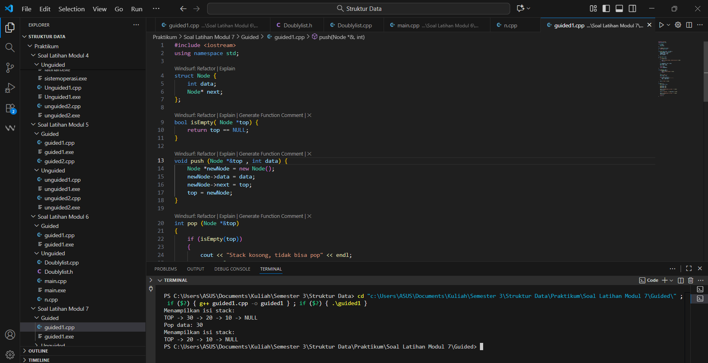
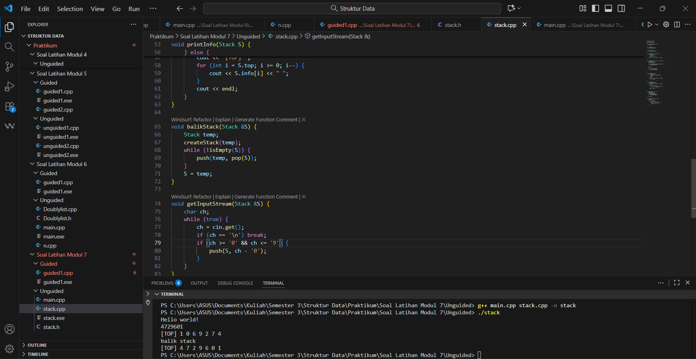

---
<h1 align="center">Laporan Praktikum Modul 7 <br>Stack
</h1>

<p align="center">Tri Setyono Martyantoro - 103112400279</p>
<p align="center">S1IF - 12 - 07</p>


---
## Dasar Teori - Stack

---
Pada modul 7 ini kita mempelajari struktur data **Stack**, yaitu kumpulan elemen yang hanya bisa ditambahkan atau dihapus dari satu ujung saja, sering disebut sebagai _top_ atau puncak tumpukan. Prinsip kerja utama stack adalah _Last In, First Out_ (LIFO) — artinya elemen yang terakhir masuk ke dalam stack itulah yang pertama keluar.

Secara umum, stack memiliki beberapa operasi dasar: **push** untuk menambahkan elemen di puncak stack, **pop** untuk menghapus elemen dari puncak stack, serta **top/peek** untuk melihat elemen teratas tanpa menghapusnya, dan **isEmpty** untuk memeriksa apakah stack kosong.

Implementasi stack bisa dilakukan menggunakan array maupun linked list. Ketika menggunakan array, kita menetapkan variabel pembantu seperti `top` untuk menunjuk indeks elemen teratas, dan jika array penuh maka terjadi _overflow_. Ketika menggunakan linked list, setiap node baru disisipkan di posisi awal list (menjadi top), dan penghapusan juga dilakukan dari node tersebut — sehingga operasi tetap LIFO. 

Keunggulan struktur data stack antara lain ialah kemampuannya mengelola data yang sifatnya tumpukan atau rekursif, seperti fungsi panggilan (call stack), evaluasi ekspresi (infix ke postfix), dan undo-redo pada aplikasi. Namun demikian, stack juga memiliki kelemahan, antara lain akses ke elemen selain top sangat terbatas, dan jika kapasitas tertetapkan dalam array maka bisa terjadi overflow.
## Guided
---

```cpp
#include <iostream>
using namespace std;

struct Node {
    int data;
    Node* next;
};

bool isEmpty( Node *top) {
    return top == NULL;
}

void push (Node *&top , int data) {
    Node *newNode = new Node();
    newNode->data = data;
    newNode->next = top;
    top = newNode;
}

int pop (Node *&top)
{
    if (isEmpty(top))
    {
        cout << "Stack kosong, tidak bisa pop" << endl;
        return 0;
    }

    int poppedData = top -> data;
    Node *temp = top;
    top = top -> next;

    delete temp;
    return poppedData;
}

void show(Node *top) {
    if (isEmpty(top)) {
        cout << "Stack kosong" << endl;
        return;
    }

    cout << "TOP -> ";
    Node *temp = top;

    while (temp != NULL) {
        cout << temp->data << " -> ";
        temp = temp->next;
    }

    cout << "NULL" << endl;
}

int main () {
    Node *stack = NULL;

    push(stack, 10);
    push(stack, 20);
    push(stack, 30);

    cout << "Menampilkan isi stack: " << endl;
    show(stack);

    cout << "Pop data: " << pop(stack) << endl;
    cout << "Menampilkan isi stack: " << endl;
    show(stack);
    
    return 0;
}
```
### Output Code

Program di atas merupakan implementasi struktur data Stack menggunakan Linked List. Struktur Node menyimpan data dan pointer ke node berikutnya. Fungsi push() digunakan untuk menambah data ke bagian atas stack, sedangkan pop() untuk menghapus dan mengambil data paling atas. Fungsi isEmpty() memeriksa apakah stack kosong, dan show() menampilkan isi stack dari atas ke bawah. Pada fungsi main(), program menambahkan data 10, 20, dan 30 ke stack, lalu menampilkan isinya, melakukan satu kali pop, dan menampilkan kembali isi stack setelah data teratas dihapus.

---
## Unguided
---
## Soal Latihan Modul 7

---
### Soal 1

> 1. Buatlah ADT Stack menggunakan ARRAY sebagai berikut di dalam file “stack.h”:

```
Type infotype : integer
Type Stack <
info : array [20] of integer
top : integer
>
procedure CreateStack( input/output S : Stack )
procedure push(input/output S : Stack,
	input x : infotype)
function pop(input/output t S : Stack )
	→ infotype
procedure printInfo( input S : Stack )
procedure balikStack(input/output S :
	Stack )
```

> Buatlah implementasi ADT Stack menggunakan Array pada file “stack.cpp” dan “main.cpp”

```
int main()
{
    cout << "Hello world!" <<
endl;
    Stack S;
    createStack(S);
    Push(S,3);
    Push(S,4);
    Push(S,8);
    pop(S)
    Push(S,2);
    Push(S,3);
    pop(S);
    Push(S,9);
    printInfo(S);
    cout<<"balik stack"<<endl;
    balikStack(S);
    printInfo(S);
    return 0;
}
```
### stack.h
```cpp
#ifndef STACK_H
#define STACK_H

#define MAX 20
typedef int infotype;

typedef struct {
    infotype info[MAX];
    int top;
} Stack;

void createStack(Stack &S);
bool isEmpty(Stack S);
bool isFull(Stack S);
void push(Stack &S, infotype x);
infotype pop(Stack &S);
void printInfo(Stack S);
void balikStack(Stack &S);

#endif
```
### stack.cpp
```cpp
#include <iostream>
#include "stack.h"

using namespace std;

void createStack(Stack &S) {
    S.top = -1;
}

bool isEmpty(Stack S) {
    return S.top == -1;
}

bool isFull(Stack S) {
    return S.top == MAX - 1;
}


void push(Stack &S, infotype x) {
    if (!isFull(S)) {
        S.top++;
        S.info[S.top] = x;
    } else {
        cout << "Stack penuh!" << endl;
    }
}

infotype pop(Stack &S) {
    if (!isEmpty(S)) {
        infotype x = S.info[S.top];
        S.top--;
        return x;
    } else {
        cout << "Stack kosong!" << endl;
        return -9999;
    }
}

void printInfo(Stack S) {
    if (isEmpty(S)) {
        cout << "Stack kosong!" << endl;
    } else {
        cout << "[TOP] ";
        for (int i = S.top; i >= 0; i--) {
            cout << S.info[i] << " ";
        }
        cout << endl;
    }
}

void balikStack(Stack &S) {
    Stack temp;
    createStack(temp);
    while (!isEmpty(S)) {
        push(temp, pop(S));
    }
    S = temp;
}
```
### main.cpp
```cpp
#include <iostream>
#include "stack.h"

using namespace std;

int main() {
    cout << "Hello world!" << endl;

    Stack S;
    createStack(S);

    push(S, 3);
    push(S, 4);
    push(S, 2);
    push(S, 9);

    printInfo(S);

    cout << "balik stack" << endl;
    balikStack(S);
    printInfo(S);

    return 0;
}
```
### Output Code

Pada nomor satu, program ini membuat ADT Stack dengan memanfaatkan array sebagai tempat penyimpanan data. Stack diinisialisasi menggunakan prosedur createStack() yang mengatur agar posisi teratas (top) dimulai dari -1, artinya stack masih kosong. Prosedur push() digunakan untuk menambahkan elemen ke dalam stack, sedangkan pop() digunakan untuk menghapus elemen teratas. Lalu ada juga printInfo() untuk menampilkan isi stack mulai dari elemen paling atas hingga paling bawah, dan balikStack() untuk membalik urutan elemen stack. Saat dijalankan, program menampilkan tulisan “Hello world!”, lalu menampilkan isi stack sebelum dan sesudah dibalik. Hasil akhirnya adalah tampilan [TOP] 9 2 4 3 kemudian setelah dibalik menjadi [TOP] 3 4 2 9.

---
### Soal 2

>  2. Tambahkan prosedur pushAscending( in/out S : Stack, in x : integer)

```
int main()
{
	cout << "Hello world!" << endl;
	Stack S;
	createStack(S);
	pushAscending(S,3);
	pushAscending(S,4);
	pushAscending(S,8);
	pushAscending(S,2);
	pushAscending(S,3);
	pushAscending(S,9);
	printInfo(S);
	cout<<"balik stack"<<endl;
	balikStack(S);
	printInfo(S);
	return 0;
}
```
### stack.h
```cpp
#ifndef STACK_H
#define STACK_H

#define MAX 20
typedef int infotype;

typedef struct {
    infotype info[MAX];
    int top;
} Stack;

void createStack(Stack &S);
bool isEmpty(Stack S);
bool isFull(Stack S);
void push(Stack &S, infotype x);
infotype pop(Stack &S);
void printInfo(Stack S);
void balikStack(Stack &S);
void pushAscending(Stack &S, infotype x);
#endif
```
### stack.cpp
```cpp
#include <iostream>
#include "stack.h"

using namespace std;

void createStack(Stack &S) {
    S.top = -1;
}

bool isEmpty(Stack S) {
    return S.top == -1;
}

bool isFull(Stack S) {
    return S.top == MAX - 1;
}

void push(Stack &S, infotype x) {
    if (!isFull(S)) {
        S.top++;
        S.info[S.top] = x;
    } else {
        cout << "Stack penuh!" << endl;
    }
}

void pushAscending(Stack &S, infotype x) {
    Stack temp;
    createStack(temp);

    while (!isEmpty(S) && S.info[S.top] > x) {
        push(temp, pop(S));
    }

    push(S, x);

    while (!isEmpty(temp)) {
        push(S, pop(temp));
    }
}

infotype pop(Stack &S) {
    if (!isEmpty(S)) {
        infotype x = S.info[S.top];
        S.top--;
        return x;
    } else {
        cout << "Stack kosong!" << endl;
        return -9999;
    }
}

void printInfo(Stack S) {
    if (isEmpty(S)) {
        cout << "Stack kosong!" << endl;
    } else {
        cout << "[TOP] ";
        for (int i = S.top; i >= 0; i--) {
            cout << S.info[i] << " ";
        }
        cout << endl;
    }
}

void balikStack(Stack &S) {
    Stack temp;
    createStack(temp);
    while (!isEmpty(S)) {
        push(temp, pop(S));
    }
    S = temp;
}
```
### main.cpp
```cpp
#include <iostream>
#include "stack.h"

using namespace std;

int main() {
    cout << "Hello world!" << endl;

    Stack S;
    createStack(S);
    pushAscending(S, 3);
    pushAscending(S, 4);
    pushAscending(S, 8);
    pushAscending(S, 2);
    pushAscending(S, 3);
    pushAscending(S, 9);
    printInfo(S);

    cout << "balik stack" << endl;
    balikStack(S);
    printInfo(S);
    return 0;
}
```
### Output Code

Pada nomor dua, ditambahkan prosedur baru bernama pushAscending() yang berfungsi untuk menyusun elemen dalam urutan menaik (ascending) saat dimasukkan ke stack. Artinya, setiap kali data baru dimasukkan, nilainya akan diatur agar posisi elemen di dalam stack tetap terurut dari kecil ke besar. Jadi elemen tidak langsung ditaruh di atas seperti push() biasa, melainkan diatur dulu agar posisinya sesuai urutan. Hasil program akan menampilkan isi stack dalam urutan naik, yaitu [TOP] 9 8 4 3 3 2, dan setelah dibalik dengan balikStack(), hasilnya menjadi [TOP] 2 3 3 4 8 9. 

---
### Soal 3

> 3. Tambahkan prosedur getInputStream( in/out S : Stack ). Prosedur akan terus membaca dan
    menerima input user dan memasukkan setiap input ke dalam stack hingga user menekan
    tombol enter. Contoh: gunakan cin.get() untuk mendapatkan inputan user.

```
int main()
{
	cout << "Hello world!" << endl;
	Stack S;
	createStack(S);
	getInputStream(S);
	printInfo(S);
	cout<<"balik stack"<<endl;
	balikStack(S);
	printInfo(S);
	return 0;
}
```
### stack.h
```cpp
#ifndef STACK_H
#define STACK_H

#define MAX 20
typedef int infotype;

typedef struct {
    infotype info[MAX];
    int top;
} Stack;

void createStack(Stack &S);
bool isEmpty(Stack S);
bool isFull(Stack S);
void push(Stack &S, infotype x);
infotype pop(Stack &S);
void printInfo(Stack S);
void balikStack(Stack &S);
void pushAscending(Stack &S, infotype x);
void getInputStream(Stack &S);

#endif
```
### stack.cpp
```cpp
#include <iostream>
#include "stack.h"

using namespace std;

void createStack(Stack &S) {
    S.top = -1;
}

bool isEmpty(Stack S) {
    return S.top == -1;
}

bool isFull(Stack S) {
    return S.top == MAX - 1;
}

void push(Stack &S, infotype x) {
    if (!isFull(S)) {
        S.top++;
        S.info[S.top] = x;
    } else {
        cout << "Stack penuh!" << endl;
    }
}

void pushAscending(Stack &S, infotype x) {
    Stack temp;
    createStack(temp);

    while (!isEmpty(S) && S.info[S.top] > x) {
        push(temp, pop(S));
    }

    push(S, x);

    while (!isEmpty(temp)) {
        push(S, pop(temp));
    }
}

infotype pop(Stack &S) {
    if (!isEmpty(S)) {
        infotype x = S.info[S.top];
        S.top--;
        return x;
    } else {
        cout << "Stack kosong!" << endl;
        return -9999;
    }
}

void printInfo(Stack S) {
    if (isEmpty(S)) {
        cout << "Stack kosong!" << endl;
    } else {
        cout << "[TOP] ";
        for (int i = S.top; i >= 0; i--) {
            cout << S.info[i] << " ";
        }
        cout << endl;
    }
}

void balikStack(Stack &S) {
    Stack temp;
    createStack(temp);
    while (!isEmpty(S)) {
        push(temp, pop(S));
    }
    S = temp;
}

void getInputStream(Stack &S) {
    char ch;
    while (true) {
        ch = cin.get();
        if (ch == '\n') break;
        if (ch >= '0' && ch <= '9') {
            push(S, ch - '0');
        }
    }
}
```
### main.cpp
```cpp
#include <iostream>
#include "stack.h"

using namespace std;

int main() {
    cout << "Hello world!" << endl;
    Stack S;
    createStack(S);

    getInputStream(S);
    printInfo(S);

    cout << "balik stack" << endl;
    balikStack(S);
    printInfo(S);
    return 0;
}
```
### Output Code

Pada nomor tiga, program dikembangkan lagi dengan menambahkan prosedur getInputStream(). Prosedur ini berfungsi untuk membaca input dari user secara langsung melalui keyboard, tanpa harus memanggil fungsi push() berulang kali. Jadi pengguna bisa mengetik beberapa angka sekaligus (misalnya 4729601), lalu program akan otomatis memasukkan tiap angka satu per satu ke dalam stack. Setelah semua angka masuk, program menampilkan isi stack menggunakan printInfo(), kemudian membalik urutan stack dengan balikStack(). Output-nya menampilkan isi stack sebelum dan sesudah dibalik, yaitu [TOP] 1 0 6 9 2 7 4 lalu [TOP] 4 7 2 9 6 0 1.

---
### Referensi
---
[1] Modul Praktikum 4 – Stack, Universitas Negeri Malang. Modul Struktur Data (PDF) https://elektro.um.ac.id/wp-content/uploads/2016/04/Struktur-Data-Modul-Praktikum-4-Stack.pdf
[2] Struktur Data Stack: Pengertian, Karakteristik, dan Kegunaannya, Trivusi. https://trivusi.web.id/2022/07/struktur-data-stack.html
[3] “Penggunaan Struktur Data Stack dalam Pemrograman C++ dengan Pendekatan Array dan Linked List”, _Jurnal JUTECH_. [https://jurnal.stkippersada.ac.id/jurnal/index.php/jutech/article/download/4263/pdf]


