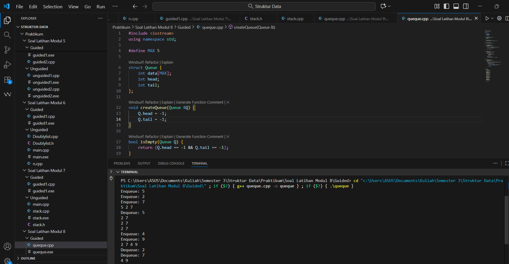
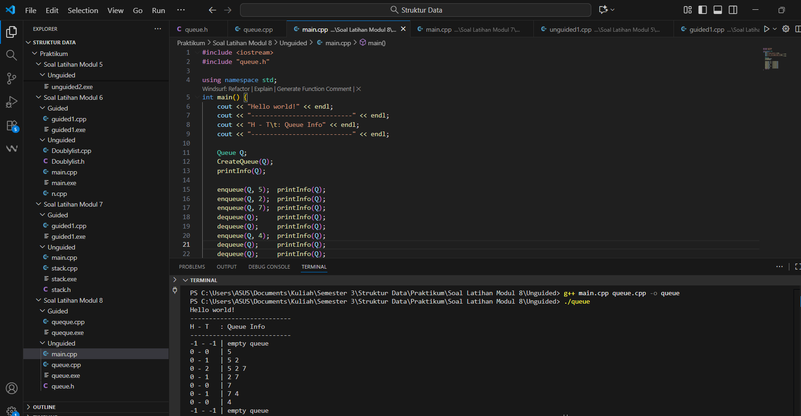
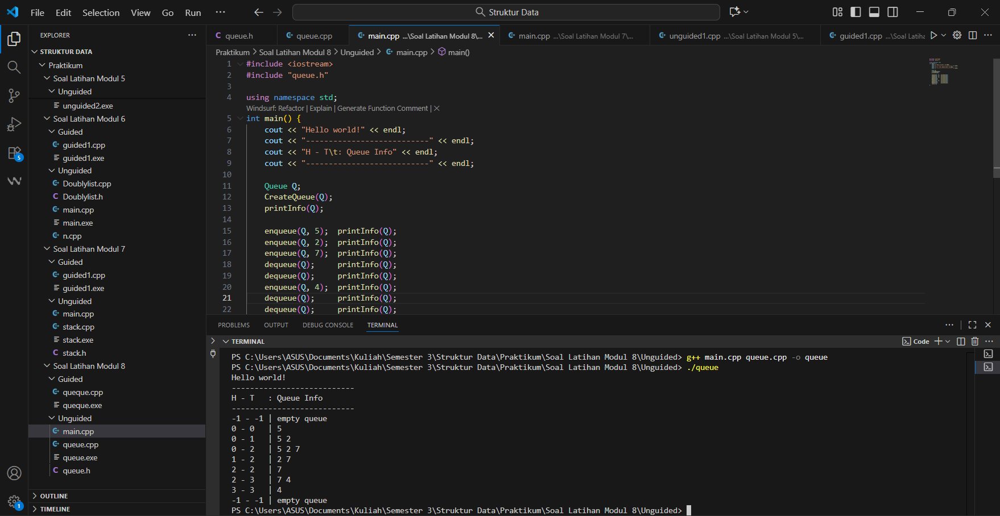
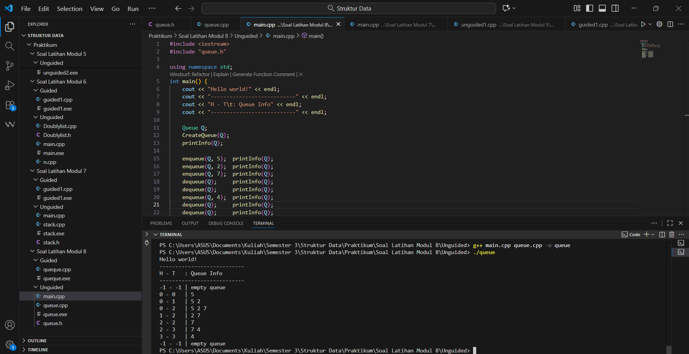

---
<h1 align="center">Laporan Praktikum Modul 8 <br>Queue
</h1>

<p align="center">Tri Setyono Martyantoro - 103112400279</p>
<p align="center">S1IF - 12 - 07</p>


---
## Dasar Teori - Queue

---
Pada modul 8 ini, mempelajari struktur data Queue, yaitu sebuah struktur data linear yang cara kerjanya mengikuti prinsip FIFO (First In, First Out). Konsep FIFO berarti bahwa data yang pertama kali masuk ke dalam antrian akan menjadi data yang pertama kali keluar. Struktur ini mirip dengan antrean di kehidupan sehari-hari, seperti antre membeli tiket atau antre mengambil makanan, sehingga yang datang dulu akan dilayani lebih dulu.

Dalam queue terdapat dua posisi penting, yaitu front sebagai posisi data yang akan dikeluarkan, dan rear sebagai posisi data yang akan dimasukkan. Operasi dasar queue terdiri dari enqueue untuk menambahkan data di bagian belakang, dequeue untuk mengambil dan menghapus data dari bagian depan, peek untuk melihat data terdepan, serta isEmpty dan isFull untuk memeriksa kondisi antrian.

Queue bisa diimplementasikan menggunakan array maupun linked list. Pada array biasa, ruang bisa cepat habis karena indeks front terus maju saat data di-dequeue. Untuk mengatasi hal tersebut, biasanya digunakan circular queue, yaitu model queue yang indeksnya berputar kembali ke awal jika sudah mencapai akhir array, sehingga pemakaian memori menjadi lebih efisien. Sementara itu, jika menggunakan linked list, queue menjadi lebih fleksibel karena ukurannya bisa bertambah sesuai kebutuhan.

Struktur queue banyak digunakan dalam berbagai aplikasi, seperti sistem antrian pelanggan, proses penjadwalan CPU, pemrosesan data secara bertahap, manajemen buffer, dan algoritma BFS pada struktur graf. Walaupun queue sangat berguna untuk mengatur data secara teratur, struktur ini tetap memiliki batasan, seperti tidak bisa mengakses data di tengah secara langsung dan kemungkinan terjadi overflow jika kapasitasnya statis.
## Guided
---

```cpp
#include <iostream>
using namespace std;

#define MAX 5

struct Queue {
    int data[MAX];
    int head;
    int tail;
};

void createQueue(Queue &Q) {
    Q.head = -1;
    Q.tail = -1;
}

bool isEmpty(Queue Q) {
    return (Q.head == -1 && Q.tail == -1);
}

bool isFull(Queue Q) {
    return (Q.tail == MAX - 1);
}

void printQueue(Queue Q) {
    if (isEmpty(Q)) {
        cout << "Queue Kosong\n";
    } else {
        for (int i = Q.head; i <= Q.tail; i++) {
            cout << Q.data[i] << " ";
        }
        cout << endl;
    }
}

void enqueue(Queue &Q, int x) {
    if (isFull(Q)) {
        cout << "Queue Penuh\n";
    } else {
        if (isEmpty(Q)) {
            Q.head = Q.tail = 0;
        } else {
            Q.tail++;
        }
        Q.data[Q.tail] = x;
        cout << "Enqueue: " << x << endl;
    }
}

void dequeue(Queue &Q) {
    if (isEmpty(Q)) {
        cout << "Queue Kosong\n";
    } else {
        cout << "Dequeue: " << Q.data[Q.head] << endl;
        if (Q.head == Q.tail) {
            Q.head = Q.tail = -1;
        } else {
            for (int i = Q.head; i < Q.tail; i++) {
                Q.data[i] = Q.data[i + 1];
            }
            Q.tail--;
        }
    }
}

int main() {
    Queue Q;
    createQueue(Q);

    enqueue(Q, 5);
    enqueue(Q, 2);
    enqueue(Q, 7);
    printQueue(Q);

    dequeue(Q);
    printQueue(Q);

    enqueue(Q, 4);
    enqueue(Q, 9);
    printQueue(Q);

    dequeue(Q);
    dequeue(Q);
    printQueue(Q);
    return 0;
	}
}
```
### Output Code

Program di atas merupakan implementasi struktur data queue menggunakan array dengan kapasitas lima elemen. Di dalam queue ini ada dua penanda penting, yaitu head dan tail, yang digunakan untuk menunjukkan posisi elemen paling depan dan paling belakang. Pada awal program dijalankan, kedua nilai ini di-set ke -1 supaya menandakan bahwa antrian masih kosong. Proses memasukkan data dilakukan lewat fungsi enqueue. Ketika queue masih kosong, nilai head dan tail langsung diubah menjadi 0. Tapi kalau queue sudah berisi, data baru cukup diletakkan di posisi tail + 1. Kalau antrian penuh, program hanya menampilkan pesan bahwa queue tidak bisa ditambah lagi. Sementara itu, penghapusan data dilakukan oleh fungsi dequeue. Data yang dihapus selalu yang berada di posisi head, karena queue menggunakan prinsip FIFO. Kalau setelah menghapus ternyata antriannya jadi kosong, maka head dan tail dikembalikan lagi ke -1. Kalau masih ada isi, elemen-elemen di belakangnya digeser satu posisi ke kiri. Di bagian main, program memasukkan beberapa nilai ke queue, menampilkannya, lalu menghapus beberapa elemen, dan menampilkannya lagi.

---
## Unguided
---
## Soal Latihan Modul 8

---
### Soal 1

> 1. Buatlah ADT Queue menggunakan ARRAY sebagai berikut di dalam file “queue.h”:

```
Type infotype: integer
Type Queue: <
    info : array [5] of infotype {index array dalam C++
    dimulai dari 0}
    head, tail : integer
>
procedure CreateQueue (input/output Q: Queue)
function isEmptyQueue (Q: Queue) → boolean
function isFullQueue (Q: Queue) → boolean
procedure enqueue (input/output Q: Queue, input x: infotype)
function dequeue (input/output Q: Queue) → infotype
procedure printInfo (input Q: Queue)
```

> Buatlah implementasi ADT Queue pada file “queue.cpp” dengan menerapkan mekanisme
   queue Alternatif 1 (head diam, tail bergerak).

```
int main() {
    cout << "Hello World" << endl;
    Queue Q;
    createQueue(Q);
    cout<<"----------------------"<<endl;
    cout<<" H - T \t | Queue info"<<endl;
    cout<<"----------------------"<<endl;
    printInfo(Q);
    enqueue(Q,5); printInfo(Q);
    enqueue(Q,2); printInfo(Q);
    enqueue(Q,7); printInfo(Q);
    dequeue(Q); printInfo(Q);
    enqueue(Q,4); printInfo(Q);
    dequeue(Q); printInfo(Q);
    dequeue(Q); printInfo(Q);
    return 0;
}
```
### queue.h
```cpp
#ifndef QUEUE_H
#define QUEUE_H

const int MAX = 5;

typedef int infotype;

struct Queue {
    infotype info[MAX];
    int head;
    int tail;
};

void CreateQueue(Queue &Q);
bool isEmptyQueue(Queue Q);
bool isFullQueue(Queue Q);
void enqueue(Queue &Q, infotype x);
infotype dequeue(Queue &Q);
void printInfo(Queue Q);
#endif
```
### queue.cpp
```cpp
#include <iostream>
#include "queue.h"

using namespace std;

void CreateQueue(Queue &Q) {
    Q.head = -1;
    Q.tail = -1;
}

bool isEmptyQueue(Queue Q) {
    return (Q.tail == -1);
}

bool isFullQueue(Queue Q) {
    return (Q.tail == MAX - 1);
}

void enqueue(Queue &Q, infotype x) {
    if (isFullQueue(Q)) {
        cout << "Queue Full!" << endl;
        return;
    }
    if (isEmptyQueue(Q)) {
        Q.head = 0;
        Q.tail = 0;
    } else {
        Q.tail++;
    }
    Q.info[Q.tail] = x;
}

infotype dequeue(Queue &Q) {
    if (isEmptyQueue(Q)) {
        cout << "Queue Empty!" << endl;
        return -1;
    }
    infotype x = Q.info[Q.head];
    for (int i = 0; i < Q.tail; i++) {
        Q.info[i] = Q.info[i + 1];
    }
    Q.tail--;
    if (Q.tail < 0) {
        Q.head = Q.tail = -1;
    }
    return x;
}

void printInfo(Queue Q) {
    cout << Q.head << " - " << Q.tail << "\t| ";
    if (isEmptyQueue(Q)) {
        cout << "empty queue" << endl;
        return;
    }
    for (int i = 0; i <= Q.tail; i++) {
        cout << Q.info[i] << " ";
    }
    cout << endl;
}
```
### main.cpp
```cpp
#include <iostream>
#include "queue.h"

using namespace std;
int main() {
    cout << "Hello world!" << endl;
    cout << "---------------------------" << endl;
    cout << "H - T\t: Queue Info" << endl;
    cout << "---------------------------" << endl;

    Queue Q;
    CreateQueue(Q);
    printInfo(Q);

    enqueue(Q, 5);  printInfo(Q);
    enqueue(Q, 2);  printInfo(Q);
    enqueue(Q, 7);  printInfo(Q);
    dequeue(Q);     printInfo(Q);
    dequeue(Q);     printInfo(Q);
    enqueue(Q, 4);  printInfo(Q);
    dequeue(Q);     printInfo(Q);
    dequeue(Q);     printInfo(Q);
    return 0;
}
```
### Output Code


---
### Soal 2

>2. Buatlah implementasi ADT Queue pada file “queue.cpp” dengan menerapkan mekanisme
   queue Alternatif 2 (head bergerak, tail bergerak).
### queue.h
```cpp
#ifndef QUEUE_H
#define QUEUE_H

const int MAX = 5;

typedef int infotype;

struct Queue {
    infotype info[MAX];
    int head;
    int tail;
};

void CreateQueue(Queue &Q);
bool isEmptyQueue(Queue Q);
bool isFullQueue(Queue Q);
void enqueue(Queue &Q, infotype x);
infotype dequeue(Queue &Q);
void printInfo(Queue Q);
#endif
```
### queue.cpp
```cpp
#include <iostream>
#include "queue.h"

using namespace std;

void CreateQueue(Queue &Q) {
    Q.head = -1;
    Q.tail = -1;
}

bool isEmptyQueue(Queue Q) {
    return (Q.head == -1);
}

bool isFullQueue(Queue Q) {
    return (Q.tail == MAX - 1);
}

void enqueue(Queue &Q, infotype x) {
    if (isFullQueue(Q)) {
        cout << "Queue Full!" << endl;
        return;
    }
    if (isEmptyQueue(Q)) {
        Q.head = Q.tail = 0;
    } else {
        Q.tail++;
    }
    Q.info[Q.tail] = x;
}

infotype dequeue(Queue &Q) {
    if (isEmptyQueue(Q)) {
        cout << "Queue Empty!" << endl;
        return -1;
    }
    infotype x = Q.info[Q.head];
    Q.head++;
    if (Q.head > Q.tail) {
        Q.head = Q.tail = -1;
    }
    return x;
}
void printInfo(Queue Q) {
    cout << Q.head << " - " << Q.tail << "\t| ";
    if (isEmptyQueue(Q)) {
        cout << "empty queue" << endl;
        return;
    }
    for (int i = Q.head; i <= Q.tail; i++) {
        cout << Q.info[i] << " ";
    }
    cout << endl;
}
```
### main.cpp
```cpp
#include <iostream>
#include "queue.h"

using namespace std;
int main() {
    cout << "Hello world!" << endl;
    cout << "---------------------------" << endl;
    cout << "H - T\t: Queue Info" << endl;
    cout << "---------------------------" << endl;

    Queue Q;
    CreateQueue(Q);
    printInfo(Q);

    enqueue(Q, 5);  printInfo(Q);
    enqueue(Q, 2);  printInfo(Q);
    enqueue(Q, 7);  printInfo(Q);
    dequeue(Q);     printInfo(Q);
    dequeue(Q);     printInfo(Q);
    enqueue(Q, 4);  printInfo(Q);
    dequeue(Q);     printInfo(Q);
    dequeue(Q);     printInfo(Q);
    return 0;
}
```
### Output Code


---
### Soal 3

> 3. Buatlah implementasi ADT Queue pada file “queue.cpp” dengan menerapkan mekanisme
   queue Alternatif 3 (head dan tail berputar).
### queue.h
```cpp
#ifndef QUEUE_H
#define QUEUE_H

const int MAX = 5;

typedef int infotype;

struct Queue {
    infotype info[MAX];
    int head;
    int tail;
};

void CreateQueue(Queue &Q);
bool isEmptyQueue(Queue Q);
bool isFullQueue(Queue Q);
void enqueue(Queue &Q, infotype x);
infotype dequeue(Queue &Q);
void printInfo(Queue Q);
#endif
```
### queue.cpp
```cpp
#include <iostream>
#include "queue.h"
using namespace std;

void CreateQueue(Queue &Q) {
    Q.head = -1;
    Q.tail = -1;
}

bool isEmptyQueue(Queue Q) {
    return (Q.head == -1);
}

bool isFullQueue(Queue Q) {
    return ((Q.tail + 1) % MAX == Q.head);
}

void enqueue(Queue &Q, infotype x) {
    if (isFullQueue(Q)) {
        cout << "Queue Full!" << endl;
        return;
    }

    if (isEmptyQueue(Q)) {
        Q.head = Q.tail = 0;
    } else {
        Q.tail = (Q.tail + 1) % MAX;
    }

    Q.info[Q.tail] = x;
}

infotype dequeue(Queue &Q) {
    if (isEmptyQueue(Q)) {
        cout << "Queue Empty!" << endl;
        return -1;
    }

    infotype x = Q.info[Q.head];

    if (Q.head == Q.tail) {
        Q.head = Q.tail = -1;
    } else {
        Q.head = (Q.head + 1) % MAX;
    }

    return x;
}

void printInfo(Queue Q) {
    cout << Q.head << " - " << Q.tail << "\t| ";

    if (isEmptyQueue(Q)) {
        cout << "empty queue" << endl;
        return;
    }

    int i = Q.head;
    while (true) {
        cout << Q.info[i] << " ";
        if (i == Q.tail) break;
        i = (i + 1) % MAX;
    }
    cout << endl;
}
```
### main.cpp
```cpp
#include <iostream>
#include "queue.h"

using namespace std;
int main() {
    cout << "Hello world!" << endl;
    cout << "---------------------------" << endl;
    cout << "H - T\t: Queue Info" << endl;
    cout << "---------------------------" << endl;

    Queue Q;
    CreateQueue(Q);
    printInfo(Q);

    enqueue(Q, 5);  printInfo(Q);
    enqueue(Q, 2);  printInfo(Q);
    enqueue(Q, 7);  printInfo(Q);
    dequeue(Q);     printInfo(Q);
    dequeue(Q);     printInfo(Q);
    enqueue(Q, 4);  printInfo(Q);
    dequeue(Q);     printInfo(Q);
    dequeue(Q);     printInfo(Q);
    return 0;
}
```
### Output Code


---
### Penjelasan Soal 1 - 3
Program di atas sebenarnya berisi tiga versi implementasi struktur data **Queue** dalam bahasa C++. Meskipun ketiganya memiliki fungsi yang sama—yakni menambah data (enqueue), menghapus data (dequeue), mengecek kondisi penuh atau kosong, serta menampilkan isi antrian—cara kerja internal masing-masing versi berbeda, sehingga bentuk output yang dihasilkan juga tidak sama.

**Pada Alternatif 1**, queue dibuat dengan konsep yang paling sederhana. Setiap kali dilakukan operasi dequeue, seluruh elemen digeser ke kiri sehingga elemen paling depan selalu menempati indeks pertama array. Karena elemen selalu dirapatkan, tampilan queue selalu rapi dan berurutan dari indeks 0. Bentuk outputnya pun sesuai dengan contoh yang biasanya diberikan di modul.

**Pada Alternatif 2**, pergerakan head dan tail dibuat lebih efisien. Ketika enqueue, tail cukup maju satu posisi tanpa menggeser elemen lain. Saat dequeue, head juga hanya maju satu langkah. Elemen yang sudah lewat tetap ada di array, tetapi tidak dianggap bagian dari queue. Karena tidak ada proses penggeseran, output yang terlihat bisa berbeda posisinya dibanding Alternatif 1, sebab elemen tidak selalu dimulai dari indeks 0.

**Alternatif 3** menggunakan konsep **Circular Queue**. Artinya, head dan tail dapat "berputar" kembali ke indeks 0 apabila mencapai ujung array, selama ruang tersebut masih kosong. Teknik ini membuat pemakaian memori array lebih optimal. Namun, karena pergerakan bersifat melingkar, tampilan outputnya terkadang terlihat tidak linear seperti biasa. Elemen tetap terbaca dalam urutan yang benar secara logis, tetapi posisi penyimpanannya dalam array bisa berada di akhir maupun awal secara bersamaan.

Secara keseluruhan, ketiga alternatif ini tetap memegang prinsip dasar queue, yaitu **FIFO (First In, First Out)**. Perbedaan output bukan karena salah, tetapi karena masing-masing cara memiliki pendekatan berbeda dalam mengelola ruang penyimpanan dan pergerakan indeks head dan tail.

---
### Referensi
---

[1] Modul Praktikum Struktur Data – Queue, Universitas Negeri Malang.  
[https://elektro.um.ac.id/wp-content/uploads/2016/04/Struktur-Data-Modul-Praktikum-5-Queue.pdf](https://elektro.um.ac.id/wp-content/uploads/2016/04/Struktur-Data-Modul-Praktikum-5-Queue.pdf)
[2] Abdillah, G. (2021). “Struktur Data Queue: Konsep, Operasi, dan Implementasi.” Trivusi.  
https://trivusi.web.id/2022/07/struktur-data-queue.html
[3] Khotimah, K. (2020). “Implementasi Queue Menggunakan Array dan Linked List dalam Pemrograman C++.” _Jurnal Teknologi dan Sistem Informasi_, 8(2).  
https://jurnal.stkippersada.ac.id/jurnal/index.php/jutech/article/download/4264/pdf

---


